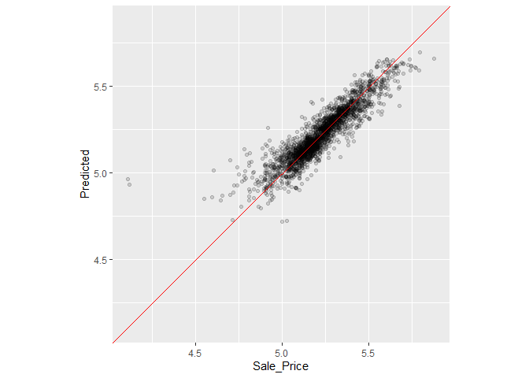

# 10 Resampling for Evaluating Performance
## 10.1 THE RESUBSTITUTION APPROACH


```r
library(tidymodels)
```

```
## ── Attaching packages ────────────────────────────────────── tidymodels 1.1.1 ──
```

```
## ✔ broom        1.0.5     ✔ recipes      1.0.8
## ✔ dials        1.2.0     ✔ rsample      1.2.0
## ✔ dplyr        1.1.2     ✔ tibble       3.2.1
## ✔ ggplot2      3.4.4     ✔ tidyr        1.3.0
## ✔ infer        1.0.5     ✔ tune         1.1.2
## ✔ modeldata    1.2.0     ✔ workflows    1.1.3
## ✔ parsnip      1.1.1     ✔ workflowsets 1.0.1
## ✔ purrr        1.0.2     ✔ yardstick    1.2.0
```

```
## ── Conflicts ───────────────────────────────────────── tidymodels_conflicts() ──
## ✖ purrr::discard() masks scales::discard()
## ✖ dplyr::filter()  masks stats::filter()
## ✖ dplyr::lag()     masks stats::lag()
## ✖ recipes::step()  masks stats::step()
## • Learn how to get started at https://www.tidymodels.org/start/
```

```r
data(ames)
ames <- mutate(ames, Sale_Price = log10(Sale_Price))

set.seed(502)
ames_split <- initial_split(ames, prop = 0.80, strata = Sale_Price)
ames_train <- training(ames_split)
ames_test  <-  testing(ames_split)

ames_rec <- 
  recipe(Sale_Price ~ Neighborhood + Gr_Liv_Area + Year_Built + Bldg_Type + 
           Latitude + Longitude, data = ames_train) %>%
  step_log(Gr_Liv_Area, base = 10) %>% 
  step_other(Neighborhood, threshold = 0.01) %>% 
  step_dummy(all_nominal_predictors()) %>% 
  step_interact( ~ Gr_Liv_Area:starts_with("Bldg_Type_") ) %>% 
  step_ns(Latitude, Longitude, deg_free = 20)
  
lm_model <- linear_reg() %>% set_engine("lm")

lm_wflow <- 
  workflow() %>% 
  add_model(lm_model) %>% 
  add_recipe(ames_rec)

lm_fit <- fit(lm_wflow, ames_train)
```


```r
rf_model <- 
  rand_forest(trees = 1000) %>% 
  set_engine("ranger") %>% 
  set_mode("regression")

rf_wflow <- 
  workflow() %>% 
  add_formula(
    Sale_Price ~ Neighborhood + Gr_Liv_Area + Year_Built + Bldg_Type + 
      Latitude + Longitude) %>% 
  add_model(rf_model) 

rf_fit <- rf_wflow %>% fit(data = ames_train)
```


```r
estimate_perf <- function(model, dat) {
  # Capture the names of the `model` and `dat` objects
  cl <- match.call()
  obj_name <- as.character(cl$model)
  data_name <- as.character(cl$dat)
  data_name <- gsub("ames_", "", data_name)
  
  # Estimate these metrics:
  reg_metrics <- metric_set(rmse, rsq)
  
  model %>%
    predict(dat) %>%
    bind_cols(dat %>% select(Sale_Price)) %>%
    reg_metrics(Sale_Price, .pred) %>%
    select(-.estimator) %>%
    mutate(object = obj_name, data = data_name)
}
```


```r
estimate_perf(rf_fit, ames_train)
```

```
## # A tibble: 2 × 4
##   .metric .estimate object data 
##   <chr>       <dbl> <chr>  <chr>
## 1 rmse       0.0364 rf_fit train
## 2 rsq        0.960  rf_fit train
```


```r
estimate_perf(lm_fit, ames_train)
```

```
## # A tibble: 2 × 4
##   .metric .estimate object data 
##   <chr>       <dbl> <chr>  <chr>
## 1 rmse       0.0754 lm_fit train
## 2 rsq        0.816  lm_fit train
```


```r
estimate_perf(rf_fit, ames_test)
```

```
## # A tibble: 2 × 4
##   .metric .estimate object data 
##   <chr>       <dbl> <chr>  <chr>
## 1 rmse       0.0701 rf_fit test 
## 2 rsq        0.853  rf_fit test
```


```r
estimate_perf(lm_fit, ames_test)
```

```
## # A tibble: 2 × 4
##   .metric .estimate object data 
##   <chr>       <dbl> <chr>  <chr>
## 1 rmse       0.0736 lm_fit test 
## 2 rsq        0.836  lm_fit test
```

## 10.2 RESAMPLING METHODS
### 10.2.1 CROSS-VALIDATION


```r
set.seed(1001)
ames_folds <- vfold_cv(ames_train, v = 10)
ames_folds
```

```
## #  10-fold cross-validation 
## # A tibble: 10 × 2
##    splits             id    
##    <list>             <chr> 
##  1 <split [2107/235]> Fold01
##  2 <split [2107/235]> Fold02
##  3 <split [2108/234]> Fold03
##  4 <split [2108/234]> Fold04
##  5 <split [2108/234]> Fold05
##  6 <split [2108/234]> Fold06
##  7 <split [2108/234]> Fold07
##  8 <split [2108/234]> Fold08
##  9 <split [2108/234]> Fold09
## 10 <split [2108/234]> Fold10
```


```r
# For the first fold:
ames_folds$splits[[1]] %>% analysis() %>% dim()
```

```
## [1] 2107   74
```


```r
# For the first fold:
ames_folds$splits[[1]] %>% assessment() %>% dim()
```

```
## [1] 235  74
```


```r
vfold_cv(ames_train, v = 10, repeats = 5)
```

```
## #  10-fold cross-validation repeated 5 times 
## # A tibble: 50 × 3
##    splits             id      id2   
##    <list>             <chr>   <chr> 
##  1 <split [2107/235]> Repeat1 Fold01
##  2 <split [2107/235]> Repeat1 Fold02
##  3 <split [2108/234]> Repeat1 Fold03
##  4 <split [2108/234]> Repeat1 Fold04
##  5 <split [2108/234]> Repeat1 Fold05
##  6 <split [2108/234]> Repeat1 Fold06
##  7 <split [2108/234]> Repeat1 Fold07
##  8 <split [2108/234]> Repeat1 Fold08
##  9 <split [2108/234]> Repeat1 Fold09
## 10 <split [2108/234]> Repeat1 Fold10
## # ℹ 40 more rows
```


```r
#loo_cv(ames_train)
```


```r
mc_cv(ames_train, prop = 9/10, times = 20)
```

```
## # Monte Carlo cross-validation (0.9/0.1) with 20 resamples  
## # A tibble: 20 × 2
##    splits             id        
##    <list>             <chr>     
##  1 <split [2107/235]> Resample01
##  2 <split [2107/235]> Resample02
##  3 <split [2107/235]> Resample03
##  4 <split [2107/235]> Resample04
##  5 <split [2107/235]> Resample05
##  6 <split [2107/235]> Resample06
##  7 <split [2107/235]> Resample07
##  8 <split [2107/235]> Resample08
##  9 <split [2107/235]> Resample09
## 10 <split [2107/235]> Resample10
## 11 <split [2107/235]> Resample11
## 12 <split [2107/235]> Resample12
## 13 <split [2107/235]> Resample13
## 14 <split [2107/235]> Resample14
## 15 <split [2107/235]> Resample15
## 16 <split [2107/235]> Resample16
## 17 <split [2107/235]> Resample17
## 18 <split [2107/235]> Resample18
## 19 <split [2107/235]> Resample19
## 20 <split [2107/235]> Resample20
```

### 10.2.2 VALIDATION SETS


```r
set.seed(52)
# To put 60% into training, 20% in validation, and 20% in testing:
ames_val_split <- initial_validation_split(ames, prop = c(0.6, 0.2))
ames_val_split
```

```
## <Training/Validation/Testing/Total>
## <1758/586/586/2930>
```

```r
# Object used for resampling: 
val_set <- validation_set(ames_val_split)
val_set
```

```
## # A tibble: 1 × 2
##   splits             id        
##   <list>             <chr>     
## 1 <split [1758/586]> validation
```

### 10.2.3 BOOTSTRAPPING


```r
bootstraps(ames_train, times = 5)
```

```
## # Bootstrap sampling 
## # A tibble: 5 × 2
##   splits             id        
##   <list>             <chr>     
## 1 <split [2342/867]> Bootstrap1
## 2 <split [2342/869]> Bootstrap2
## 3 <split [2342/859]> Bootstrap3
## 4 <split [2342/858]> Bootstrap4
## 5 <split [2342/873]> Bootstrap5
```

### 10.2.4 ROLLING FORECASTING ORIGIN RESAMPLING


```r
time_slices <- 
  tibble(x = 1:365) %>% 
  rolling_origin(initial = 6 * 30, assess = 30, skip = 29, cumulative = FALSE)

data_range <- function(x) {
  summarize(x, first = min(x), last = max(x))
}

map_dfr(time_slices$splits, ~   analysis(.x) %>% data_range())
```

```
## # A tibble: 6 × 2
##   first  last
##   <int> <int>
## 1     1   180
## 2    31   210
## 3    61   240
## 4    91   270
## 5   121   300
## 6   151   330
```

```r
map_dfr(time_slices$splits, ~ assessment(.x) %>% data_range())
```

```
## # A tibble: 6 × 2
##   first  last
##   <int> <int>
## 1   181   210
## 2   211   240
## 3   241   270
## 4   271   300
## 5   301   330
## 6   331   360
```

## 10.3 ESTIMATING PERFORMANCE


```r
# model_spec %>% fit_resamples(formula,  resamples, ...)
# model_spec %>% fit_resamples(recipe,   resamples, ...)
# workflow   %>% fit_resamples(          resamples, ...)
```


```r
keep_pred <- control_resamples(save_pred = TRUE, save_workflow = TRUE)

set.seed(1003)
rf_res <- 
  rf_wflow %>% 
  fit_resamples(resamples = ames_folds, control = keep_pred)
rf_res
```

```
## # Resampling results
## # 10-fold cross-validation 
## # A tibble: 10 × 5
##    splits             id     .metrics         .notes           .predictions
##    <list>             <chr>  <list>           <list>           <list>      
##  1 <split [2107/235]> Fold01 <tibble [2 × 4]> <tibble [0 × 3]> <tibble>    
##  2 <split [2107/235]> Fold02 <tibble [2 × 4]> <tibble [0 × 3]> <tibble>    
##  3 <split [2108/234]> Fold03 <tibble [2 × 4]> <tibble [0 × 3]> <tibble>    
##  4 <split [2108/234]> Fold04 <tibble [2 × 4]> <tibble [0 × 3]> <tibble>    
##  5 <split [2108/234]> Fold05 <tibble [2 × 4]> <tibble [0 × 3]> <tibble>    
##  6 <split [2108/234]> Fold06 <tibble [2 × 4]> <tibble [0 × 3]> <tibble>    
##  7 <split [2108/234]> Fold07 <tibble [2 × 4]> <tibble [0 × 3]> <tibble>    
##  8 <split [2108/234]> Fold08 <tibble [2 × 4]> <tibble [0 × 3]> <tibble>    
##  9 <split [2108/234]> Fold09 <tibble [2 × 4]> <tibble [0 × 3]> <tibble>    
## 10 <split [2108/234]> Fold10 <tibble [2 × 4]> <tibble [0 × 3]> <tibble>
```


```r
collect_metrics(rf_res)
```

```
## # A tibble: 2 × 6
##   .metric .estimator   mean     n std_err .config             
##   <chr>   <chr>       <dbl> <int>   <dbl> <chr>               
## 1 rmse    standard   0.0721    10 0.00305 Preprocessor1_Model1
## 2 rsq     standard   0.831     10 0.0108  Preprocessor1_Model1
```


```r
collect_metrics(rf_res, summarize = FALSE)
```

```
## # A tibble: 20 × 5
##    id     .metric .estimator .estimate .config             
##    <chr>  <chr>   <chr>          <dbl> <chr>               
##  1 Fold01 rmse    standard      0.0605 Preprocessor1_Model1
##  2 Fold01 rsq     standard      0.862  Preprocessor1_Model1
##  3 Fold02 rmse    standard      0.0653 Preprocessor1_Model1
##  4 Fold02 rsq     standard      0.861  Preprocessor1_Model1
##  5 Fold03 rmse    standard      0.0609 Preprocessor1_Model1
##  6 Fold03 rsq     standard      0.880  Preprocessor1_Model1
##  7 Fold04 rmse    standard      0.0699 Preprocessor1_Model1
##  8 Fold04 rsq     standard      0.818  Preprocessor1_Model1
##  9 Fold05 rmse    standard      0.0738 Preprocessor1_Model1
## 10 Fold05 rsq     standard      0.851  Preprocessor1_Model1
## 11 Fold06 rmse    standard      0.0682 Preprocessor1_Model1
## 12 Fold06 rsq     standard      0.822  Preprocessor1_Model1
## 13 Fold07 rmse    standard      0.0712 Preprocessor1_Model1
## 14 Fold07 rsq     standard      0.850  Preprocessor1_Model1
## 15 Fold08 rmse    standard      0.0871 Preprocessor1_Model1
## 16 Fold08 rsq     standard      0.784  Preprocessor1_Model1
## 17 Fold09 rmse    standard      0.0887 Preprocessor1_Model1
## 18 Fold09 rsq     standard      0.789  Preprocessor1_Model1
## 19 Fold10 rmse    standard      0.0752 Preprocessor1_Model1
## 20 Fold10 rsq     standard      0.795  Preprocessor1_Model1
```


```r
assess_res <- collect_predictions(rf_res)
assess_res
```

```
## # A tibble: 2,342 × 5
##    id     .pred  .row Sale_Price .config             
##    <chr>  <dbl> <int>      <dbl> <chr>               
##  1 Fold01  5.10    10       5.09 Preprocessor1_Model1
##  2 Fold01  4.92    27       4.90 Preprocessor1_Model1
##  3 Fold01  5.21    47       5.08 Preprocessor1_Model1
##  4 Fold01  5.13    52       5.10 Preprocessor1_Model1
##  5 Fold01  5.13    59       5.10 Preprocessor1_Model1
##  6 Fold01  5.13    63       5.11 Preprocessor1_Model1
##  7 Fold01  4.87    65       4.91 Preprocessor1_Model1
##  8 Fold01  4.98    66       5.04 Preprocessor1_Model1
##  9 Fold01  4.91    67       4.84 Preprocessor1_Model1
## 10 Fold01  4.91    68       5.01 Preprocessor1_Model1
## # ℹ 2,332 more rows
```


```r
collect_predictions(rf_res, summarize = T)
```

```
## # A tibble: 2,342 × 4
##     .row Sale_Price .config              .pred
##    <int>      <dbl> <chr>                <dbl>
##  1     1       5.10 Preprocessor1_Model1  5.00
##  2     2       5.06 Preprocessor1_Model1  5.07
##  3     3       5.02 Preprocessor1_Model1  4.98
##  4     4       4.94 Preprocessor1_Model1  5.02
##  5     5       5.11 Preprocessor1_Model1  5.15
##  6     6       5.08 Preprocessor1_Model1  5.11
##  7     7       5.00 Preprocessor1_Model1  5.14
##  8     8       4.83 Preprocessor1_Model1  5.00
##  9     9       5.05 Preprocessor1_Model1  5.15
## 10    10       5.09 Preprocessor1_Model1  5.10
## # ℹ 2,332 more rows
```


```r
assess_res %>% 
  ggplot(aes(x = Sale_Price, y = .pred)) + 
  geom_point(alpha = .15) +
  geom_abline(color = "red") + 
  coord_obs_pred() + 
  ylab("Predicted")
```

<!-- -->


```r
over_predicted <- 
  assess_res %>% 
  mutate(residual = Sale_Price - .pred) %>% 
  arrange(desc(abs(residual))) %>% 
  slice(1:2)
over_predicted
```

```
## # A tibble: 2 × 6
##   id     .pred  .row Sale_Price .config              residual
##   <chr>  <dbl> <int>      <dbl> <chr>                   <dbl>
## 1 Fold09  4.96    32       4.11 Preprocessor1_Model1   -0.858
## 2 Fold08  4.93   317       4.12 Preprocessor1_Model1   -0.816
```


```r
ames_train %>% 
  slice(over_predicted$.row) %>% 
  select(Gr_Liv_Area, Neighborhood, Year_Built, Bedroom_AbvGr, Full_Bath)
```

```
## # A tibble: 2 × 5
##   Gr_Liv_Area Neighborhood           Year_Built Bedroom_AbvGr Full_Bath
##         <int> <fct>                       <int>         <int>     <int>
## 1         832 Old_Town                     1923             2         1
## 2         733 Iowa_DOT_and_Rail_Road       1952             2         1
```


```r
val_res <- rf_wflow %>% fit_resamples(resamples = val_set)
```

```
## Warning in `[.tbl_df`(x, is.finite(x <- as.numeric(x))): NAs introduced by
## coercion
```

```r
val_res
```

```
## # Resampling results
## #  
## # A tibble: 1 × 4
##   splits             id         .metrics         .notes          
##   <list>             <chr>      <list>           <list>          
## 1 <split [1758/586]> validation <tibble [2 × 4]> <tibble [0 × 3]>
```

```r
collect_metrics(val_res)
```

```
## # A tibble: 2 × 6
##   .metric .estimator   mean     n std_err .config             
##   <chr>   <chr>       <dbl> <int>   <dbl> <chr>               
## 1 rmse    standard   0.0727     1      NA Preprocessor1_Model1
## 2 rsq     standard   0.823      1      NA Preprocessor1_Model1
```

## 10.4 PARALLEL PROCESSING


```r
# The number of physical cores in the hardware:
parallel::detectCores(logical = FALSE)
```

```
## [1] 4
```


```r
parallel::detectCores(logical = TRUE)
```

```
## [1] 8
```


```r
# All operating systems
library(doParallel)

# Create a cluster object and then register: 
cl <- makePSOCKcluster(2)
registerDoParallel(cl)

# Now run fit_resamples()`...

stopCluster(cl)
```

## 10.5 SAVING THE RESAMPLED OBJECTS


```r
ames_rec <- 
  recipe(Sale_Price ~ Neighborhood + Gr_Liv_Area + Year_Built + Bldg_Type + 
           Latitude + Longitude, data = ames_train) %>%
  step_other(Neighborhood, threshold = 0.01) %>% 
  step_dummy(all_nominal_predictors()) %>% 
  step_interact( ~ Gr_Liv_Area:starts_with("Bldg_Type_") ) %>% 
  step_ns(Latitude, Longitude, deg_free = 20)

lm_wflow <-  
  workflow() %>% 
  add_recipe(ames_rec) %>% 
  add_model(linear_reg() %>% set_engine("lm")) 

lm_fit <- lm_wflow %>% fit(data = ames_train)

# Select the recipe: 
extract_recipe(lm_fit, estimated = TRUE)
```

```
## 
```

```
## ── Recipe ──────────────────────────────────────────────────────────────────────
```

```
## 
```

```
## ── Inputs
```

```
## Number of variables by role
```

```
## outcome:   1
## predictor: 6
```

```
## 
```

```
## ── Training information
```

```
## Training data contained 2342 data points and no incomplete rows.
```

```
## 
```

```
## ── Operations
```

```
## • Collapsing factor levels for: Neighborhood | Trained
```

```
## • Dummy variables from: Neighborhood, Bldg_Type | Trained
```

```
## • Interactions with: Gr_Liv_Area:(Bldg_Type_TwoFmCon + Bldg_Type_Duplex +
##   Bldg_Type_Twnhs + Bldg_Type_TwnhsE) | Trained
```

```
## • Natural splines on: Latitude, Longitude | Trained
```


```r
get_model <- function(x) {
  extract_fit_parsnip(x) %>% tidy()
}
```


```r
get_model(lm_fit)
```

```
## # A tibble: 73 × 5
##    term                             estimate  std.error statistic   p.value
##    <chr>                               <dbl>      <dbl>     <dbl>     <dbl>
##  1 (Intercept)                      1.54     0.298         5.16   2.61e-  7
##  2 Gr_Liv_Area                      0.000163 0.00000446   36.4    2.81e-229
##  3 Year_Built                       0.00177  0.000140     12.6    1.93e- 35
##  4 Neighborhood_College_Creek       0.00125  0.0350        0.0357 9.72e-  1
##  5 Neighborhood_Old_Town           -0.0718   0.0129       -5.55   3.18e-  8
##  6 Neighborhood_Edwards            -0.0957   0.0293       -3.27   1.09e-  3
##  7 Neighborhood_Somerset            0.0944   0.0199        4.74   2.31e-  6
##  8 Neighborhood_Northridge_Heights  0.158    0.0363        4.36   1.37e-  5
##  9 Neighborhood_Gilbert             0.0285   0.0330        0.864  3.88e-  1
## 10 Neighborhood_Sawyer             -0.0967   0.0275       -3.52   4.36e-  4
## # ℹ 63 more rows
```


```r
ctrl <- control_resamples(extract = get_model)

lm_res <- lm_wflow %>%  fit_resamples(resamples = ames_folds, control = ctrl)
lm_res
```

```
## # Resampling results
## # 10-fold cross-validation 
## # A tibble: 10 × 5
##    splits             id     .metrics         .notes           .extracts       
##    <list>             <chr>  <list>           <list>           <list>          
##  1 <split [2107/235]> Fold01 <tibble [2 × 4]> <tibble [0 × 3]> <tibble [1 × 2]>
##  2 <split [2107/235]> Fold02 <tibble [2 × 4]> <tibble [0 × 3]> <tibble [1 × 2]>
##  3 <split [2108/234]> Fold03 <tibble [2 × 4]> <tibble [0 × 3]> <tibble [1 × 2]>
##  4 <split [2108/234]> Fold04 <tibble [2 × 4]> <tibble [0 × 3]> <tibble [1 × 2]>
##  5 <split [2108/234]> Fold05 <tibble [2 × 4]> <tibble [0 × 3]> <tibble [1 × 2]>
##  6 <split [2108/234]> Fold06 <tibble [2 × 4]> <tibble [0 × 3]> <tibble [1 × 2]>
##  7 <split [2108/234]> Fold07 <tibble [2 × 4]> <tibble [0 × 3]> <tibble [1 × 2]>
##  8 <split [2108/234]> Fold08 <tibble [2 × 4]> <tibble [0 × 3]> <tibble [1 × 2]>
##  9 <split [2108/234]> Fold09 <tibble [2 × 4]> <tibble [0 × 3]> <tibble [1 × 2]>
## 10 <split [2108/234]> Fold10 <tibble [2 × 4]> <tibble [0 × 3]> <tibble [1 × 2]>
```


```r
lm_res$.extracts[[1]]
```

```
## # A tibble: 1 × 2
##   .extracts         .config             
##   <list>            <chr>               
## 1 <tibble [73 × 5]> Preprocessor1_Model1
```

```r
# To get the results
lm_res$.extracts[[1]][[1]]
```

```
## [[1]]
## # A tibble: 73 × 5
##    term                             estimate  std.error statistic   p.value
##    <chr>                               <dbl>      <dbl>     <dbl>     <dbl>
##  1 (Intercept)                      1.48     0.320         4.62   4.11e-  6
##  2 Gr_Liv_Area                      0.000158 0.00000476   33.2    9.72e-194
##  3 Year_Built                       0.00180  0.000149     12.1    1.57e- 32
##  4 Neighborhood_College_Creek      -0.00163  0.0373       -0.0438 9.65e-  1
##  5 Neighborhood_Old_Town           -0.0757   0.0138       -5.47   4.92e-  8
##  6 Neighborhood_Edwards            -0.109    0.0310       -3.53   4.21e-  4
##  7 Neighborhood_Somerset            0.0832   0.0217        3.83   1.33e-  4
##  8 Neighborhood_Northridge_Heights  0.163    0.0401        4.06   5.19e-  5
##  9 Neighborhood_Gilbert             0.0304   0.0367        0.827  4.08e-  1
## 10 Neighborhood_Sawyer             -0.113    0.0291       -3.88   1.07e-  4
## # ℹ 63 more rows
```


```r
all_coef <- map_dfr(lm_res$.extracts, ~ .x[[1]][[1]])
# Show the replicates for a single predictor:
filter(all_coef, term == "Year_Built")
```

```
## # A tibble: 10 × 5
##    term       estimate std.error statistic  p.value
##    <chr>         <dbl>     <dbl>     <dbl>    <dbl>
##  1 Year_Built  0.00180  0.000149      12.1 1.57e-32
##  2 Year_Built  0.00180  0.000151      12.0 6.45e-32
##  3 Year_Built  0.00185  0.000150      12.3 1.00e-33
##  4 Year_Built  0.00183  0.000147      12.5 1.90e-34
##  5 Year_Built  0.00184  0.000150      12.2 2.47e-33
##  6 Year_Built  0.00180  0.000150      12.0 3.35e-32
##  7 Year_Built  0.00179  0.000149      12.0 3.52e-32
##  8 Year_Built  0.00185  0.000145      12.7 1.47e-35
##  9 Year_Built  0.00158  0.000146      10.8 2.02e-26
## 10 Year_Built  0.00181  0.000148      12.2 3.02e-33
```

## 10.6 CHAPTER SUMMARY


```r
library(tidymodels)
data(ames)
ames <- mutate(ames, Sale_Price = log10(Sale_Price))

set.seed(502)
ames_split <- initial_split(ames, prop = 0.80, strata = Sale_Price)
ames_train <- training(ames_split)
ames_test  <-  testing(ames_split)

ames_rec <- 
  recipe(Sale_Price ~ Neighborhood + Gr_Liv_Area + Year_Built + Bldg_Type + 
           Latitude + Longitude, data = ames_train) %>%
  step_log(Gr_Liv_Area, base = 10) %>% 
  step_other(Neighborhood, threshold = 0.01) %>% 
  step_dummy(all_nominal_predictors()) %>% 
  step_interact( ~ Gr_Liv_Area:starts_with("Bldg_Type_") ) %>% 
  step_ns(Latitude, Longitude, deg_free = 20)

lm_model <- linear_reg() %>% set_engine("lm")

lm_wflow <- 
  workflow() %>% 
  add_model(lm_model) %>% 
  add_recipe(ames_rec)

lm_fit <- fit(lm_wflow, ames_train)

rf_model <- 
  rand_forest(trees = 1000) %>% 
  set_engine("ranger") %>% 
  set_mode("regression")

rf_wflow <- 
  workflow() %>% 
  add_formula(
    Sale_Price ~ Neighborhood + Gr_Liv_Area + Year_Built + Bldg_Type + 
      Latitude + Longitude) %>% 
  add_model(rf_model) 

set.seed(1001)
ames_folds <- vfold_cv(ames_train, v = 10)

keep_pred <- control_resamples(save_pred = TRUE, save_workflow = TRUE)

set.seed(1003)
rf_res <- rf_wflow %>% fit_resamples(resamples = ames_folds, control = keep_pred)
```

