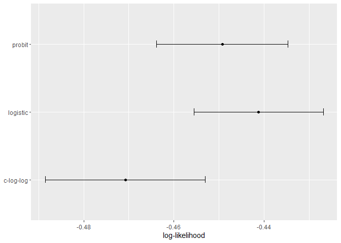
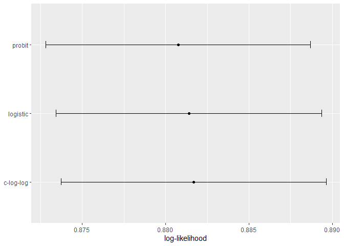

# 12 Model Tuning and the Dangers of Overfitting
## 12.1 MODEL PARAMETERS
## 12.2 TUNING PARAMETERS FOR DIFFERENT TYPES OF MODELS
## 12.3 WHAT DO WE OPTIMIZE?


```r
library(tidymodels)
```

```
## ── Attaching packages ────────────────────────────────────── tidymodels 1.1.1 ──
```

```
## ✔ broom        1.0.5     ✔ recipes      1.0.8
## ✔ dials        1.2.0     ✔ rsample      1.2.0
## ✔ dplyr        1.1.4     ✔ tibble       3.2.1
## ✔ ggplot2      3.4.4     ✔ tidyr        1.3.0
## ✔ infer        1.0.5     ✔ tune         1.1.2
## ✔ modeldata    1.2.0     ✔ workflows    1.1.3
## ✔ parsnip      1.1.1     ✔ workflowsets 1.0.1
## ✔ purrr        1.0.2     ✔ yardstick    1.2.0
```

```
## ── Conflicts ───────────────────────────────────────── tidymodels_conflicts() ──
## ✖ purrr::discard() masks scales::discard()
## ✖ dplyr::filter()  masks stats::filter()
## ✖ dplyr::lag()     masks stats::lag()
## ✖ recipes::step()  masks stats::step()
## • Use tidymodels_prefer() to resolve common conflicts.
```

```r
tidymodels_prefer()

data(two_class_dat)

set.seed(91)
split <- initial_split(two_class_dat)

training_set <- training(split)
testing_set  <-  testing(split)

llhood <- function(...) {
  logistic_reg() %>% 
    set_engine("glm", ...) %>% 
    fit(Class ~ ., data = training_set) %>% 
    glance() %>% 
    select(logLik)
}

bind_rows(
  llhood(),
  llhood(family = binomial(link = "probit")),
  llhood(family = binomial(link = "cloglog"))
) %>% 
  mutate(link = c("logit", "probit", "c-log-log"))  %>% 
  arrange(desc(logLik))
```

```
## # A tibble: 3 × 2
##   logLik link     
##    <dbl> <chr>    
## 1  -258. logit    
## 2  -262. probit   
## 3  -270. c-log-log
```


```r
set.seed(1201)
rs <- vfold_cv(training_set, repeats = 10)

# Return the individual resampled performance estimates:
lloss <- function(...) {
  perf_meas <- metric_set(roc_auc, mn_log_loss)
    
  logistic_reg() %>% 
    set_engine("glm", ...) %>% 
    fit_resamples(Class ~ A + B, rs, metrics = perf_meas) %>% 
    collect_metrics(summarize = FALSE) %>%
    select(id, id2, .metric, .estimate)
}

resampled_res <- 
  bind_rows(
    lloss()                                    %>% mutate(model = "logistic"),
    lloss(family = binomial(link = "probit"))  %>% mutate(model = "probit"),
    lloss(family = binomial(link = "cloglog")) %>% mutate(model = "c-log-log")     
  ) %>%
  # Convert log-loss to log-likelihood:
  mutate(.estimate = ifelse(.metric == "mn_log_loss", -.estimate, .estimate)) %>% 
  group_by(model, .metric) %>% 
  summarize(
    mean = mean(.estimate, na.rm = TRUE),
    std_err = sd(.estimate, na.rm = TRUE) / sqrt(n()), 
    .groups = "drop"
  )
```

```
## → A | warning: glm.fit: fitted probabilities numerically 0 or 1 occurred
```

```
## 
There were issues with some computations   A: x1

There were issues with some computations   A: x1
```

```r
resampled_res %>% 
  filter(.metric == "mn_log_loss") %>% 
  ggplot(aes(x = mean, y = model)) + 
  geom_point() + 
  geom_errorbar(aes(xmin = mean - 1.64 * std_err, xmax = mean + 1.64 * std_err),
                width = .1) + 
  labs(y = NULL, x = "log-likelihood")
```

<!-- -->


```r
resampled_res %>% 
  filter(.metric == "roc_auc") %>% 
  ggplot(aes(x = mean, y = model)) + 
  geom_point() + 
  geom_errorbar(aes(xmin = mean - 1.64 * std_err, xmax = mean + 1.64 * std_err),
                width = .1) + 
  labs(y = NULL, x = "log-likelihood")
```

<!-- -->

## 12.4 THE CONSEQUENCES OF POOR PARAMETER ESTIMATES
## 12.5 TWO GENERAL STRATEGIES FOR OPTIMIZATION
## 12.6 TUNING PARAMETERS IN TIDYMODELS


```r
rand_forest(trees = 2000, min_n = 10) %>%                   # <- main arguments
  set_engine("ranger", regularization.factor = 0.5)         # <- engine-specific
```

```
## Random Forest Model Specification (unknown mode)
## 
## Main Arguments:
##   trees = 2000
##   min_n = 10
## 
## Engine-Specific Arguments:
##   regularization.factor = 0.5
## 
## Computational engine: ranger
```


```r
neural_net_spec <- 
  mlp(hidden_units = tune()) %>%
  set_mode("regression") %>%
  set_engine("keras")
```


```r
tune()
```

```
## tune()
```


```r
extract_parameter_set_dials(neural_net_spec)
```

```
## Collection of 1 parameters for tuning
## 
##    identifier         type    object
##  hidden_units hidden_units nparam[+]
```


```r
data(ames)
ames <- mutate(ames, Sale_Price = log10(Sale_Price))

set.seed(502)
ames_split <- initial_split(ames, prop = 0.80, strata = Sale_Price)
ames_train <- training(ames_split)
ames_test  <-  testing(ames_split)

ames_rec <- 
  recipe(Sale_Price ~ Neighborhood + Gr_Liv_Area + Year_Built + Bldg_Type + 
           Latitude + Longitude, data = ames_train)  %>%
  step_log(Gr_Liv_Area, base = 10) %>% 
  step_other(Neighborhood, threshold = tune()) %>% 
  step_dummy(all_nominal_predictors()) %>% 
  step_interact( ~ Gr_Liv_Area:starts_with("Bldg_Type_") ) %>% 
  step_ns(Longitude, deg_free = tune("longitude df")) %>% 
  step_ns(Latitude,  deg_free = tune("latitude df"))

recipes_param <- extract_parameter_set_dials(ames_rec)
recipes_param
```

```
## Collection of 3 parameters for tuning
## 
##    identifier      type    object
##     threshold threshold nparam[+]
##  longitude df  deg_free nparam[+]
##   latitude df  deg_free nparam[+]
```


```r
wflow_param <- 
  workflow() %>% 
  add_recipe(ames_rec) %>% 
  add_model(neural_net_spec) %>% 
  extract_parameter_set_dials()
wflow_param
```

```
## Collection of 4 parameters for tuning
## 
##    identifier         type    object
##  hidden_units hidden_units nparam[+]
##     threshold    threshold nparam[+]
##  longitude df     deg_free nparam[+]
##   latitude df     deg_free nparam[+]
```


```r
hidden_units()
```

```
## # Hidden Units (quantitative)
## Range: [1, 10]
```


```r
threshold()
```

```
## Threshold (quantitative)
## Range: [0, 1]
```


```r
spline_degree()
```

```
## Spline Degrees of Freedom (quantitative)
## Range: [1, 10]
```


```r
# identify the parameter using the id value:
wflow_param %>% extract_parameter_dials("threshold")
```

```
## Threshold (quantitative)
## Range: [0, 0.1]
```


```r
extract_parameter_set_dials(ames_rec) %>% 
  update(threshold = threshold(c(0.8, 1.0)))
```

```
## Collection of 3 parameters for tuning
## 
##    identifier      type    object
##     threshold threshold nparam[+]
##  longitude df  deg_free nparam[+]
##   latitude df  deg_free nparam[+]
```


```r
rf_spec <- 
  rand_forest(mtry = tune()) %>% 
  set_engine("ranger", regularization.factor = tune("regularization")) %>%
  set_mode("regression")

rf_param <- extract_parameter_set_dials(rf_spec)
rf_param
```

```
## Collection of 2 parameters for tuning
## 
##      identifier                  type    object
##            mtry                  mtry nparam[?]
##  regularization regularization.factor nparam[+]
## 
## Model parameters needing finalization:
##    # Randomly Selected Predictors ('mtry')
## 
## See `?dials::finalize` or `?dials::update.parameters` for more information.
```


```r
rf_param %>% 
  update(mtry = mtry(c(1, 70)))
```

```
## Collection of 2 parameters for tuning
## 
##      identifier                  type    object
##            mtry                  mtry nparam[+]
##  regularization regularization.factor nparam[+]
```


```r
pca_rec <- 
  recipe(Sale_Price ~ ., data = ames_train) %>% 
  # Select the square-footage predictors and extract their PCA components:
  step_normalize(contains("SF")) %>% 
  # Select the number of components needed to capture 95% of
  # the variance in the predictors. 
  step_pca(contains("SF"), threshold = .95)
  
updated_param <- 
  workflow() %>% 
  add_model(rf_spec) %>% 
  add_recipe(pca_rec) %>% 
  extract_parameter_set_dials() %>% 
  finalize(ames_train)
updated_param
```

```
## Collection of 2 parameters for tuning
## 
##      identifier                  type    object
##            mtry                  mtry nparam[+]
##  regularization regularization.factor nparam[+]
```

```r
updated_param %>% extract_parameter_dials("mtry")
```

```
## # Randomly Selected Predictors (quantitative)
## Range: [1, 74]
```


```r
rf_param
```

```
## Collection of 2 parameters for tuning
## 
##      identifier                  type    object
##            mtry                  mtry nparam[?]
##  regularization regularization.factor nparam[+]
## 
## Model parameters needing finalization:
##    # Randomly Selected Predictors ('mtry')
## 
## See `?dials::finalize` or `?dials::update.parameters` for more information.
```


```r
regularization_factor()
```

```
## Gain Penalization (quantitative)
## Range: [0, 1]
```


```r
penalty()
```

```
## Amount of Regularization (quantitative)
## Transformer: log-10 [1e-100, Inf]
## Range (transformed scale): [-10, 0]
```


```r
#correct
penalty(c(-1, 0)) %>% value_sample(1000) %>% summary()
```

```
##    Min. 1st Qu.  Median    Mean 3rd Qu.    Max. 
##  0.1002  0.1796  0.3284  0.4007  0.5914  0.9957
```

```r
#incorrect
penalty(c(0.1, 1.0)) %>% value_sample(1000) %>% summary()
```

```
##    Min. 1st Qu.  Median    Mean 3rd Qu.    Max. 
##   1.261   2.081   3.437   4.151   5.781   9.996
```


```r
penalty(trans = NULL, range = 10^c(-10, 0))
```

```
## Amount of Regularization (quantitative)
## Range: [1e-10, 1]
```

# 12.7 CHAPTER SUMMARY

