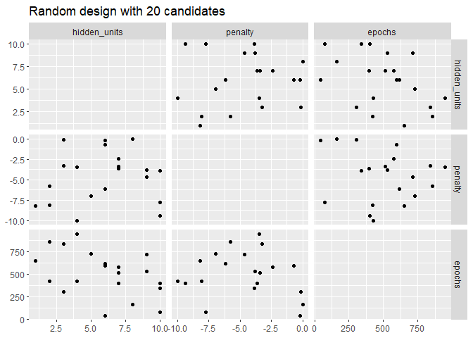
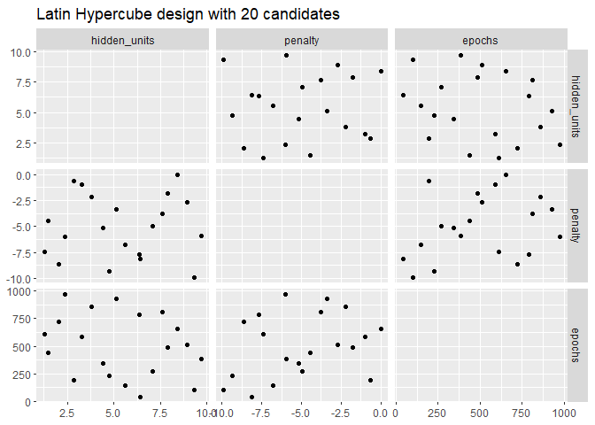
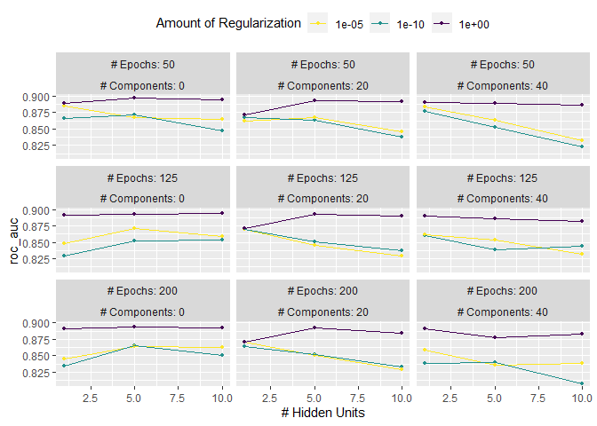
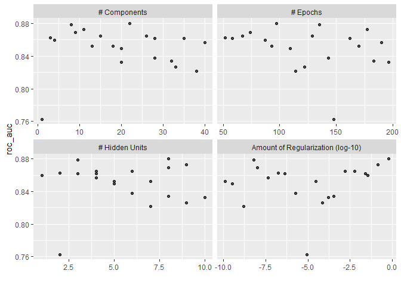

# 13 Grid Search
## 13.1 REGULAR AND NONREGULAR GRIDS


```r
library(tidymodels)
```

```
## ── Attaching packages ────────────────────────────────────── tidymodels 1.1.1 ──
```

```
## ✔ broom        1.0.5     ✔ recipes      1.0.8
## ✔ dials        1.2.0     ✔ rsample      1.2.0
## ✔ dplyr        1.1.2     ✔ tibble       3.2.1
## ✔ ggplot2      3.4.4     ✔ tidyr        1.3.0
## ✔ infer        1.0.5     ✔ tune         1.1.2
## ✔ modeldata    1.2.0     ✔ workflows    1.1.3
## ✔ parsnip      1.1.1     ✔ workflowsets 1.0.1
## ✔ purrr        1.0.2     ✔ yardstick    1.2.0
```

```
## ── Conflicts ───────────────────────────────────────── tidymodels_conflicts() ──
## ✖ purrr::discard() masks scales::discard()
## ✖ dplyr::filter()  masks stats::filter()
## ✖ dplyr::lag()     masks stats::lag()
## ✖ recipes::step()  masks stats::step()
## • Learn how to get started at https://www.tidymodels.org/start/
```

```r
tidymodels_prefer()

mlp_spec <- 
  mlp(hidden_units = tune(), penalty = tune(), epochs = tune()) %>% 
  set_engine("nnet", trace = 0) %>% 
  set_mode("classification")
```


```r
mlp_param <- extract_parameter_set_dials(mlp_spec)
mlp_param %>% extract_parameter_dials("hidden_units")
```

```
## # Hidden Units (quantitative)
## Range: [1, 10]
```


```r
mlp_param %>% extract_parameter_dials("penalty")
```

```
## Amount of Regularization (quantitative)
## Transformer: log-10 [1e-100, Inf]
## Range (transformed scale): [-10, 0]
```


```r
mlp_param %>% extract_parameter_dials("epochs")
```

```
## # Epochs (quantitative)
## Range: [10, 1000]
```


```r
crossing(
  hidden_units = 1:3,
  penalty = c(0.0, 0.1),
  epochs = c(100, 200)
)
```

```
## # A tibble: 12 × 3
##    hidden_units penalty epochs
##           <int>   <dbl>  <dbl>
##  1            1     0      100
##  2            1     0      200
##  3            1     0.1    100
##  4            1     0.1    200
##  5            2     0      100
##  6            2     0      200
##  7            2     0.1    100
##  8            2     0.1    200
##  9            3     0      100
## 10            3     0      200
## 11            3     0.1    100
## 12            3     0.1    200
```


```r
grid_regular(mlp_param, levels = 2)
```

```
## # A tibble: 8 × 3
##   hidden_units      penalty epochs
##          <int>        <dbl>  <int>
## 1            1 0.0000000001     10
## 2           10 0.0000000001     10
## 3            1 1                10
## 4           10 1                10
## 5            1 0.0000000001   1000
## 6           10 0.0000000001   1000
## 7            1 1              1000
## 8           10 1              1000
```


```r
mlp_param %>% 
  grid_regular(levels = c(hidden_units = 3, penalty = 2, epochs = 2))
```

```
## # A tibble: 12 × 3
##    hidden_units      penalty epochs
##           <int>        <dbl>  <int>
##  1            1 0.0000000001     10
##  2            5 0.0000000001     10
##  3           10 0.0000000001     10
##  4            1 1                10
##  5            5 1                10
##  6           10 1                10
##  7            1 0.0000000001   1000
##  8            5 0.0000000001   1000
##  9           10 0.0000000001   1000
## 10            1 1              1000
## 11            5 1              1000
## 12           10 1              1000
```


```r
set.seed(1301)
mlp_param %>% 
  grid_random(size = 1000) %>% # 'size' is the number of combinations
  summary()
```

```
##   hidden_units       penalty              epochs     
##  Min.   : 1.000   Min.   :0.0000000   Min.   : 10.0  
##  1st Qu.: 3.000   1st Qu.:0.0000000   1st Qu.:265.8  
##  Median : 5.000   Median :0.0000061   Median :497.0  
##  Mean   : 5.381   Mean   :0.0437435   Mean   :509.5  
##  3rd Qu.: 8.000   3rd Qu.:0.0026854   3rd Qu.:761.0  
##  Max.   :10.000   Max.   :0.9814405   Max.   :999.0
```


```r
library(ggforce)
set.seed(1302)
mlp_param %>% 
  # The 'original = FALSE' option keeps penalty in log10 units
  grid_random(size = 20, original = FALSE) %>% 
  ggplot(aes(x = .panel_x, y = .panel_y)) + 
  geom_point() +
  geom_blank() +
  facet_matrix(vars(hidden_units, penalty, epochs), layer.diag = 2) + 
  labs(title = "Random design with 20 candidates")
```

<!-- -->


```r
set.seed(1303)
mlp_param %>% 
  grid_latin_hypercube(size = 20, original = FALSE) %>% 
  ggplot(aes(x = .panel_x, y = .panel_y)) + 
  geom_point() +
  geom_blank() +
  facet_matrix(vars(hidden_units, penalty, epochs), layer.diag = 2) + 
  labs(title = "Latin Hypercube design with 20 candidates")
```

<!-- -->

## 13.2 EVALUATING THE GRID


```r
library(tidymodels)
data(cells)
cells <- cells %>% select(-case)
```


```r
set.seed(1304)
cell_folds <- vfold_cv(cells)
```


```r
mlp_rec <-
  recipe(class ~ ., data = cells) %>%
  step_YeoJohnson(all_numeric_predictors()) %>% 
  step_normalize(all_numeric_predictors()) %>% 
  step_pca(all_numeric_predictors(), num_comp = tune()) %>% 
  step_normalize(all_numeric_predictors())

mlp_wflow <- 
  workflow() %>% 
  add_model(mlp_spec) %>% 
  add_recipe(mlp_rec)
```


```r
mlp_param <- 
  mlp_wflow %>% 
  extract_parameter_set_dials() %>% 
  update(
    epochs = epochs(c(50, 200)),
    num_comp = num_comp(c(0, 40))
  )
```


```r
roc_res <- metric_set(roc_auc)
set.seed(1305)
mlp_reg_tune <-
  mlp_wflow %>%
  tune_grid(
    cell_folds,
    grid = mlp_param %>% grid_regular(levels = 3),
    metrics = roc_res
  )
mlp_reg_tune
```

```
## # Tuning results
## # 10-fold cross-validation 
## # A tibble: 10 × 4
##    splits             id     .metrics          .notes          
##    <list>             <chr>  <list>            <list>          
##  1 <split [1817/202]> Fold01 <tibble [81 × 8]> <tibble [0 × 3]>
##  2 <split [1817/202]> Fold02 <tibble [81 × 8]> <tibble [0 × 3]>
##  3 <split [1817/202]> Fold03 <tibble [81 × 8]> <tibble [0 × 3]>
##  4 <split [1817/202]> Fold04 <tibble [81 × 8]> <tibble [0 × 3]>
##  5 <split [1817/202]> Fold05 <tibble [81 × 8]> <tibble [0 × 3]>
##  6 <split [1817/202]> Fold06 <tibble [81 × 8]> <tibble [0 × 3]>
##  7 <split [1817/202]> Fold07 <tibble [81 × 8]> <tibble [0 × 3]>
##  8 <split [1817/202]> Fold08 <tibble [81 × 8]> <tibble [0 × 3]>
##  9 <split [1817/202]> Fold09 <tibble [81 × 8]> <tibble [0 × 3]>
## 10 <split [1818/201]> Fold10 <tibble [81 × 8]> <tibble [0 × 3]>
```


```r
autoplot(mlp_reg_tune) + 
  scale_color_viridis_d(direction = -1) + 
  theme(legend.position = "top")
```

<!-- -->


```r
show_best(mlp_reg_tune) %>% select(-.estimator)
```

```
## # A tibble: 5 × 9
##   hidden_units penalty epochs num_comp .metric  mean     n std_err .config      
##          <int>   <dbl>  <int>    <int> <chr>   <dbl> <int>   <dbl> <chr>        
## 1            5       1     50        0 roc_auc 0.897    10 0.00857 Preprocessor…
## 2           10       1    125        0 roc_auc 0.895    10 0.00898 Preprocessor…
## 3           10       1     50        0 roc_auc 0.894    10 0.00960 Preprocessor…
## 4            5       1    200        0 roc_auc 0.894    10 0.00784 Preprocessor…
## 5            5       1    125        0 roc_auc 0.892    10 0.00822 Preprocessor…
```


```r
set.seed(1306)
mlp_sfd_tune <-
  mlp_wflow %>%
  tune_grid(
    cell_folds,
    grid = 20,
    # Pass in the parameter object to use the appropriate range: 
    param_info = mlp_param,
    metrics = roc_res
  )
mlp_sfd_tune
```

```
## # Tuning results
## # 10-fold cross-validation 
## # A tibble: 10 × 4
##    splits             id     .metrics          .notes          
##    <list>             <chr>  <list>            <list>          
##  1 <split [1817/202]> Fold01 <tibble [20 × 8]> <tibble [0 × 3]>
##  2 <split [1817/202]> Fold02 <tibble [20 × 8]> <tibble [0 × 3]>
##  3 <split [1817/202]> Fold03 <tibble [20 × 8]> <tibble [0 × 3]>
##  4 <split [1817/202]> Fold04 <tibble [20 × 8]> <tibble [0 × 3]>
##  5 <split [1817/202]> Fold05 <tibble [20 × 8]> <tibble [0 × 3]>
##  6 <split [1817/202]> Fold06 <tibble [20 × 8]> <tibble [0 × 3]>
##  7 <split [1817/202]> Fold07 <tibble [20 × 8]> <tibble [0 × 3]>
##  8 <split [1817/202]> Fold08 <tibble [20 × 8]> <tibble [0 × 3]>
##  9 <split [1817/202]> Fold09 <tibble [20 × 8]> <tibble [0 × 3]>
## 10 <split [1818/201]> Fold10 <tibble [20 × 8]> <tibble [0 × 3]>
```


```r
autoplot(mlp_sfd_tune)
```

<!-- -->


```r
show_best(mlp_sfd_tune) %>% select(-.estimator)
```

```
## # A tibble: 5 × 9
##   hidden_units       penalty epochs num_comp .metric  mean     n std_err .config
##          <int>         <dbl>  <int>    <int> <chr>   <dbl> <int>   <dbl> <chr>  
## 1            8 0.594             97       22 roc_auc 0.880    10 0.00998 Prepro…
## 2            3 0.00000000649    135        8 roc_auc 0.878    10 0.00953 Prepro…
## 3            9 0.141            177       11 roc_auc 0.873    10 0.0104  Prepro…
## 4            8 0.0000000103      74        9 roc_auc 0.869    10 0.00761 Prepro…
## 5            6 0.00581          129       15 roc_auc 0.865    10 0.00658 Prepro…
```

## 13.3 FINALIZING THE MODEL


```r
select_best(mlp_reg_tune, metric = "roc_auc")
```

```
## # A tibble: 1 × 5
##   hidden_units penalty epochs num_comp .config              
##          <int>   <dbl>  <int>    <int> <chr>                
## 1            5       1     50        0 Preprocessor1_Model08
```


```r
logistic_param <- 
  tibble(
    num_comp = 0,
    epochs = 125,
    hidden_units = 1,
    penalty = 1
  )

final_mlp_wflow <- 
  mlp_wflow %>% 
  finalize_workflow(logistic_param)
final_mlp_wflow
```

```
## ══ Workflow ════════════════════════════════════════════════════════════════════
## Preprocessor: Recipe
## Model: mlp()
## 
## ── Preprocessor ────────────────────────────────────────────────────────────────
## 4 Recipe Steps
## 
## • step_YeoJohnson()
## • step_normalize()
## • step_pca()
## • step_normalize()
## 
## ── Model ───────────────────────────────────────────────────────────────────────
## Single Layer Neural Network Model Specification (classification)
## 
## Main Arguments:
##   hidden_units = 1
##   penalty = 1
##   epochs = 125
## 
## Engine-Specific Arguments:
##   trace = 0
## 
## Computational engine: nnet
```


```r
final_mlp_fit <- 
  final_mlp_wflow %>% 
  fit(cells)
```

## 13.4 TOOLS FOR CREATING TUNING SPECIFICATIONS


```r
data(ames)
ames <- mutate(ames, Sale_Price = log10(Sale_Price))

set.seed(502)
ames_split <- initial_split(ames, prop = 0.80, strata = Sale_Price)
ames_train <- training(ames_split)
ames_test  <-  testing(ames_split)
```


```r
library(usemodels)
```

```
## Warning: package 'usemodels' was built under R version 4.3.2
```

```r
use_xgboost(Sale_Price ~ Neighborhood + Gr_Liv_Area + Year_Built + Bldg_Type + 
              Latitude + Longitude, 
            data = ames_train,
            # Add comments explaining some of the code:
            verbose = TRUE)
```

```
## xgboost_recipe <- 
##   recipe(formula = Sale_Price ~ Neighborhood + Gr_Liv_Area + Year_Built + Bldg_Type + 
##     Latitude + Longitude, data = ames_train) %>% 
##   step_zv(all_predictors()) 
## 
## xgboost_spec <- 
##   boost_tree(trees = tune(), min_n = tune(), tree_depth = tune(), learn_rate = tune(), 
##     loss_reduction = tune(), sample_size = tune()) %>% 
##   set_mode("classification") %>% 
##   set_engine("xgboost") 
## 
## xgboost_workflow <- 
##   workflow() %>% 
##   add_recipe(xgboost_recipe) %>% 
##   add_model(xgboost_spec) 
## 
## set.seed(7019)
## xgboost_tune <-
##   tune_grid(xgboost_workflow, resamples = stop("add your rsample object"), grid = stop("add number of candidate points"))
```

## 13.5 TOOLS FOR EFFICIENT GRID SEARCH
### 13.5.1 SUBMODEL OPTIMIZATION


```r
c5_spec <- 
  boost_tree(trees = tune()) %>% 
  set_engine("C5.0") %>% 
  set_mode("classification")

set.seed(1307)
c5_spec %>%
  tune_grid(
    class ~ .,
    resamples = cell_folds,
    grid = data.frame(trees = 1:100),
    metrics = roc_res
  )
```

```
## Warning: package 'C50' was built under R version 4.3.2
```

```
## # Tuning results
## # 10-fold cross-validation 
## # A tibble: 10 × 4
##    splits             id     .metrics           .notes          
##    <list>             <chr>  <list>             <list>          
##  1 <split [1817/202]> Fold01 <tibble [100 × 5]> <tibble [0 × 3]>
##  2 <split [1817/202]> Fold02 <tibble [100 × 5]> <tibble [0 × 3]>
##  3 <split [1817/202]> Fold03 <tibble [100 × 5]> <tibble [0 × 3]>
##  4 <split [1817/202]> Fold04 <tibble [100 × 5]> <tibble [0 × 3]>
##  5 <split [1817/202]> Fold05 <tibble [100 × 5]> <tibble [0 × 3]>
##  6 <split [1817/202]> Fold06 <tibble [100 × 5]> <tibble [0 × 3]>
##  7 <split [1817/202]> Fold07 <tibble [100 × 5]> <tibble [0 × 3]>
##  8 <split [1817/202]> Fold08 <tibble [100 × 5]> <tibble [0 × 3]>
##  9 <split [1817/202]> Fold09 <tibble [100 × 5]> <tibble [0 × 3]>
## 10 <split [1818/201]> Fold10 <tibble [100 × 5]> <tibble [0 × 3]>
```

### 13.5.2 PARALLEL PROCESSING


```r
for (rs in resamples) {
  # Create analysis and assessment sets
  # Preprocess data (e.g. formula or recipe)
  for (mod in configurations) {
    # Fit model {mod} to the {rs} analysis set
    # Predict the {rs} assessment set
  }
}
```


```r
all_tasks <- crossing(resamples, configurations)

for (iter in all_tasks) {                           
  # Create analysis and assessment sets for {iter}
  # Preprocess data (e.g. formula or recipe)
  # Fit model {iter} to the {iter} analysis set
  # Predict the {iter} assessment set
}
```

### 13.5.3 BENCHMARKING BOOSTED TREES
### 13.5.4 ACCESS TO GLOBAL VARIABLES


```r
coef_penalty <- 0.1
spec <- linear_reg(penalty = coef_penalty) %>% set_engine("glmnet")
spec
```

```
## Linear Regression Model Specification (regression)
## 
## Main Arguments:
##   penalty = coef_penalty
## 
## Computational engine: glmnet
```


```r
spec$args$penalty
```

```
## <quosure>
## expr: ^coef_penalty
## env:  global
```


```r
spec <- linear_reg(penalty = !!coef_penalty) %>% set_engine("glmnet")
spec$args$penalty
```

```
## <quosure>
## expr: ^0.1
## env:  empty
```


```r
mcmc_args <- list(chains = 3, iter = 1000, cores = 3)

linear_reg() %>% set_engine("stan", !!!mcmc_args)
```

```
## Linear Regression Model Specification (regression)
## 
## Engine-Specific Arguments:
##   chains = 3
##   iter = 1000
##   cores = 3
## 
## Computational engine: stan
```


```r
library(stringr)
ch_2_vars <- str_subset(names(cells), "ch_2")
ch_2_vars
```

```
## [1] "avg_inten_ch_2"   "total_inten_ch_2"
```


```r
# Still uses a reference to global data (~_~;)
recipe(class ~ ., data = cells) %>% 
  step_spatialsign(all_of(ch_2_vars))
```

```
## 
```

```
## ── Recipe ──────────────────────────────────────────────────────────────────────
```

```
## 
```

```
## ── Inputs
```

```
## Number of variables by role
```

```
## outcome:    1
## predictor: 56
```

```
## 
```

```
## ── Operations
```

```
## • Spatial sign on: all_of(ch_2_vars)
```


```r
# Inserts the values into the step ヽ(•‿•)ノ
recipe(class ~ ., data = cells) %>% 
  step_spatialsign(!!!ch_2_vars)
```

```
## 
```

```
## ── Recipe ──────────────────────────────────────────────────────────────────────
```

```
## 
```

```
## ── Inputs
```

```
## Number of variables by role
```

```
## outcome:    1
## predictor: 56
```

```
## 
```

```
## ── Operations
```

```
## • Spatial sign on: "avg_inten_ch_2", "total_inten_ch_2"
```

### 13.5.5 RACING METHODS


```r
library(finetune)
```

```
## Warning: package 'finetune' was built under R version 4.3.2
```

```r
set.seed(1308)
mlp_sfd_race <-
  mlp_wflow %>%
  tune_race_anova(
    cell_folds,
    grid = 20,
    param_info = mlp_param,
    metrics = roc_res,
    control = control_race(verbose_elim = TRUE)
  )
```

```
## ℹ Racing will maximize the roc_auc metric.
## ℹ Resamples are analyzed in a random order.
## ℹ Fold10: 14 eliminated; 6 candidates remain.
## 
## ℹ Fold06: 2 eliminated; 4 candidates remain.
## 
## ℹ Fold08: 2 eliminated; 2 candidates remain.
## 
## ℹ Fold09: 0 eliminated; 2 candidates remain.
## 
## ℹ Fold05: All but one parameter combination were eliminated.
```


```r
show_best(mlp_sfd_race, n = 10)
```

```
## # A tibble: 1 × 10
##   hidden_units penalty epochs num_comp .metric .estimator  mean     n std_err
##          <int>   <dbl>  <int>    <int> <chr>   <chr>      <dbl> <int>   <dbl>
## 1            8   0.814    177       15 roc_auc binary     0.890    10 0.00966
## # ℹ 1 more variable: .config <chr>
```

## 13.6 CHAPTER SUMMARY


```r
library(tidymodels)

data(cells)
cells <- cells %>% select(-case)

set.seed(1304)
cell_folds <- vfold_cv(cells)

roc_res <- metric_set(roc_auc)
```

