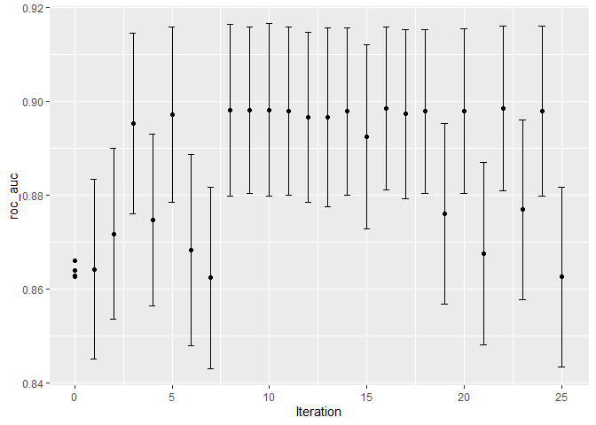
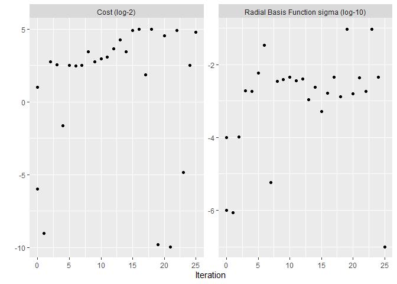
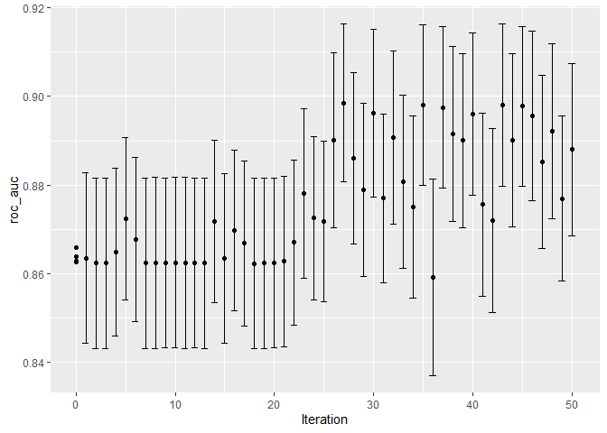
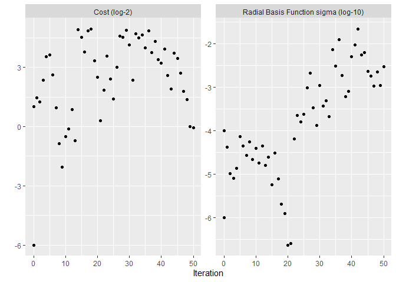

# 14 Iterative Search


```r
library(tidymodels)
```

```
## ── Attaching packages ────────────────────────────────────── tidymodels 1.1.1 ──
```

```
## ✔ broom        1.0.5     ✔ recipes      1.0.8
## ✔ dials        1.2.0     ✔ rsample      1.2.0
## ✔ dplyr        1.1.2     ✔ tibble       3.2.1
## ✔ ggplot2      3.4.4     ✔ tidyr        1.3.0
## ✔ infer        1.0.5     ✔ tune         1.1.2
## ✔ modeldata    1.2.0     ✔ workflows    1.1.3
## ✔ parsnip      1.1.1     ✔ workflowsets 1.0.1
## ✔ purrr        1.0.2     ✔ yardstick    1.2.0
```

```
## ── Conflicts ───────────────────────────────────────── tidymodels_conflicts() ──
## ✖ purrr::discard() masks scales::discard()
## ✖ dplyr::filter()  masks stats::filter()
## ✖ dplyr::lag()     masks stats::lag()
## ✖ recipes::step()  masks stats::step()
## • Dig deeper into tidy modeling with R at https://www.tmwr.org
```

```r
library(tidyverse)
```

```
## ── Attaching core tidyverse packages ──────────────────────── tidyverse 2.0.0 ──
## ✔ forcats   1.0.0     ✔ readr     2.1.4
## ✔ lubridate 1.9.2     ✔ stringr   1.5.0
```

```
## ── Conflicts ────────────────────────────────────────── tidyverse_conflicts() ──
## ✖ readr::col_factor() masks scales::col_factor()
## ✖ purrr::discard()    masks scales::discard()
## ✖ dplyr::filter()     masks stats::filter()
## ✖ stringr::fixed()    masks recipes::fixed()
## ✖ dplyr::lag()        masks stats::lag()
## ✖ readr::spec()       masks yardstick::spec()
## ℹ Use the conflicted package (<http://conflicted.r-lib.org/>) to force all conflicts to become errors
```

```r
library(doParallel)
```

```
## Loading required package: foreach
## 
## Attaching package: 'foreach'
## 
## The following objects are masked from 'package:purrr':
## 
##     accumulate, when
## 
## Loading required package: iterators
## Loading required package: parallel
```

```r
library(finetune)
```

```
## Warning: package 'finetune' was built under R version 4.3.2
```

```r
data(cells)
cells <- cells %>% select(-case)

set.seed(1304)
cell_folds <- vfold_cv(cells)

roc_res <- metric_set(roc_auc)
```

## 14.1 A SUPPORT VECTOR MACHINE MODEL


```r
tidymodels_prefer()

svm_rec <- 
  recipe(class ~ ., data = cells) %>%
  step_YeoJohnson(all_numeric_predictors()) %>%
  step_normalize(all_numeric_predictors())

svm_spec <- 
  svm_rbf(cost = tune(), rbf_sigma = tune()) %>% 
  set_engine("kernlab") %>% 
  set_mode("classification")

svm_wflow <- 
  workflow() %>% 
  add_model(svm_spec) %>% 
  add_recipe(svm_rec)
```


```r
cost()
```

```
## Cost (quantitative)
## Transformer: log-2 [1e-100, Inf]
## Range (transformed scale): [-10, 5]
```


```r
rbf_sigma()
```

```
## Radial Basis Function sigma (quantitative)
## Transformer: log-10 [1e-100, Inf]
## Range (transformed scale): [-10, 0]
```


```r
svm_param <- 
  svm_wflow %>% 
  extract_parameter_set_dials() %>% 
  update(rbf_sigma = rbf_sigma(c(-7, -1)))
```


```r
set.seed(1401)
start_grid <- 
  svm_param %>% 
  update(
    cost = cost(c(-6, 1)),
    rbf_sigma = rbf_sigma(c(-6, -4))
  ) %>% 
  grid_regular(levels = 2)

set.seed(1402)
svm_initial <- 
  svm_wflow %>% 
  tune_grid(resamples = cell_folds, grid = start_grid, metrics = roc_res)

collect_metrics(svm_initial)
```

```
## # A tibble: 4 × 8
##     cost rbf_sigma .metric .estimator  mean     n std_err .config             
##    <dbl>     <dbl> <chr>   <chr>      <dbl> <int>   <dbl> <chr>               
## 1 0.0156  0.000001 roc_auc binary     0.864    10 0.00864 Preprocessor1_Model1
## 2 2       0.000001 roc_auc binary     0.863    10 0.00867 Preprocessor1_Model2
## 3 0.0156  0.0001   roc_auc binary     0.863    10 0.00862 Preprocessor1_Model3
## 4 2       0.0001   roc_auc binary     0.866    10 0.00855 Preprocessor1_Model4
```

## 14.2 BAYESIAN OPTIMIZATION
### 14.2.1 A GAUSSIAN PROCESS MODEL
### 14.2.2 ACQUISITION FUNCTIONS
### 14.2.3 THE `tune_bayes()` FUNCTION


```r
cl <- makePSOCKcluster(6)
registerDoParallel(cl)

ctrl <- control_bayes(verbose = TRUE)

set.seed(1403)
svm_bo <-
  svm_wflow %>%
  tune_bayes(
    resamples = cell_folds,
    metrics = roc_res,
    initial = svm_initial,
    param_info = svm_param,
    iter = 25,
    control = ctrl
  )

stopCluster(cl)
```


```r
show_best(svm_bo)
```

```
## # A tibble: 5 × 9
##    cost rbf_sigma .metric .estimator  mean     n std_err .config .iter
##   <dbl>     <dbl> <chr>   <chr>      <dbl> <int>   <dbl> <chr>   <int>
## 1 30.4    0.00184 roc_auc binary     0.899    10 0.00789 Iter22     22
## 2 32.0    0.00162 roc_auc binary     0.898    10 0.00783 Iter16     16
## 3  7.77   0.00452 roc_auc binary     0.898    10 0.00827 Iter10     10
## 4  6.71   0.00392 roc_auc binary     0.898    10 0.00797 Iter9       9
## 5 11.0    0.00345 roc_auc binary     0.898    10 0.00822 Iter8       8
```


```r
autoplot(svm_bo, type = "performance")
```

<!-- -->


```r
autoplot(svm_bo, type = "parameters")
```

<!-- -->

## 14.3 SIMULATED ANNEALING
### 14.3.1 SIMULATED ANNEALING SEARCH PROCESS
### 14.3.2 THE tune_sim_anneal() FUNCTION


```r
cl <- makePSOCKcluster(6)
registerDoParallel(cl)

ctrl_sa <- control_sim_anneal(verbose = TRUE, no_improve = 10L)

set.seed(1404)
svm_sa <-
  svm_wflow %>%
  tune_sim_anneal(
    resamples = cell_folds,
    metrics = roc_res,
    initial = svm_initial,
    param_info = svm_param,
    iter = 50,
    control = ctrl_sa
  )

stopCluster(cl)
```


```r
autoplot(svm_sa, type = "performance")
```

<!-- -->


```r
autoplot(svm_sa, type = "parameters")
```

<!-- -->

## 14.4 CHAPTER SUMMARY
