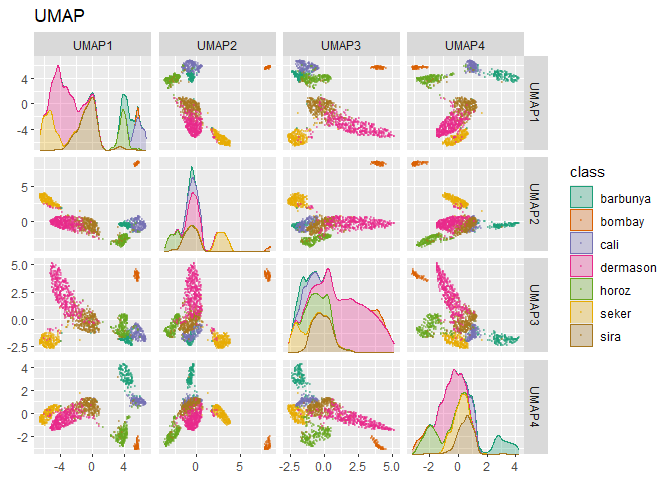

# 16. Dimensionality Reduction
## 16.1 WHAT PROBLEMS CAN DIMENSIONALITY REDUCTION SOLVE?
## 16.2 A PICTURE IS WORTH A THOUSAND… BEANS


```r
library(tidymodels)
```

```
## Warning: package 'tidymodels' was built under R version 4.3.3
```

```
## ── Attaching packages ────────────────────────────────────── tidymodels 1.2.0 ──
```

```
## ✔ broom        1.0.5      ✔ recipes      1.0.10
## ✔ dials        1.2.1      ✔ rsample      1.2.1 
## ✔ dplyr        1.1.4      ✔ tibble       3.2.1 
## ✔ ggplot2      3.5.0      ✔ tidyr        1.3.1 
## ✔ infer        1.0.7      ✔ tune         1.2.0 
## ✔ modeldata    1.3.0      ✔ workflows    1.1.4 
## ✔ parsnip      1.2.1      ✔ workflowsets 1.1.0 
## ✔ purrr        1.0.2      ✔ yardstick    1.3.1
```

```
## Warning: package 'dials' was built under R version 4.3.3
```

```
## Warning: package 'scales' was built under R version 4.3.3
```

```
## Warning: package 'dplyr' was built under R version 4.3.3
```

```
## Warning: package 'ggplot2' was built under R version 4.3.3
```

```
## Warning: package 'infer' was built under R version 4.3.3
```

```
## Warning: package 'modeldata' was built under R version 4.3.3
```

```
## Warning: package 'parsnip' was built under R version 4.3.3
```

```
## Warning: package 'recipes' was built under R version 4.3.3
```

```
## Warning: package 'rsample' was built under R version 4.3.3
```

```
## Warning: package 'tidyr' was built under R version 4.3.3
```

```
## Warning: package 'tune' was built under R version 4.3.3
```

```
## Warning: package 'workflows' was built under R version 4.3.3
```

```
## Warning: package 'workflowsets' was built under R version 4.3.3
```

```
## Warning: package 'yardstick' was built under R version 4.3.3
```

```
## ── Conflicts ───────────────────────────────────────── tidymodels_conflicts() ──
## ✖ purrr::discard() masks scales::discard()
## ✖ dplyr::filter()  masks stats::filter()
## ✖ dplyr::lag()     masks stats::lag()
## ✖ recipes::step()  masks stats::step()
## • Dig deeper into tidy modeling with R at https://www.tmwr.org
```

```r
tidymodels_prefer()
library(beans)
```

```
## Warning: package 'beans' was built under R version 4.3.3
```


```r
set.seed(1601)
bean_split <- initial_validation_split(beans, strata = class, prop = c(0.75, 0.125))
```

```
## Warning: Too little data to stratify.
## • Resampling will be unstratified.
```


```r
bean_split
```

```
## <Training/Validation/Testing/Total>
## <10206/1702/1703/13611>
```


```r
# Return data frames:
bean_train <- training(bean_split)
bean_test <- testing(bean_split)
bean_validation <- validation(bean_split)
```


```r
set.seed(1602)
# Return an 'rset' object to use with the tune functions:
bean_val <- validation_set(bean_split)
bean_val$splits[[1]]
```

```
## <Training/Validation/Total>
## <10206/1702/11908>
```


```r
library(corrplot)
```

```
## Warning: package 'corrplot' was built under R version 4.3.3
```

```
## corrplot 0.92 loaded
```

```r
tmwr_cols <- colorRampPalette(c("#91CBD765", "#CA225E"))
bean_train %>% 
  select(-class) %>% 
  cor() %>% 
  corrplot(col = tmwr_cols(200), tl.col = "black", method = "ellipse")
```

<!-- -->

## 16.3 A STARTER RECIPE


```r
library(bestNormalize)
```

```
## Warning: package 'bestNormalize' was built under R version 4.3.3
```

```r
bean_rec <-
  # Use the training data from the bean_val split object
  recipe(class ~ ., data = bean_train) %>%
  step_zv(all_numeric_predictors()) %>%
  step_orderNorm(all_numeric_predictors()) %>% 
  step_normalize(all_numeric_predictors())
```

## 16.4 RECIPES IN THE WILD
### 16.4.1 PREPARING A RECIPE


```r
bean_rec_trained <- prep(bean_rec)
bean_rec_trained
```

```
## 
```

```
## ── Recipe ──────────────────────────────────────────────────────────────────────
```

```
## 
```

```
## ── Inputs
```

```
## Number of variables by role
```

```
## outcome:    1
## predictor: 16
```

```
## 
```

```
## ── Training information
```

```
## Training data contained 10206 data points and no incomplete rows.
```

```
## 
```

```
## ── Operations
```

```
## • Zero variance filter removed: <none> | Trained
```

```
## • orderNorm transformation on: area and perimeter, ... | Trained
```

```
## • Centering and scaling for: area and perimeter, ... | Trained
```

```r
bean_rec_trained %>% 
  step_dummy(cornbread) %>%  # <- not a real predictor
  prep(verbose = TRUE)
```

```
## oper 1 step zv [pre-trained]
## oper 2 step orderNorm [pre-trained]
## oper 3 step normalize [pre-trained]
## oper 4 step dummy [training]
```

```
## Error in `step_dummy()`:
## Caused by error in `prep()`:
## ! Can't select columns that don't exist.
## ✖ Column `cornbread` doesn't exist.
```


```r
show_variables <- 
  bean_rec %>% 
  prep(log_changes = TRUE)
```

```
## step_zv (zv_RLYwH): same number of columns
## 
## step_orderNorm (orderNorm_Jx8oD): same number of columns
## 
## step_normalize (normalize_GU75D): same number of columns
```

### 16.4.2 BAKING THE RECIPE


```r
bean_val_processed <- bake(bean_rec_trained, new_data = bean_validation)
```


```r
library(patchwork)
```

```
## Warning: package 'patchwork' was built under R version 4.3.3
```

```r
p1 <- 
  bean_validation %>% 
  ggplot(aes(x = area)) + 
  geom_histogram(bins = 30, color = "white", fill = "blue", alpha = 1/3) + 
  ggtitle("Original validation set data")

p2 <- 
  bean_val_processed %>% 
  ggplot(aes(x = area)) + 
  geom_histogram(bins = 30, color = "white", fill = "red", alpha = 1/3) + 
  ggtitle("Processed validation set data")

p1 + p2
```

<!-- -->


```r
bake(bean_rec_trained, new_data = NULL) %>% nrow()
```

```
## [1] 10206
```

```r
bean_train %>% nrow()
```

```
## [1] 10206
```

## 16.5 FEATURE EXTRACTION TECHNIQUES


```r
library(ggforce)
```

```
## Warning: package 'ggforce' was built under R version 4.3.3
```

```r
plot_validation_results <- function(recipe, dat = bean_validation) {
  recipe %>%
    # Estimate any additional steps
    prep() %>%
    # Process the data (the validation set by default)
    bake(new_data = dat) %>%
    # Create the scatterplot matrix
    ggplot(aes(x = .panel_x, y = .panel_y, color = class, fill = class)) +
    geom_point(alpha = 0.4, size = 0.5) +
    geom_autodensity(alpha = .3) +
    facet_matrix(vars(-class), layer.diag = 2) + 
    scale_color_brewer(palette = "Dark2") + 
    scale_fill_brewer(palette = "Dark2")
}
```

### 16.5.1 PRINCIPAL COMPONENT ANALYSIS


```r
bean_rec_trained %>%
  step_pca(all_numeric_predictors(), num_comp = 4) %>%
  plot_validation_results() + 
  ggtitle("Principal Component Analysis")
```

<!-- -->


```r
library(learntidymodels)
```

```
## Loading required package: tidyverse
```

```
## Warning: package 'readr' was built under R version 4.3.3
```

```
## Warning: package 'stringr' was built under R version 4.3.3
```

```
## Warning: package 'lubridate' was built under R version 4.3.3
```

```
## ── Attaching core tidyverse packages ──────────────────────── tidyverse 2.0.0 ──
## ✔ forcats   1.0.0     ✔ readr     2.1.5
## ✔ lubridate 1.9.3     ✔ stringr   1.5.1
```

```
## ── Conflicts ────────────────────────────────────────── tidyverse_conflicts() ──
## ✖ readr::col_factor() masks scales::col_factor()
## ✖ purrr::discard()    masks scales::discard()
## ✖ dplyr::filter()     masks stats::filter()
## ✖ stringr::fixed()    masks recipes::fixed()
## ✖ dplyr::lag()        masks stats::lag()
## ✖ readr::spec()       masks yardstick::spec()
## ℹ Use the conflicted package (<http://conflicted.r-lib.org/>) to force all conflicts to become errors
```

```r
bean_rec_trained %>%
  step_pca(all_numeric_predictors(), num_comp = 4) %>% 
  prep() %>% 
  plot_top_loadings(component_number <= 4, n = 5) + 
  scale_fill_brewer(palette = "Paired") +
  ggtitle("Principal Component Analysis")
```

<!-- -->

### 16.5.2 PARTIAL LEAST SQUARES


```r
bean_rec_trained %>%
  step_pls(all_numeric_predictors(), outcome = "class", num_comp = 4) %>%
  plot_validation_results() + 
  ggtitle("Partial Least Squares")
```

<!-- -->


```r
bean_rec_trained %>%
  step_pls(all_numeric_predictors(), outcome = "class", num_comp = 4) %>%
  prep() %>% 
  plot_top_loadings(component_number <= 4, n = 5, type = "pls") + 
  scale_fill_brewer(palette = "Paired") +
  ggtitle("Partial Least Squares")
```

<!-- -->

### 16.5.3 INDEPENDENT COMPONENT ANALYSIS


```r
bean_rec_trained %>%
  step_ica(all_numeric_predictors(), num_comp = 4) %>%
  plot_validation_results() + 
  ggtitle("Independent Component Analysis")
```

<!-- -->

### 16.5.4 UNIFORM MANIFOLD APPROXIMATION AND PROJECTION


```r
library(embed)
```

```
## Warning: package 'embed' was built under R version 4.3.3
```

```r
bean_rec_trained %>%
  step_umap(all_numeric_predictors(), num_comp = 4) %>%
  plot_validation_results() +
  ggtitle("UMAP")
```

<!-- -->


```r
bean_rec_trained %>%
  step_umap(all_numeric_predictors(), outcome = "class", num_comp = 4) %>%
  plot_validation_results() +
  ggtitle("UMAP (supervised)")
```

<!-- -->

## 16.6 MODELING


```r
library(baguette)
```

```
## Warning: package 'baguette' was built under R version 4.3.3
```

```r
library(discrim)
```

```
## Warning: package 'discrim' was built under R version 4.3.3
```

```r
mlp_spec <-
  mlp(hidden_units = tune(), penalty = tune(), epochs = tune()) %>%
  set_engine('nnet') %>%
  set_mode('classification')

bagging_spec <-
  bag_tree() %>%
  set_engine('rpart') %>%
  set_mode('classification')

fda_spec <-
  discrim_flexible(
    prod_degree = tune()
  ) %>%
  set_engine('earth')

rda_spec <-
  discrim_regularized(frac_common_cov = tune(), frac_identity = tune()) %>%
  set_engine('klaR')

bayes_spec <-
  naive_Bayes() %>%
  set_engine('klaR')
```


```r
bean_rec <-
  recipe(class ~ ., data = bean_train) %>%
  step_zv(all_numeric_predictors()) %>%
  step_orderNorm(all_numeric_predictors()) %>%
  step_normalize(all_numeric_predictors())

pls_rec <- 
  bean_rec %>% 
  step_pls(all_numeric_predictors(), outcome = "class", num_comp = tune())

umap_rec <-
  bean_rec %>%
  step_umap(
    all_numeric_predictors(),
    outcome = "class",
    num_comp = tune(),
    neighbors = tune(),
    min_dist = tune()
  )
```


```r
ctrl <- control_grid(parallel_over = "everything")
bean_res <- 
  workflow_set(
    preproc = list(basic = class ~., pls = pls_rec, umap = umap_rec), 
    models = list(bayes = bayes_spec, fda = fda_spec,
                  rda = rda_spec, bag = bagging_spec,
                  mlp = mlp_spec)
  ) %>% 
  workflow_map(
    verbose = TRUE,
    seed = 1603,
    resamples = bean_val,
    grid = 10,
    metrics = metric_set(roc_auc),
    control = ctrl
  )
```

```
## i	No tuning parameters. `fit_resamples()` will be attempted
```

```
## i  1 of 15 resampling: basic_bayes
```

```
## Warning: package 'klaR' was built under R version 4.3.3
```

```
## Warning: package 'MASS' was built under R version 4.3.3
```

```
## → A | warning: Numerical 0 probability for all classes with observation 1, Numerical 0 probability for all classes with observation 10, Numerical 0 probability for all classes with observation 31, Numerical 0 probability for all classes with observation 62, Numerical 0 probability for all classes with observation 94, Numerical 0 probability for all classes with observation 182, Numerical 0 probability for all classes with observation 219, Numerical 0 probability for all classes with observation 252, Numerical 0 probability for all classes with observation 253, Numerical 0 probability for all classes with observation 254, Numerical 0 probability for all classes with observation 255, Numerical 0 probability for all classes with observation 257, Numerical 0 probability for all classes with observation 260, Numerical 0 probability for all classes with observation 262, Numerical 0 probability for all classes with observation 269, Numerical 0 probability for all classes with observation 308, Numerical 0 probability for all classes with observation 314, Numerical 0 probability for all classes with observation 319, Numerical 0 probability for all classes with observation 320, Numerical 0 probability for all classes with observation 394, Numerical 0 probability for all classes with observation 416, Numerical 0 probability for all classes with observation 418, Numerical 0 probability for all classes with observation 419, Numerical 0 probability for all classes with observation 433, Numerical 0 probability for all classes with observation 436, Numerical 0 probability for all classes with observation 440, Numerical 0 probability for all classes with observation 442, Numerical 0 probability for all classes with observation 445, Numerical 0 probability for all classes with observation 476, Numerical 0 probability for all classes with observation 480, Numerical 0 probability for all classes with observation 481, Numerical 0 probability for all classes with observation 482, Numerical 0 probability for all classes with observation 483, Numerical 0 probability for all classes with observation 645, Numerical 0 probability for all classes with observation 669, Numerical 0 probability for all classes with observation 678, Numerical 0 probability for all classes with observation 680, Numerical 0 probability for all classes with observation 681, Numerical 0 probability for all classes with observation 682, Numerical 0 probability for all classes with observation 683, Numerical 0 probability for all classes with observation 684, Numerical 0 probability for all classes with observation 686, Numerical 0 probability for all classes with observation 689, Numerical 0 probability for all classes with observation 720, Numerical 0 probability for all classes with observation 724, Numerical 0 probability for all classes with observation 728, Numerical 0 probability for all classes with observation 761, Numerical 0 probability for all classes with observation 762, Numerical 0 probability for all classes with observation 777, Numerical 0 probability for all classes with observation 798, Numerical 0 probability for all classes with observation 799, Numerical 0 probability for all classes with observation 863, Numerical 0 probability for all classes with observation 909, Numerical 0 probability for all classes with observation 916, Numerical 0 probability for all classes with observation 918, Numerical 0 probability for all classes with observation 922, Numerical 0 probability for all classes with observation 923, Numerical 0 probability for all classes with observation 924, Numerical 0 probability for all classes with observation 925, Numerical 0 probability for all classes with observation 966, Numerical 0 probability for all classes with observation 990, Numerical 0 probability for all classes with observation 1005, Numerical 0 probability for all classes with observation 1240, Numerical 0 probability for all classes with observation 1265, Numerical 0 probability for all classes with observation 1266, Numerical 0 probability for all classes with observation 1267, Numerical 0 probability for all classes with observation 1268, Numerical 0 probability for all classes with observation 1270, Numerical 0 probability for all classes with observation 1277, Numerical 0 probability for all classes with observation 1278, Numerical 0 probability for all classes with observation 1291, Numerical 0 probability for all classes with observation 1296, Numerical 0 probability for all classes with observation 1307, Numerical 0 probability for all classes with observation 1329, Numerical 0 probability for all classes with observation 1353, Numerical 0 probability for all classes with observation 1376, Numerical 0 probability for all classes with observation 1499, Numerical 0 probability for all classes with observation 1506, Numerical 0 probability for all classes with observation 1549, Numerical 0 probability for all classes with observation 1568, Numerical 0 probability for all classes with observation 1590, Numerical 0 probability for all classes with observation 1640, Numerical 0 probability for all classes with observation 1660
```

```
## 
There were issues with some computations   A: x1

There were issues with some computations   A: x1
## ✔  1 of 15 resampling: basic_bayes (5.9s)
## i  2 of 15 tuning:     basic_fda
```

```
## Warning: package 'mda' was built under R version 4.3.3
```

```
## Warning: package 'earth' was built under R version 4.3.3
```

```
## Warning: package 'plotmo' was built under R version 4.3.3
```

```
## Warning: package 'plotrix' was built under R version 4.3.2
```

```
## ✔  2 of 15 tuning:     basic_fda (2.7s)
## i  3 of 15 tuning:     basic_rda
## ✔  3 of 15 tuning:     basic_rda (11.7s)
## i	No tuning parameters. `fit_resamples()` will be attempted
## i  4 of 15 resampling: basic_bag
```

```
## Warning: package 'rpart' was built under R version 4.3.3
```

```
## ✔  4 of 15 resampling: basic_bag (2s)
## i  5 of 15 tuning:     basic_mlp
## ✔  5 of 15 tuning:     basic_mlp (14.5s)
## i  6 of 15 tuning:     pls_bayes
```

```
## Warning: package 'lattice' was built under R version 4.3.3
```

```
## ✔  6 of 15 tuning:     pls_bayes (16.9s)
## i  7 of 15 tuning:     pls_fda
## ✔  7 of 15 tuning:     pls_fda (19.1s)
## i  8 of 15 tuning:     pls_rda
## ✔  8 of 15 tuning:     pls_rda (39.6s)
## i  9 of 15 tuning:     pls_bag
## ✔  9 of 15 tuning:     pls_bag (15.6s)
## i 10 of 15 tuning:     pls_mlp
## ✔ 10 of 15 tuning:     pls_mlp (1m 26.8s)
## i 11 of 15 tuning:     umap_bayes
```

```
## Warning: package 'uwot' was built under R version 4.3.3
```

```
## Warning: package 'Matrix' was built under R version 4.3.3
```

```
## → A | warning: Numerical 0 probability for all classes with observation 59, Numerical 0 probability for all classes with observation 128, Numerical 0 probability for all classes with observation 179, Numerical 0 probability for all classes with observation 196, Numerical 0 probability for all classes with observation 219, Numerical 0 probability for all classes with observation 245, Numerical 0 probability for all classes with observation 251, Numerical 0 probability for all classes with observation 257, Numerical 0 probability for all classes with observation 262, Numerical 0 probability for all classes with observation 263, Numerical 0 probability for all classes with observation 269, Numerical 0 probability for all classes with observation 273, Numerical 0 probability for all classes with observation 282, Numerical 0 probability for all classes with observation 287, Numerical 0 probability for all classes with observation 296, Numerical 0 probability for all classes with observation 317, Numerical 0 probability for all classes with observation 325, Numerical 0 probability for all classes with observation 338, Numerical 0 probability for all classes with observation 366, Numerical 0 probability for all classes with observation 368, Numerical 0 probability for all classes with observation 386, Numerical 0 probability for all classes with observation 395, Numerical 0 probability for all classes with observation 398, Numerical 0 probability for all classes with observation 442, Numerical 0 probability for all classes with observation 445, Numerical 0 probability for all classes with observation 488, Numerical 0 probability for all classes with observation 490, Numerical 0 probability for all classes with observation 492, Numerical 0 probability for all classes with observation 494, Numerical 0 probability for all classes with observation 496, Numerical 0 probability for all classes with observation 500, Numerical 0 probability for all classes with observation 511, Numerical 0 probability for all classes with observation 518, Numerical 0 probability for all classes with observation 683, Numerical 0 probability for all classes with observation 685, Numerical 0 probability for all classes with observation 731, Numerical 0 probability for all classes with observation 798, Numerical 0 probability for all classes with observation 799, Numerical 0 probability for all classes with observation 904, Numerical 0 probability for all classes with observation 922, Numerical 0 probability for all classes with observation 924, Numerical 0 probability for all classes with observation 929, Numerical 0 probability for all classes with observation 930, Numerical 0 probability for all classes with observation 932, Numerical 0 probability for all classes with observation 936, Numerical 0 probability for all classes with observation 941, Numerical 0 probability for all classes with observation 943, Numerical 0 probability for all classes with observation 948, Numerical 0 probability for all classes with observation 954, Numerical 0 probability for all classes with observation 957, Numerical 0 probability for all classes with observation 958, Numerical 0 probability for all classes with observation 959, Numerical 0 probability for all classes with observation 960, Numerical 0 probability for all classes with observation 964, Numerical 0 probability for all classes with observation 965, Numerical 0 probability for all classes with observation 967, Numerical 0 probability for all classes with observation 970, Numerical 0 probability for all classes with observation 972, Numerical 0 probability for all classes with observation 975, Numerical 0 probability for all classes with observation 976, Numerical 0 probability for all classes with observation 979, Numerical 0 probability for all classes with observation 980, Numerical 0 probability for all classes with observation 981, Numerical 0 probability for all classes with observation 982, Numerical 0 probability for all classes with observation 987, Numerical 0 probability for all classes with observation 988, Numerical 0 probability for all classes with observation 992, Numerical 0 probability for all classes with observation 995, Numerical 0 probability for all classes with observation 996, Numerical 0 probability for all classes with observation 998, Numerical 0 probability for all classes with observation 1000, Numerical 0 probability for all classes with observation 1002, Numerical 0 probability for all classes with observation 1005, Numerical 0 probability for all classes with observation 1007, Numerical 0 probability for all classes with observation 1030, Numerical 0 probability for all classes with observation 1073, Numerical 0 probability for all classes with observation 1088, Numerical 0 probability for all classes with observation 1152, Numerical 0 probability for all classes with observation 1188, Numerical 0 probability for all classes with observation 1228, Numerical 0 probability for all classes with observation 1246, Numerical 0 probability for all classes with observation 1250, Numerical 0 probability for all classes with observation 1251, Numerical 0 probability for all classes with observation 1263, Numerical 0 probability for all classes with observation 1264, Numerical 0 probability for all classes with observation 1559, Numerical 0 probability for all classes with observation 1566, Numerical 0 probability for all classes with observation 1568, Numerical 0 probability for all classes with observation 1575, Numerical 0 probability for all classes with observation 1587, Numerical 0 probability for all classes with observation 1590, Numerical 0 probability for all classes with observation 1606, Numerical 0 probability for all classes with observation 1613, Numerical 0 probability for all classes with observation 1614, Numerical 0 probability for all classes with observation 1617, Numerical 0 probability for all classes with observation 1625, Numerical 0 probability for all classes with observation 1627, Numerical 0 probability for all classes with observation 1631, Numerical 0 probability for all classes with observation 1632, Numerical 0 probability for all classes with observation 1638, Numerical 0 probability for all classes with observation 1640, Numerical 0 probability for all classes with observation 1643, Numerical 0 probability for all classes with observation 1651, Numerical 0 probability for all classes with observation 1660, Numerical 0 probability for all classes with observation 1664, Numerical 0 probability for all classes with observation 1665, Numerical 0 probability for all classes with observation 1666, Numerical 0 probability for all classes with observation 1667, Numerical 0 probability for all classes with observation 1671, Numerical 0 probability for all classes with observation 1673, Numerical 0 probability for all classes with observation 1674, Numerical 0 probability for all classes with observation 1676, Numerical 0 probability for all classes with observation 1677, Numerical 0 probability for all classes with observation 1678, Numerical 0 probability for all classes with observation 1683, Numerical 0 probability for all classes with observation 1686, Numerical 0 probability for all classes with observation 1688, Numerical 0 probability for all classes with observation 1689, Numerical 0 probability for all classes with observation 1691, Numerical 0 probability for all classes with observation 1692, Numerical 0 probability for all classes with observation 1697, Numerical 0 probability for all classes with observation 1698, Numerical 0 probability for all classes with observation 1701, Numerical 0 probability for all classes with observation 1702
## 
There were issues with some computations   A: x1

                                                 
→ B | warning: Numerical 0 probability for all classes with observation 54, Numerical 0 probability for all classes with observation 89, Numerical 0 probability for all classes with observation 262, Numerical 0 probability for all classes with observation 436, Numerical 0 probability for all classes with observation 440, Numerical 0 probability for all classes with observation 445, Numerical 0 probability for all classes with observation 449, Numerical 0 probability for all classes with observation 1057, Numerical 0 probability for all classes with observation 1073, Numerical 0 probability for all classes with observation 1251, Numerical 0 probability for all classes with observation 1559, Numerical 0 probability for all classes with observation 1566, Numerical 0 probability for all classes with observation 1613
## There were issues with some computations   A: x1

There were issues with some computations   A: x1   B: x1

                                                         
→ C | warning: Numerical 0 probability for all classes with observation 54, Numerical 0 probability for all classes with observation 59, Numerical 0 probability for all classes with observation 85, Numerical 0 probability for all classes with observation 89, Numerical 0 probability for all classes with observation 128, Numerical 0 probability for all classes with observation 179, Numerical 0 probability for all classes with observation 196, Numerical 0 probability for all classes with observation 245, Numerical 0 probability for all classes with observation 251, Numerical 0 probability for all classes with observation 262, Numerical 0 probability for all classes with observation 263, Numerical 0 probability for all classes with observation 269, Numerical 0 probability for all classes with observation 281, Numerical 0 probability for all classes with observation 282, Numerical 0 probability for all classes with observation 286, Numerical 0 probability for all classes with observation 287, Numerical 0 probability for all classes with observation 296, Numerical 0 probability for all classes with observation 317, Numerical 0 probability for all classes with observation 338, Numerical 0 probability for all classes with observation 366, Numerical 0 probability for all classes with observation 368, Numerical 0 probability for all classes with observation 386, Numerical 0 probability for all classes with observation 395, Numerical 0 probability for all classes with observation 436, Numerical 0 probability for all classes with observation 442, Numerical 0 probability for all classes with observation 445, Numerical 0 probability for all classes with observation 488, Numerical 0 probability for all classes with observation 490, Numerical 0 probability for all classes with observation 492, Numerical 0 probability for all classes with observation 494, Numerical 0 probability for all classes with observation 496, Numerical 0 probability for all classes with observation 510, Numerical 0 probability for all classes with observation 518, Numerical 0 probability for all classes with observation 520, Numerical 0 probability for all classes with observation 683, Numerical 0 probability for all classes with observation 685, Numerical 0 probability for all classes with observation 686, Numerical 0 probability for all classes with observation 691, Numerical 0 probability for all classes with observation 722, Numerical 0 probability for all classes with observation 731, Numerical 0 probability for all classes with observation 798, Numerical 0 probability for all classes with observation 799, Numerical 0 probability for all classes with observation 875, Numerical 0 probability for all classes with observation 904, Numerical 0 probability for all classes with observation 922, Numerical 0 probability for all classes with observation 924, Numerical 0 probability for all classes with observation 929, Numerical 0 probability for all classes with observation 930, Numerical 0 probability for all classes with observation 932, Numerical 0 probability for all classes with observation 936, Numerical 0 probability for all classes with observation 940, Numerical 0 probability for all classes with observation 941, Numerical 0 probability for all classes with observation 942, Numerical 0 probability for all classes with observation 943, Numerical 0 probability for all classes with observation 948, Numerical 0 probability for all classes with observation 954, Numerical 0 probability for all classes with observation 955, Numerical 0 probability for all classes with observation 957, Numerical 0 probability for all classes with observation 958, Numerical 0 probability for all classes with observation 959, Numerical 0 probability for all classes with observation 960, Numerical 0 probability for all classes with observation 963, Numerical 0 probability for all classes with observation 964, Numerical 0 probability for all classes with observation 965, Numerical 0 probability for all classes with observation 966, Numerical 0 probability for all classes with observation 967, Numerical 0 probability for all classes with observation 970, Numerical 0 probability for all classes with observation 972, Numerical 0 probability for all classes with observation 975, Numerical 0 probability for all classes with observation 976, Numerical 0 probability for all classes with observation 979, Numerical 0 probability for all classes with observation 980, Numerical 0 probability for all classes with observation 981, Numerical 0 probability for all classes with observation 982, Numerical 0 probability for all classes with observation 986, Numerical 0 probability for all classes with observation 987, Numerical 0 probability for all classes with observation 988, Numerical 0 probability for all classes with observation 992, Numerical 0 probability for all classes with observation 993, Numerical 0 probability for all classes with observation 995, Numerical 0 probability for all classes with observation 996, Numerical 0 probability for all classes with observation 998, Numerical 0 probability for all classes with observation 1000, Numerical 0 probability for all classes with observation 1002, Numerical 0 probability for all classes with observation 1005, Numerical 0 probability for all classes with observation 1007, Numerical 0 probability for all classes with observation 1030, Numerical 0 probability for all classes with observation 1057, Numerical 0 probability for all classes with observation 1073, Numerical 0 probability for all classes with observation 1088, Numerical 0 probability for all classes with observation 1135, Numerical 0 probability for all classes with observation 1152, Numerical 0 probability for all classes with observation 1186, Numerical 0 probability for all classes with observation 1188, Numerical 0 probability for all classes with observation 1228, Numerical 0 probability for all classes with observation 1240, Numerical 0 probability for all classes with observation 1246, Numerical 0 probability for all classes with observation 1250, Numerical 0 probability for all classes with observation 1251, Numerical 0 probability for all classes with observation 1263, Numerical 0 probability for all classes with observation 1264, Numerical 0 probability for all classes with observation 1376, Numerical 0 probability for all classes with observation 1549, Numerical 0 probability for all classes with observation 1559, Numerical 0 probability for all classes with observation 1566, Numerical 0 probability for all classes with observation 1568, Numerical 0 probability for all classes with observation 1575, Numerical 0 probability for all classes with observation 1587, Numerical 0 probability for all classes with observation 1590, Numerical 0 probability for all classes with observation 1606, Numerical 0 probability for all classes with observation 1613, Numerical 0 probability for all classes with observation 1614, Numerical 0 probability for all classes with observation 1617, Numerical 0 probability for all classes with observation 1625, Numerical 0 probability for all classes with observation 1627, Numerical 0 probability for all classes with observation 1628, Numerical 0 probability for all classes with observation 1631, Numerical 0 probability for all classes with observation 1632, Numerical 0 probability for all classes with observation 1637, Numerical 0 probability for all classes with observation 1638, Numerical 0 probability for all classes with observation 1640, Numerical 0 probability for all classes with observation 1643, Numerical 0 probability for all classes with observation 1648, Numerical 0 probability for all classes with observation 1650, Numerical 0 probability for all classes with observation 1651, Numerical 0 probability for all classes with observation 1652, Numerical 0 probability for all classes with observation 1656, Numerical 0 probability for all classes with observation 1658, Numerical 0 probability for all classes with observation 1660, Numerical 0 probability for all classes with observation 1664, Numerical 0 probability for all classes with observation 1665, Numerical 0 probability for all classes with observation 1666, Numerical 0 probability for all classes with observation 1667, Numerical 0 probability for all classes with observation 1671, Numerical 0 probability for all classes with observation 1672, Numerical 0 probability for all classes with observation 1673, Numerical 0 probability for all classes with observation 1674, Numerical 0 probability for all classes with observation 1675, Numerical 0 probability for all classes with observation 1676, Numerical 0 probability for all classes with observation 1677, Numerical 0 probability for all classes with observation 1678, Numerical 0 probability for all classes with observation 1679, Numerical 0 probability for all classes with observation 1680, Numerical 0 probability for all classes with observation 1681, Numerical 0 probability for all classes with observation 1683, Numerical 0 probability for all classes with observation 1686, Numerical 0 probability for all classes with observation 1688, Numerical 0 probability for all classes with observation 1689, Numerical 0 probability for all classes with observation 1691, Numerical 0 probability for all classes with observation 1692, Numerical 0 probability for all classes with observation 1694, Numerical 0 probability for all classes with observation 1695, Numerical 0 probability for all classes with observation 1696, Numerical 0 probability for all classes with observation 1697, Numerical 0 probability for all classes with observation 1698, Numerical 0 probability for all classes with observation 1701, Numerical 0 probability for all classes with observation 1702
## There were issues with some computations   A: x1   B: x1

There were issues with some computations   A: x1   B: x1   C: x1

                                                                 
→ D | warning: Numerical 0 probability for all classes with observation 179, Numerical 0 probability for all classes with observation 219, Numerical 0 probability for all classes with observation 486, Numerical 0 probability for all classes with observation 488, Numerical 0 probability for all classes with observation 922, Numerical 0 probability for all classes with observation 924, Numerical 0 probability for all classes with observation 965, Numerical 0 probability for all classes with observation 1250, Numerical 0 probability for all classes with observation 1568
## There were issues with some computations   A: x1   B: x1   C: x1

There were issues with some computations   A: x1   B: x1   C: x1   D: x1

                                                                         
→ E | warning: Numerical 0 probability for all classes with observation 1613
## There were issues with some computations   A: x1   B: x1   C: x1   D: x1

There were issues with some computations   A: x1   B: x1   C: x1   D: x1   E: x1

                                                                                 
→ F | warning: Numerical 0 probability for all classes with observation 54, Numerical 0 probability for all classes with observation 59, Numerical 0 probability for all classes with observation 85, Numerical 0 probability for all classes with observation 89, Numerical 0 probability for all classes with observation 128, Numerical 0 probability for all classes with observation 179, Numerical 0 probability for all classes with observation 196, Numerical 0 probability for all classes with observation 245, Numerical 0 probability for all classes with observation 251, Numerical 0 probability for all classes with observation 262, Numerical 0 probability for all classes with observation 263, Numerical 0 probability for all classes with observation 269, Numerical 0 probability for all classes with observation 281, Numerical 0 probability for all classes with observation 282, Numerical 0 probability for all classes with observation 286, Numerical 0 probability for all classes with observation 287, Numerical 0 probability for all classes with observation 296, Numerical 0 probability for all classes with observation 317, Numerical 0 probability for all classes with observation 338, Numerical 0 probability for all classes with observation 366, Numerical 0 probability for all classes with observation 368, Numerical 0 probability for all classes with observation 379, Numerical 0 probability for all classes with observation 381, Numerical 0 probability for all classes with observation 386, Numerical 0 probability for all classes with observation 395, Numerical 0 probability for all classes with observation 417, Numerical 0 probability for all classes with observation 436, Numerical 0 probability for all classes with observation 442, Numerical 0 probability for all classes with observation 445, Numerical 0 probability for all classes with observation 488, Numerical 0 probability for all classes with observation 490, Numerical 0 probability for all classes with observation 492, Numerical 0 probability for all classes with observation 494, Numerical 0 probability for all classes with observation 496, Numerical 0 probability for all classes with observation 510, Numerical 0 probability for all classes with observation 516, Numerical 0 probability for all classes with observation 518, Numerical 0 probability for all classes with observation 520, Numerical 0 probability for all classes with observation 683, Numerical 0 probability for all classes with observation 685, Numerical 0 probability for all classes with observation 686, Numerical 0 probability for all classes with observation 691, Numerical 0 probability for all classes with observation 731, Numerical 0 probability for all classes with observation 798, Numerical 0 probability for all classes with observation 799, Numerical 0 probability for all classes with observation 904, Numerical 0 probability for all classes with observation 906, Numerical 0 probability for all classes with observation 922, Numerical 0 probability for all classes with observation 924, Numerical 0 probability for all classes with observation 932, Numerical 0 probability for all classes with observation 936, Numerical 0 probability for all classes with observation 940, Numerical 0 probability for all classes with observation 943, Numerical 0 probability for all classes with observation 948, Numerical 0 probability for all classes with observation 955, Numerical 0 probability for all classes with observation 959, Numerical 0 probability for all classes with observation 960, Numerical 0 probability for all classes with observation 963, Numerical 0 probability for all classes with observation 964, Numerical 0 probability for all classes with observation 965, Numerical 0 probability for all classes with observation 966, Numerical 0 probability for all classes with observation 967, Numerical 0 probability for all classes with observation 970, Numerical 0 probability for all classes with observation 972, Numerical 0 probability for all classes with observation 975, Numerical 0 probability for all classes with observation 976, Numerical 0 probability for all classes with observation 979, Numerical 0 probability for all classes with observation 980, Numerical 0 probability for all classes with observation 981, Numerical 0 probability for all classes with observation 982, Numerical 0 probability for all classes with observation 986, Numerical 0 probability for all classes with observation 987, Numerical 0 probability for all classes with observation 992, Numerical 0 probability for all classes with observation 995, Numerical 0 probability for all classes with observation 996, Numerical 0 probability for all classes with observation 998, Numerical 0 probability for all classes with observation 1000, Numerical 0 probability for all classes with observation 1002, Numerical 0 probability for all classes with observation 1005, Numerical 0 probability for all classes with observation 1007, Numerical 0 probability for all classes with observation 1030, Numerical 0 probability for all classes with observation 1057, Numerical 0 probability for all classes with observation 1073, Numerical 0 probability for all classes with observation 1152, Numerical 0 probability for all classes with observation 1246, Numerical 0 probability for all classes with observation 1250, Numerical 0 probability for all classes with observation 1251, Numerical 0 probability for all classes with observation 1263, Numerical 0 probability for all classes with observation 1264, Numerical 0 probability for all classes with observation 1559, Numerical 0 probability for all classes with observation 1566, Numerical 0 probability for all classes with observation 1568, Numerical 0 probability for all classes with observation 1575, Numerical 0 probability for all classes with observation 1587, Numerical 0 probability for all classes with observation 1590, Numerical 0 probability for all classes with observation 1606, Numerical 0 probability for all classes with observation 1613, Numerical 0 probability for all classes with observation 1614, Numerical 0 probability for all classes with observation 1617, Numerical 0 probability for all classes with observation 1625, Numerical 0 probability for all classes with observation 1631, Numerical 0 probability for all classes with observation 1632, Numerical 0 probability for all classes with observation 1638, Numerical 0 probability for all classes with observation 1643, Numerical 0 probability for all classes with observation 1660, Numerical 0 probability for all classes with observation 1664, Numerical 0 probability for all classes with observation 1665, Numerical 0 probability for all classes with observation 1666, Numerical 0 probability for all classes with observation 1667, Numerical 0 probability for all classes with observation 1671, Numerical 0 probability for all classes with observation 1673, Numerical 0 probability for all classes with observation 1676, Numerical 0 probability for all classes with observation 1677, Numerical 0 probability for all classes with observation 1678, Numerical 0 probability for all classes with observation 1679, Numerical 0 probability for all classes with observation 1681, Numerical 0 probability for all classes with observation 1683, Numerical 0 probability for all classes with observation 1686, Numerical 0 probability for all classes with observation 1688, Numerical 0 probability for all classes with observation 1689, Numerical 0 probability for all classes with observation 1691, Numerical 0 probability for all classes with observation 1692, Numerical 0 probability for all classes with observation 1697, Numerical 0 probability for all classes with observation 1698, Numerical 0 probability for all classes with observation 1701
## There were issues with some computations   A: x1   B: x1   C: x1   D: x1   E: x1

There were issues with some computations   A: x1   B: x1   C: x1   D: x1   E: x…

                                                                                 
→ G | warning: Numerical 0 probability for all classes with observation 59, Numerical 0 probability for all classes with observation 179, Numerical 0 probability for all classes with observation 196, Numerical 0 probability for all classes with observation 219, Numerical 0 probability for all classes with observation 245, Numerical 0 probability for all classes with observation 251, Numerical 0 probability for all classes with observation 257, Numerical 0 probability for all classes with observation 262, Numerical 0 probability for all classes with observation 269, Numerical 0 probability for all classes with observation 282, Numerical 0 probability for all classes with observation 286, Numerical 0 probability for all classes with observation 287, Numerical 0 probability for all classes with observation 296, Numerical 0 probability for all classes with observation 317, Numerical 0 probability for all classes with observation 338, Numerical 0 probability for all classes with observation 368, Numerical 0 probability for all classes with observation 379, Numerical 0 probability for all classes with observation 386, Numerical 0 probability for all classes with observation 395, Numerical 0 probability for all classes with observation 417, Numerical 0 probability for all classes with observation 436, Numerical 0 probability for all classes with observation 442, Numerical 0 probability for all classes with observation 445, Numerical 0 probability for all classes with observation 490, Numerical 0 probability for all classes with observation 496, Numerical 0 probability for all classes with observation 520, Numerical 0 probability for all classes with observation 683, Numerical 0 probability for all classes with observation 691, Numerical 0 probability for all classes with observation 731, Numerical 0 probability for all classes with observation 799, Numerical 0 probability for all classes with observation 894, Numerical 0 probability for all classes with observation 904, Numerical 0 probability for all classes with observation 924, Numerical 0 probability for all classes with observation 964, Numerical 0 probability for all classes with observation 980, Numerical 0 probability for all classes with observation 995, Numerical 0 probability for all classes with observation 1030, Numerical 0 probability for all classes with observation 1057, Numerical 0 probability for all classes with observation 1073, Numerical 0 probability for all classes with observation 1152, Numerical 0 probability for all classes with observation 1246, Numerical 0 probability for all classes with observation 1250, Numerical 0 probability for all classes with observation 1263, Numerical 0 probability for all classes with observation 1264, Numerical 0 probability for all classes with observation 1559, Numerical 0 probability for all classes with observation 1568, Numerical 0 probability for all classes with observation 1575, Numerical 0 probability for all classes with observation 1606, Numerical 0 probability for all classes with observation 1613, Numerical 0 probability for all classes with observation 1638, Numerical 0 probability for all classes with observation 1666, Numerical 0 probability for all classes with observation 1692
## There were issues with some computations   A: x1   B: x1   C: x1   D: x1   E: x…

There were issues with some computations   A: x1   B: x1   C: x1   D: x1   E: x…

                                                                                 
→ H | warning: Numerical 0 probability for all classes with observation 54, Numerical 0 probability for all classes with observation 59, Numerical 0 probability for all classes with observation 128, Numerical 0 probability for all classes with observation 179, Numerical 0 probability for all classes with observation 196, Numerical 0 probability for all classes with observation 219, Numerical 0 probability for all classes with observation 245, Numerical 0 probability for all classes with observation 251, Numerical 0 probability for all classes with observation 257, Numerical 0 probability for all classes with observation 262, Numerical 0 probability for all classes with observation 263, Numerical 0 probability for all classes with observation 269, Numerical 0 probability for all classes with observation 286, Numerical 0 probability for all classes with observation 287, Numerical 0 probability for all classes with observation 296, Numerical 0 probability for all classes with observation 317, Numerical 0 probability for all classes with observation 338, Numerical 0 probability for all classes with observation 366, Numerical 0 probability for all classes with observation 368, Numerical 0 probability for all classes with observation 379, Numerical 0 probability for all classes with observation 381, Numerical 0 probability for all classes with observation 386, Numerical 0 probability for all classes with observation 395, Numerical 0 probability for all classes with observation 417, Numerical 0 probability for all classes with observation 436, Numerical 0 probability for all classes with observation 442, Numerical 0 probability for all classes with observation 445, Numerical 0 probability for all classes with observation 488, Numerical 0 probability for all classes with observation 490, Numerical 0 probability for all classes with observation 492, Numerical 0 probability for all classes with observation 494, Numerical 0 probability for all classes with observation 496, Numerical 0 probability for all classes with observation 510, Numerical 0 probability for all classes with observation 518, Numerical 0 probability for all classes with observation 520, Numerical 0 probability for all classes with observation 683, Numerical 0 probability for all classes with observation 685, Numerical 0 probability for all classes with observation 691, Numerical 0 probability for all classes with observation 731, Numerical 0 probability for all classes with observation 798, Numerical 0 probability for all classes with observation 799, Numerical 0 probability for all classes with observation 904, Numerical 0 probability for all classes with observation 922, Numerical 0 probability for all classes with observation 924, Numerical 0 probability for all classes with observation 930, Numerical 0 probability for all classes with observation 932, Numerical 0 probability for all classes with observation 936, Numerical 0 probability for all classes with observation 941, Numerical 0 probability for all classes with observation 942, Numerical 0 probability for all classes with observation 943, Numerical 0 probability for all classes with observation 948, Numerical 0 probability for all classes with observation 951, Numerical 0 probability for all classes with observation 954, Numerical 0 probability for all classes with observation 957, Numerical 0 probability for all classes with observation 959, Numerical 0 probability for all classes with observation 960, Numerical 0 probability for all classes with observation 963, Numerical 0 probability for all classes with observation 964, Numerical 0 probability for all classes with observation 965, Numerical 0 probability for all classes with observation 967, Numerical 0 probability for all classes with observation 970, Numerical 0 probability for all classes with observation 972, Numerical 0 probability for all classes with observation 975, Numerical 0 probability for all classes with observation 976, Numerical 0 probability for all classes with observation 979, Numerical 0 probability for all classes with observation 980, Numerical 0 probability for all classes with observation 981, Numerical 0 probability for all classes with observation 982, Numerical 0 probability for all classes with observation 986, Numerical 0 probability for all classes with observation 987, Numerical 0 probability for all classes with observation 988, Numerical 0 probability for all classes with observation 992, Numerical 0 probability for all classes with observation 995, Numerical 0 probability for all classes with observation 996, Numerical 0 probability for all classes with observation 998, Numerical 0 probability for all classes with observation 1000, Numerical 0 probability for all classes with observation 1005, Numerical 0 probability for all classes with observation 1007, Numerical 0 probability for all classes with observation 1030, Numerical 0 probability for all classes with observation 1057, Numerical 0 probability for all classes with observation 1073, Numerical 0 probability for all classes with observation 1152, Numerical 0 probability for all classes with observation 1228, Numerical 0 probability for all classes with observation 1246, Numerical 0 probability for all classes with observation 1250, Numerical 0 probability for all classes with observation 1251, Numerical 0 probability for all classes with observation 1263, Numerical 0 probability for all classes with observation 1264, Numerical 0 probability for all classes with observation 1549, Numerical 0 probability for all classes with observation 1559, Numerical 0 probability for all classes with observation 1566, Numerical 0 probability for all classes with observation 1568, Numerical 0 probability for all classes with observation 1575, Numerical 0 probability for all classes with observation 1587, Numerical 0 probability for all classes with observation 1590, Numerical 0 probability for all classes with observation 1606, Numerical 0 probability for all classes with observation 1613, Numerical 0 probability for all classes with observation 1614, Numerical 0 probability for all classes with observation 1617, Numerical 0 probability for all classes with observation 1625, Numerical 0 probability for all classes with observation 1627, Numerical 0 probability for all classes with observation 1628, Numerical 0 probability for all classes with observation 1631, Numerical 0 probability for all classes with observation 1637, Numerical 0 probability for all classes with observation 1638, Numerical 0 probability for all classes with observation 1640, Numerical 0 probability for all classes with observation 1643, Numerical 0 probability for all classes with observation 1648, Numerical 0 probability for all classes with observation 1650, Numerical 0 probability for all classes with observation 1651, Numerical 0 probability for all classes with observation 1656, Numerical 0 probability for all classes with observation 1660, Numerical 0 probability for all classes with observation 1664, Numerical 0 probability for all classes with observation 1665, Numerical 0 probability for all classes with observation 1666, Numerical 0 probability for all classes with observation 1667, Numerical 0 probability for all classes with observation 1671, Numerical 0 probability for all classes with observation 1672, Numerical 0 probability for all classes with observation 1673, Numerical 0 probability for all classes with observation 1674, Numerical 0 probability for all classes with observation 1675, Numerical 0 probability for all classes with observation 1676, Numerical 0 probability for all classes with observation 1677, Numerical 0 probability for all classes with observation 1678, Numerical 0 probability for all classes with observation 1680, Numerical 0 probability for all classes with observation 1681, Numerical 0 probability for all classes with observation 1683, Numerical 0 probability for all classes with observation 1686, Numerical 0 probability for all classes with observation 1688, Numerical 0 probability for all classes with observation 1689, Numerical 0 probability for all classes with observation 1691, Numerical 0 probability for all classes with observation 1694, Numerical 0 probability for all classes with observation 1695, Numerical 0 probability for all classes with observation 1697, Numerical 0 probability for all classes with observation 1698, Numerical 0 probability for all classes with observation 1701, Numerical 0 probability for all classes with observation 1702
## There were issues with some computations   A: x1   B: x1   C: x1   D: x1   E: x…

There were issues with some computations   A: x1   B: x1   C: x1   D: x1   E: x…

                                                                                 
→ I | warning: Numerical 0 probability for all classes with observation 54, Numerical 0 probability for all classes with observation 59, Numerical 0 probability for all classes with observation 128, Numerical 0 probability for all classes with observation 179, Numerical 0 probability for all classes with observation 196, Numerical 0 probability for all classes with observation 219, Numerical 0 probability for all classes with observation 245, Numerical 0 probability for all classes with observation 251, Numerical 0 probability for all classes with observation 257, Numerical 0 probability for all classes with observation 262, Numerical 0 probability for all classes with observation 263, Numerical 0 probability for all classes with observation 269, Numerical 0 probability for all classes with observation 273, Numerical 0 probability for all classes with observation 282, Numerical 0 probability for all classes with observation 286, Numerical 0 probability for all classes with observation 287, Numerical 0 probability for all classes with observation 296, Numerical 0 probability for all classes with observation 317, Numerical 0 probability for all classes with observation 325, Numerical 0 probability for all classes with observation 338, Numerical 0 probability for all classes with observation 366, Numerical 0 probability for all classes with observation 368, Numerical 0 probability for all classes with observation 381, Numerical 0 probability for all classes with observation 386, Numerical 0 probability for all classes with observation 395, Numerical 0 probability for all classes with observation 398, Numerical 0 probability for all classes with observation 442, Numerical 0 probability for all classes with observation 445, Numerical 0 probability for all classes with observation 488, Numerical 0 probability for all classes with observation 490, Numerical 0 probability for all classes with observation 492, Numerical 0 probability for all classes with observation 494, Numerical 0 probability for all classes with observation 496, Numerical 0 probability for all classes with observation 500, Numerical 0 probability for all classes with observation 510, Numerical 0 probability for all classes with observation 518, Numerical 0 probability for all classes with observation 520, Numerical 0 probability for all classes with observation 683, Numerical 0 probability for all classes with observation 685, Numerical 0 probability for all classes with observation 686, Numerical 0 probability for all classes with observation 691, Numerical 0 probability for all classes with observation 731, Numerical 0 probability for all classes with observation 798, Numerical 0 probability for all classes with observation 799, Numerical 0 probability for all classes with observation 875, Numerical 0 probability for all classes with observation 904, Numerical 0 probability for all classes with observation 922, Numerical 0 probability for all classes with observation 924, Numerical 0 probability for all classes with observation 929, Numerical 0 probability for all classes with observation 930, Numerical 0 probability for all classes with observation 932, Numerical 0 probability for all classes with observation 936, Numerical 0 probability for all classes with observation 941, Numerical 0 probability for all classes with observation 943, Numerical 0 probability for all classes with observation 948, Numerical 0 probability for all classes with observation 954, Numerical 0 probability for all classes with observation 955, Numerical 0 probability for all classes with observation 957, Numerical 0 probability for all classes with observation 958, Numerical 0 probability for all classes with observation 959, Numerical 0 probability for all classes with observation 960, Numerical 0 probability for all classes with observation 963, Numerical 0 probability for all classes with observation 964, Numerical 0 probability for all classes with observation 965, Numerical 0 probability for all classes with observation 966, Numerical 0 probability for all classes with observation 967, Numerical 0 probability for all classes with observation 970, Numerical 0 probability for all classes with observation 972, Numerical 0 probability for all classes with observation 975, Numerical 0 probability for all classes with observation 976, Numerical 0 probability for all classes with observation 979, Numerical 0 probability for all classes with observation 980, Numerical 0 probability for all classes with observation 981, Numerical 0 probability for all classes with observation 982, Numerical 0 probability for all classes with observation 986, Numerical 0 probability for all classes with observation 987, Numerical 0 probability for all classes with observation 988, Numerical 0 probability for all classes with observation 992, Numerical 0 probability for all classes with observation 993, Numerical 0 probability for all classes with observation 995, Numerical 0 probability for all classes with observation 996, Numerical 0 probability for all classes with observation 998, Numerical 0 probability for all classes with observation 1000, Numerical 0 probability for all classes with observation 1002, Numerical 0 probability for all classes with observation 1005, Numerical 0 probability for all classes with observation 1007, Numerical 0 probability for all classes with observation 1030, Numerical 0 probability for all classes with observation 1073, Numerical 0 probability for all classes with observation 1152, Numerical 0 probability for all classes with observation 1188, Numerical 0 probability for all classes with observation 1228, Numerical 0 probability for all classes with observation 1246, Numerical 0 probability for all classes with observation 1250, Numerical 0 probability for all classes with observation 1251, Numerical 0 probability for all classes with observation 1263, Numerical 0 probability for all classes with observation 1264, Numerical 0 probability for all classes with observation 1559, Numerical 0 probability for all classes with observation 1566, Numerical 0 probability for all classes with observation 1568, Numerical 0 probability for all classes with observation 1575, Numerical 0 probability for all classes with observation 1587, Numerical 0 probability for all classes with observation 1590, Numerical 0 probability for all classes with observation 1606, Numerical 0 probability for all classes with observation 1613, Numerical 0 probability for all classes with observation 1614, Numerical 0 probability for all classes with observation 1617, Numerical 0 probability for all classes with observation 1625, Numerical 0 probability for all classes with observation 1627, Numerical 0 probability for all classes with observation 1631, Numerical 0 probability for all classes with observation 1632, Numerical 0 probability for all classes with observation 1638, Numerical 0 probability for all classes with observation 1640, Numerical 0 probability for all classes with observation 1651, Numerical 0 probability for all classes with observation 1660, Numerical 0 probability for all classes with observation 1664, Numerical 0 probability for all classes with observation 1665, Numerical 0 probability for all classes with observation 1666, Numerical 0 probability for all classes with observation 1667, Numerical 0 probability for all classes with observation 1671, Numerical 0 probability for all classes with observation 1672, Numerical 0 probability for all classes with observation 1673, Numerical 0 probability for all classes with observation 1674, Numerical 0 probability for all classes with observation 1676, Numerical 0 probability for all classes with observation 1677, Numerical 0 probability for all classes with observation 1678, Numerical 0 probability for all classes with observation 1679, Numerical 0 probability for all classes with observation 1681, Numerical 0 probability for all classes with observation 1683, Numerical 0 probability for all classes with observation 1686, Numerical 0 probability for all classes with observation 1688, Numerical 0 probability for all classes with observation 1689, Numerical 0 probability for all classes with observation 1691, Numerical 0 probability for all classes with observation 1694, Numerical 0 probability for all classes with observation 1695, Numerical 0 probability for all classes with observation 1696, Numerical 0 probability for all classes with observation 1697, Numerical 0 probability for all classes with observation 1698, Numerical 0 probability for all classes with observation 1701, Numerical 0 probability for all classes with observation 1702
## There were issues with some computations   A: x1   B: x1   C: x1   D: x1   E: x…

There were issues with some computations   A: x1   B: x1   C: x1   D: x1   E: x…

There were issues with some computations   A: x1   B: x1   C: x1   D: x1   E: x…
## ✔ 11 of 15 tuning:     umap_bayes (7m 9.6s)
## i 12 of 15 tuning:     umap_fda
## ✔ 12 of 15 tuning:     umap_fda (6m 30s)
## i 13 of 15 tuning:     umap_rda
## ✔ 13 of 15 tuning:     umap_rda (6m 39.4s)
## i 14 of 15 tuning:     umap_bag
## ✔ 14 of 15 tuning:     umap_bag (6m 40.2s)
## i 15 of 15 tuning:     umap_mlp
## ✔ 15 of 15 tuning:     umap_mlp (7m 49.4s)
```


```r
rankings <- 
  rank_results(bean_res, select_best = TRUE) %>% 
  mutate(method = map_chr(wflow_id, ~ str_split(.x, "_", simplify = TRUE)[1])) 

tidymodels_prefer()
filter(rankings, rank <= 5) %>% dplyr::select(rank, mean, model, method)
```

```
## # A tibble: 5 × 4
##    rank  mean model               method
##   <int> <dbl> <chr>               <chr> 
## 1     1 0.996 mlp                 pls   
## 2     2 0.996 discrim_regularized pls   
## 3     3 0.995 discrim_flexible    basic 
## 4     4 0.995 naive_Bayes         pls   
## 5     5 0.994 naive_Bayes         basic
```


```r
rda_res <- 
  bean_res %>% 
  extract_workflow("pls_rda") %>% 
  finalize_workflow(
    bean_res %>% 
      extract_workflow_set_result("pls_rda") %>% 
      select_best(metric = "roc_auc")
  ) %>% 
  last_fit(split = bean_split, metrics = metric_set(roc_auc))

rda_wflow_fit <- extract_workflow(rda_res)
```


```r
collect_metrics(rda_res)
```

```
## # A tibble: 1 × 4
##   .metric .estimator .estimate .config             
##   <chr>   <chr>          <dbl> <chr>               
## 1 roc_auc hand_till      0.995 Preprocessor1_Model1
```

## 16.7 CHAPTER SUMMARY
