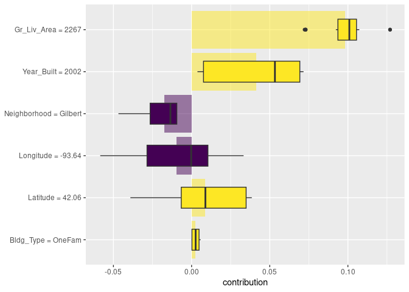

# 18 Explaining Models and Predictions


```r
library(tidyverse)
```

```
## Warning in system("timedatectl", intern = TRUE): 명령 'timedatectl'의 실행으로
## 상태 1가 되었습니다
```

```
## ── Attaching core tidyverse packages ──────────────────────── tidyverse 2.0.0 ──
## ✔ dplyr     1.1.4     ✔ readr     2.1.5
## ✔ forcats   1.0.0     ✔ stringr   1.5.1
## ✔ ggplot2   3.5.0     ✔ tibble    3.2.1
## ✔ lubridate 1.9.3     ✔ tidyr     1.3.1
## ✔ purrr     1.0.2     
## ── Conflicts ────────────────────────────────────────── tidyverse_conflicts() ──
## ✖ dplyr::filter() masks stats::filter()
## ✖ dplyr::lag()    masks stats::lag()
## ℹ Use the conflicted package (<http://conflicted.r-lib.org/>) to force all conflicts to become errors
```

```r
library(tidymodels)
```

```
## ── Attaching packages ────────────────────────────────────── tidymodels 1.2.0 ──
## ✔ broom        1.0.5      ✔ rsample      1.2.1 
## ✔ dials        1.2.1      ✔ tune         1.2.0 
## ✔ infer        1.0.7      ✔ workflows    1.1.4 
## ✔ modeldata    1.3.0      ✔ workflowsets 1.1.0 
## ✔ parsnip      1.2.1      ✔ yardstick    1.3.1 
## ✔ recipes      1.0.10     
## ── Conflicts ───────────────────────────────────────── tidymodels_conflicts() ──
## ✖ scales::discard() masks purrr::discard()
## ✖ dplyr::filter()   masks stats::filter()
## ✖ recipes::fixed()  masks stringr::fixed()
## ✖ dplyr::lag()      masks stats::lag()
## ✖ yardstick::spec() masks readr::spec()
## ✖ recipes::step()   masks stats::step()
## • Dig deeper into tidy modeling with R at https://www.tmwr.org
```

```r
library(beans)
library(bestNormalize)
library(patchwork)
library(baguette)
library(discrim)
```

```
## 
## 다음의 패키지를 부착합니다: 'discrim'
## 
## The following object is masked from 'package:dials':
## 
##     smoothness
```

```r
library(ggforce)
library(learntidymodels)
library(embed)
library(doParallel)
```

```
## 필요한 패키지를 로딩중입니다: foreach
## 
## 다음의 패키지를 부착합니다: 'foreach'
## 
## The following objects are masked from 'package:purrr':
## 
##     accumulate, when
## 
## 필요한 패키지를 로딩중입니다: iterators
## 필요한 패키지를 로딩중입니다: parallel
```

```r
#super speed
cl <- makePSOCKcluster(40)
registerDoParallel(cl)

### start
data(ames)
ames <- mutate(ames, Sale_Price = log10(Sale_Price))

set.seed(502)
ames_split <- initial_split(ames, prop = 0.80, strata = Sale_Price)
ames_train <- training(ames_split)
ames_test  <-  testing(ames_split)

ames_rec <- 
  recipe(Sale_Price ~ Neighborhood + Gr_Liv_Area + Year_Built + Bldg_Type + 
           Latitude + Longitude, data = ames_train) %>%
  step_other(Neighborhood, threshold = 0.01) %>% 
  step_dummy(all_nominal_predictors()) %>% 
  step_interact( ~ Gr_Liv_Area:starts_with("Bldg_Type_") ) %>% 
  step_ns(Latitude, Longitude, deg_free = 20)

lm_wflow <-  
  workflow() %>% 
  add_recipe(ames_rec) %>% 
  add_model(linear_reg() %>% set_engine("lm")) 

lm_fit <- lm_wflow %>% fit(data = ames_train)

rf_model <- 
  rand_forest(trees = 1000) %>% 
  set_engine("ranger") %>% 
  set_mode("regression")

rf_wflow <- 
  workflow() %>% 
  add_formula(
    Sale_Price ~ Neighborhood + Gr_Liv_Area + Year_Built + Bldg_Type + 
      Latitude + Longitude) %>% 
  add_model(rf_model) 

rf_fit <- rf_wflow %>% fit(data = ames_train)
```

## 18.1 SOFTWARE FOR MODEL EXPLANATIONS


```r
library(DALEXtra)
```

```
## 필요한 패키지를 로딩중입니다: DALEX
```

```
## Welcome to DALEX (version: 2.4.3).
## Find examples and detailed introduction at: http://ema.drwhy.ai/
## Additional features will be available after installation of: ggpubr.
## Use 'install_dependencies()' to get all suggested dependencies
```

```
## 
## 다음의 패키지를 부착합니다: 'DALEX'
```

```
## The following object is masked from 'package:dplyr':
## 
##     explain
```

```r
vip_features <- c("Neighborhood", "Gr_Liv_Area", "Year_Built", 
                  "Bldg_Type", "Latitude", "Longitude")

vip_train <- 
  ames_train %>% 
  select(all_of(vip_features))

explainer_lm <- 
  explain_tidymodels(
    lm_fit, 
    data = vip_train, 
    y = ames_train$Sale_Price,
    label = "lm + interactions",
    verbose = FALSE
  )

explainer_rf <- 
  explain_tidymodels(
    rf_fit, 
    data = vip_train, 
    y = ames_train$Sale_Price,
    label = "random forest",
    verbose = FALSE
  )
```

## 18.2 LOCAL EXPLANATIONS


```r
duplex <- vip_train[120,]
duplex
```

```
## # A tibble: 1 × 6
##   Neighborhood Gr_Liv_Area Year_Built Bldg_Type Latitude Longitude
##   <fct>              <int>      <int> <fct>        <dbl>     <dbl>
## 1 North_Ames          1040       1949 Duplex        42.0     -93.6
```


```r
lm_breakdown <- predict_parts(explainer = explainer_lm, new_observation = duplex)
lm_breakdown
```

```
##                                              contribution
## lm + interactions: intercept                        5.221
## lm + interactions: Bldg_Type = Duplex              -0.075
## lm + interactions: Gr_Liv_Area = 1040              -0.050
## lm + interactions: Longitude = -93.608903          -0.041
## lm + interactions: Year_Built = 1949               -0.040
## lm + interactions: Latitude = 42.035841            -0.011
## lm + interactions: Neighborhood = North_Ames       -0.001
## lm + interactions: prediction                       5.003
```


```r
rf_breakdown <- predict_parts(explainer = explainer_rf, new_observation = duplex)
rf_breakdown
```

```
##                                          contribution
## random forest: intercept                        5.221
## random forest: Year_Built = 1949               -0.075
## random forest: Gr_Liv_Area = 1040              -0.076
## random forest: Bldg_Type = Duplex              -0.027
## random forest: Longitude = -93.608903          -0.044
## random forest: Latitude = 42.035841            -0.027
## random forest: Neighborhood = North_Ames       -0.007
## random forest: prediction                       4.965
```


```r
predict_parts(
  explainer = explainer_rf, 
  new_observation = duplex,
  order = lm_breakdown$variable_name
)
```

```
##                                          contribution
## random forest: intercept                        5.221
## random forest: Bldg_Type = Duplex              -0.028
## random forest: Gr_Liv_Area = 1040              -0.065
## random forest: Longitude = -93.608903          -0.025
## random forest: Year_Built = 1949               -0.104
## random forest: Latitude = 42.035841            -0.027
## random forest: Neighborhood = North_Ames       -0.007
## random forest: prediction                       4.965
```


```r
set.seed(1801)
shap_duplex <- 
  predict_parts(
    explainer = explainer_rf, 
    new_observation = duplex, 
    type = "shap",
    B = 20
  )
```


```r
library(forcats)
shap_duplex %>%
  group_by(variable) %>%
  mutate(mean_val = mean(contribution)) %>%
  ungroup() %>%
  mutate(variable = fct_reorder(variable, abs(mean_val))) %>%
  ggplot(aes(contribution, variable, fill = mean_val > 0)) +
  geom_col(data = ~distinct(., variable, mean_val), 
           aes(mean_val, variable), 
           alpha = 0.5) +
  geom_boxplot(width = 0.5) +
  theme(legend.position = "none") +
  scale_fill_viridis_d() +
  labs(y = NULL)
```

<!-- -->


```r
big_house <- vip_train[1269,]
big_house
```

```
## # A tibble: 1 × 6
##   Neighborhood Gr_Liv_Area Year_Built Bldg_Type Latitude Longitude
##   <fct>              <int>      <int> <fct>        <dbl>     <dbl>
## 1 Gilbert             2267       2002 OneFam        42.1     -93.6
```


```r
set.seed(1802)
shap_house <- 
  predict_parts(
    explainer = explainer_rf, 
    new_observation = big_house, 
    type = "shap",
    B = 20
  )
```


```r
shap_house %>%
  group_by(variable) %>%
  mutate(mean_val = mean(contribution)) %>%
  ungroup() %>%
  mutate(variable = fct_reorder(variable, abs(mean_val))) %>%
  ggplot(aes(contribution, variable, fill = mean_val > 0)) +
  geom_col(data = ~distinct(., variable, mean_val), 
           aes(mean_val, variable), 
           alpha = 0.5) +
  geom_boxplot(width = 0.5) +
  theme(legend.position = "none") +
  scale_fill_viridis_d() +
  labs(y = NULL)
```

<!-- -->

## 18.3 GLOBAL EXPLANATIONS


```r
set.seed(1803)
vip_lm <- model_parts(explainer_lm, loss_function = loss_root_mean_square)
set.seed(1804)
vip_rf <- model_parts(explainer_rf, loss_function = loss_root_mean_square)
```


```r
ggplot_imp <- function(...) {
  obj <- list(...)
  metric_name <- attr(obj[[1]], "loss_name")
  metric_lab <- paste(metric_name, 
                      "after permutations\n(higher indicates more important)")
  
  full_vip <- bind_rows(obj) %>%
    filter(variable != "_baseline_")
  
  perm_vals <- full_vip %>% 
    filter(variable == "_full_model_") %>% 
    group_by(label) %>% 
    summarise(dropout_loss = mean(dropout_loss))
  
  p <- full_vip %>%
    filter(variable != "_full_model_") %>% 
    mutate(variable = fct_reorder(variable, dropout_loss)) %>%
    ggplot(aes(dropout_loss, variable)) 
  if(length(obj) > 1) {
    p <- p + 
      facet_wrap(vars(label)) +
      geom_vline(data = perm_vals, aes(xintercept = dropout_loss, color = label),
                 linewidth = 1.4, lty = 2, alpha = 0.7) +
      geom_boxplot(aes(color = label, fill = label), alpha = 0.2)
  } else {
    p <- p + 
      geom_vline(data = perm_vals, aes(xintercept = dropout_loss),
                 linewidth = 1.4, lty = 2, alpha = 0.7) +
      geom_boxplot(fill = "#91CBD765", alpha = 0.4)
    
  }
  p +
    theme(legend.position = "none") +
    labs(x = metric_lab, 
         y = NULL,  fill = NULL,  color = NULL)
}
```


```r
ggplot_imp(vip_lm, vip_rf)
```

<!-- -->

## 18.4 BUILDING GLOBAL EXPLANATIONS FROM LOCAL EXPLANATIONS


```r
set.seed(1805)
pdp_age <- model_profile(explainer_rf, N = 500, variables = "Year_Built")
```


```r
ggplot_pdp <- function(obj, x) {
  
  p <- 
    as_tibble(obj$agr_profiles) %>%
    mutate(`_label_` = stringr::str_remove(`_label_`, "^[^_]*_")) %>%
    ggplot(aes(`_x_`, `_yhat_`)) +
    geom_line(data = as_tibble(obj$cp_profiles),
              aes(x = {{ x }}, group = `_ids_`),
              linewidth = 0.5, alpha = 0.05, color = "gray50")
  
  num_colors <- n_distinct(obj$agr_profiles$`_label_`)
  
  if (num_colors > 1) {
    p <- p + geom_line(aes(color = `_label_`), linewidth = 1.2, alpha = 0.8)
  } else {
    p <- p + geom_line(color = "midnightblue", linewidth = 1.2, alpha = 0.8)
  }
  
  p
}
```


```r
ggplot_pdp(pdp_age, Year_Built)  +
  labs(x = "Year built", 
       y = "Sale Price (log)", 
       color = NULL)
```

<!-- -->


```r
set.seed(1806)
pdp_liv <- model_profile(explainer_rf, N = 1000, 
                         variables = "Gr_Liv_Area", 
                         groups = "Bldg_Type")
```

```
## Warning in FUN(X[[i]], ...): Variable: < Gr_Liv_Area > has more than 201 unique
## values and all of them will be used as variable splits in calculating variable
## profiles. Use the `variable_splits` parameter to mannualy change this
## behaviour. If you believe this warning to be a false positive, raise issue at
## <https://github.com/ModelOriented/ingredients/issues>.
```

```r
ggplot_pdp(pdp_liv, Gr_Liv_Area) +
  scale_x_log10() +
  scale_color_brewer(palette = "Dark2") +
  labs(x = "Gross living area", 
       y = "Sale Price (log)", 
       color = NULL)
```

<!-- -->


```r
as_tibble(pdp_liv$agr_profiles) %>%
  mutate(Bldg_Type = stringr::str_remove(`_label_`, "random forest_")) %>%
  ggplot(aes(`_x_`, `_yhat_`, color = Bldg_Type)) +
  geom_line(data = as_tibble(pdp_liv$cp_profiles),
            aes(x = Gr_Liv_Area, group = `_ids_`),
            linewidth = 0.5, alpha = 0.1, color = "gray50") +
  geom_line(linewidth = 1.2, alpha = 0.8, show.legend = FALSE) +
  scale_x_log10() +
  facet_wrap(~Bldg_Type) +
  scale_color_brewer(palette = "Dark2") +
  labs(x = "Gross living area", 
       y = "Sale Price (log)", 
       color = NULL)
```

<!-- -->

## 18.5 BACK TO BEANS!


```r
set.seed(1601)
bean_split <- initial_validation_split(beans, strata = class, prop = c(0.75, 0.125))
```

```
## Warning: Too little data to stratify.
## • Resampling will be unstratified.
```

```r
bean_train <- training(bean_split)
bean_test <- testing(bean_split)
bean_validation <- validation(bean_split)

set.seed(1602)
# Return an 'rset' object to use with the tune functions:
bean_val <- validation_set(bean_split)

mlp_spec <-
  mlp(hidden_units = tune(), penalty = tune(), epochs = tune()) %>%
  set_engine('nnet') %>%
  set_mode('classification')

bagging_spec <-
  bag_tree() %>%
  set_engine('rpart') %>%
  set_mode('classification')

fda_spec <-
  discrim_flexible(
    prod_degree = tune()
  ) %>%
  set_engine('earth')

rda_spec <-
  discrim_regularized(frac_common_cov = tune(), frac_identity = tune()) %>%
  set_engine('klaR')

bayes_spec <-
  naive_Bayes() %>%
  set_engine('klaR')
bean_rec <-
  recipe(class ~ ., data = bean_train) %>%
  step_zv(all_numeric_predictors()) %>%
  step_orderNorm(all_numeric_predictors()) %>%
  step_normalize(all_numeric_predictors())

pls_rec <- 
  bean_rec %>% 
  step_pls(all_numeric_predictors(), outcome = "class", num_comp = tune())

umap_rec <-
  bean_rec %>%
  step_umap(
    all_numeric_predictors(),
    outcome = "class",
    num_comp = tune(),
    neighbors = tune(),
    min_dist = tune()
  )

ctrl <- control_grid(parallel_over = "everything")
bean_res <- 
  workflow_set(
    preproc = list(basic = class ~., pls = pls_rec, umap = umap_rec), 
    models = list(bayes = bayes_spec, fda = fda_spec,
                  rda = rda_spec, bag = bagging_spec,
                  mlp = mlp_spec)
  ) %>% 
  workflow_map(
    verbose = TRUE,
    seed = 1603,
    resamples = bean_val,
    grid = 10,
    metrics = metric_set(roc_auc),
    control = ctrl
  )
```

```
## i	No tuning parameters. `fit_resamples()` will be attempted
```

```
## i  1 of 15 resampling: basic_bayes
```

```
## Registered S3 method overwritten by 'questionr':
##   method            from 
##   print.description DALEX
```

```
## ✔  1 of 15 resampling: basic_bayes (46.2s)
```

```
## i  2 of 15 tuning:     basic_fda
```

```
## ✔  2 of 15 tuning:     basic_fda (7.4s)
```

```
## i  3 of 15 tuning:     basic_rda
```

```
## ✔  3 of 15 tuning:     basic_rda (3.8s)
```

```
## i	No tuning parameters. `fit_resamples()` will be attempted
```

```
## i  4 of 15 resampling: basic_bag
```

```
## ✔  4 of 15 resampling: basic_bag (3.5s)
```

```
## i  5 of 15 tuning:     basic_mlp
```

```
## ✔  5 of 15 tuning:     basic_mlp (5.5s)
```

```
## i  6 of 15 tuning:     pls_bayes
```

```
## ✔  6 of 15 tuning:     pls_bayes (9.2s)
```

```
## i  7 of 15 tuning:     pls_fda
```

```
## ✔  7 of 15 tuning:     pls_fda (11.6s)
```

```
## i  8 of 15 tuning:     pls_rda
```

```
## ✔  8 of 15 tuning:     pls_rda (14.3s)
```

```
## i  9 of 15 tuning:     pls_bag
```

```
## ✔  9 of 15 tuning:     pls_bag (9.6s)
```

```
## i 10 of 15 tuning:     pls_mlp
```

```
## ✔ 10 of 15 tuning:     pls_mlp (18.2s)
```

```
## i 11 of 15 tuning:     umap_bayes
```

```
## ✔ 11 of 15 tuning:     umap_bayes (1m 21.9s)
```

```
## i 12 of 15 tuning:     umap_fda
```

```
## ✔ 12 of 15 tuning:     umap_fda (1m 19s)
```

```
## i 13 of 15 tuning:     umap_rda
```

```
## ✔ 13 of 15 tuning:     umap_rda (1m 16.9s)
```

```
## i 14 of 15 tuning:     umap_bag
```

```
## ✔ 14 of 15 tuning:     umap_bag (1m 17.4s)
```

```
## i 15 of 15 tuning:     umap_mlp
```

```
## ✔ 15 of 15 tuning:     umap_mlp (1m 25.6s)
```

```r
rda_res <- 
  bean_res %>% 
  extract_workflow("pls_rda") %>% 
  finalize_workflow(
    bean_res %>% 
      extract_workflow_set_result("pls_rda") %>% 
      select_best(metric = "roc_auc")
  ) %>% 
  last_fit(split = bean_split, metrics = metric_set(roc_auc))

rda_wflow_fit <- extract_workflow(rda_res)
```


```r
set.seed(1807)
vip_beans <- 
  explain_tidymodels(
    rda_wflow_fit, 
    data = bean_train %>% dplyr::select(-class), 
    y = bean_train$class,
    label = "RDA",
    verbose = FALSE
  ) %>% 
  model_parts() 
```


```r
ggplot_imp(vip_beans)
```

<!-- -->

## 18.6 CHAPTER SUMMARY


```r
stopCluster(cl)
```
