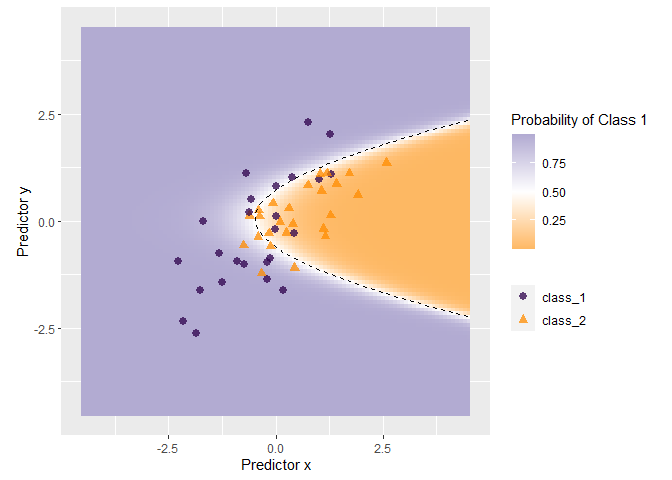
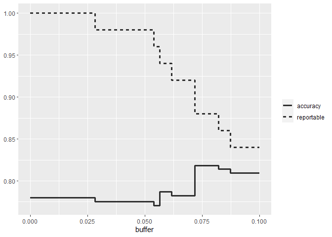
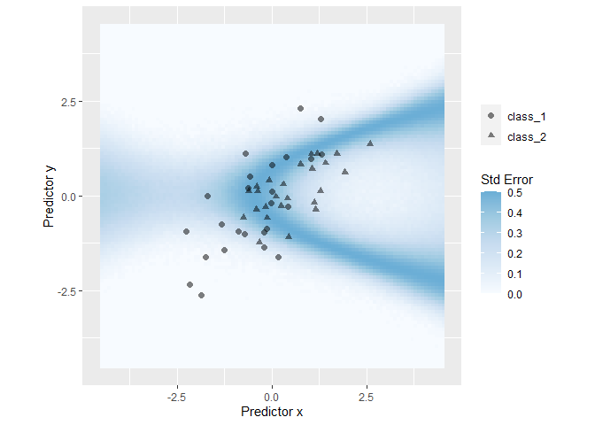
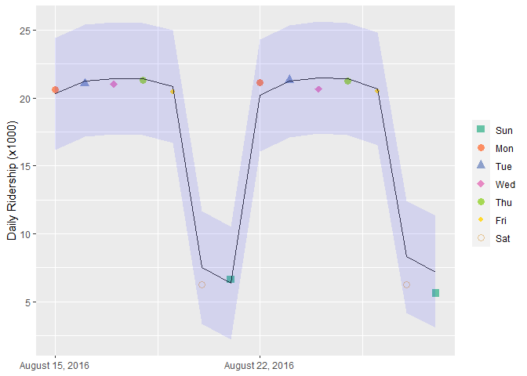
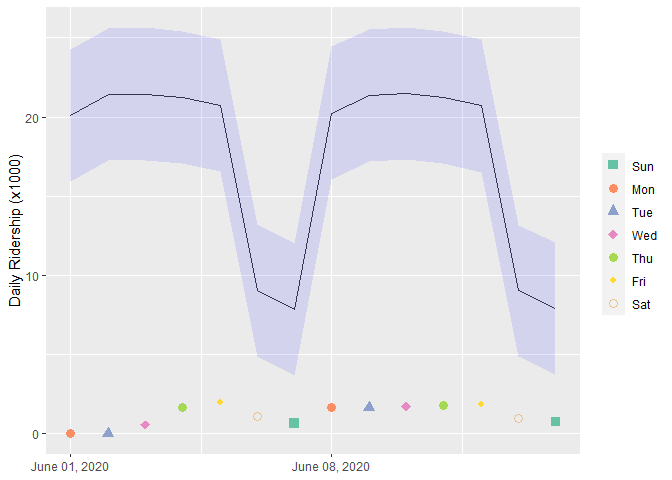
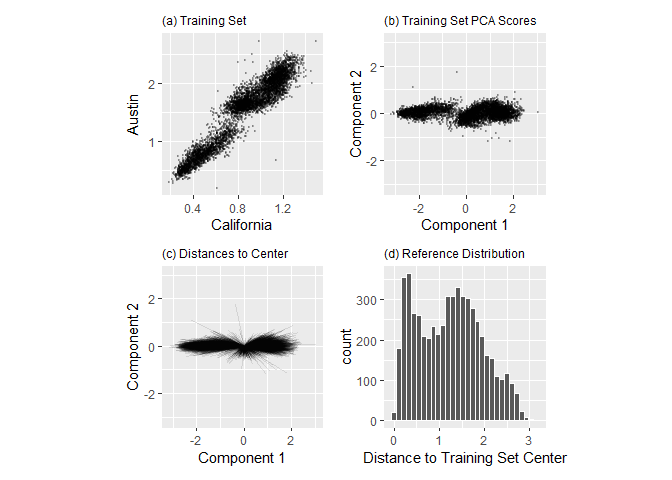
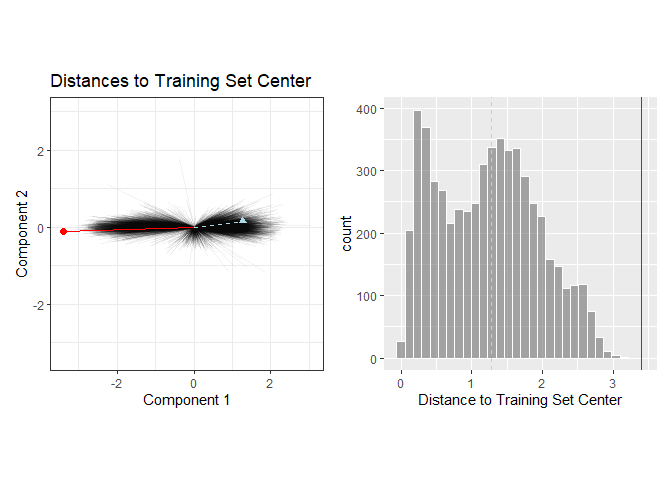
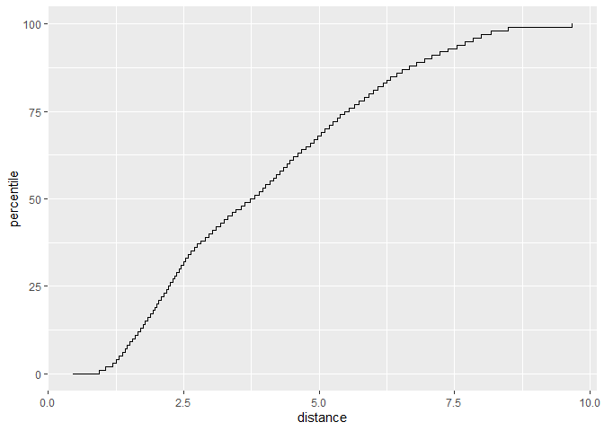

# 19 When Should You Trust Your Predictions?


```r
library(tidyverse)
```

```
## ── Attaching core tidyverse packages ──────────────────────── tidyverse 2.0.0 ──
## ✔ dplyr     1.1.4     ✔ readr     2.1.4
## ✔ forcats   1.0.0     ✔ stringr   1.5.1
## ✔ ggplot2   3.4.4     ✔ tibble    3.2.1
## ✔ lubridate 1.9.3     ✔ tidyr     1.3.0
## ✔ purrr     1.0.2     
## ── Conflicts ────────────────────────────────────────── tidyverse_conflicts() ──
## ✖ dplyr::filter() masks stats::filter()
## ✖ dplyr::lag()    masks stats::lag()
## ℹ Use the conflicted package (<http://conflicted.r-lib.org/>) to force all conflicts to become errors
```

```r
library(tidymodels)
```

```
## ── Attaching packages ────────────────────────────────────── tidymodels 1.1.1 ──
## ✔ broom        1.0.5     ✔ rsample      1.2.0
## ✔ dials        1.2.0     ✔ tune         1.1.2
## ✔ infer        1.0.5     ✔ workflows    1.1.4
## ✔ modeldata    1.2.0     ✔ workflowsets 1.0.1
## ✔ parsnip      1.2.1     ✔ yardstick    1.3.1
## ✔ recipes      1.0.8
```

```
## Warning: package 'parsnip' was built under R version 4.3.3
```

```
## Warning: package 'workflows' was built under R version 4.3.3
```

```
## Warning: package 'yardstick' was built under R version 4.3.3
```

```
## ── Conflicts ───────────────────────────────────────── tidymodels_conflicts() ──
## ✖ scales::discard() masks purrr::discard()
## ✖ dplyr::filter()   masks stats::filter()
## ✖ recipes::fixed()  masks stringr::fixed()
## ✖ dplyr::lag()      masks stats::lag()
## ✖ yardstick::spec() masks readr::spec()
## ✖ recipes::step()   masks stats::step()
## • Use suppressPackageStartupMessages() to eliminate package startup messages
```

```r
library(doParallel)
```

```
## Loading required package: foreach
## 
## Attaching package: 'foreach'
## 
## The following objects are masked from 'package:purrr':
## 
##     accumulate, when
## 
## Loading required package: iterators
## Loading required package: parallel
```

```r
library(probably)
```

```
## Warning: package 'probably' was built under R version 4.3.3
```

```
## 
## Attaching package: 'probably'
## 
## The following objects are masked from 'package:base':
## 
##     as.factor, as.ordered
```

```r
library(patchwork)
library(applicable)
```

```
## Warning: package 'applicable' was built under R version 4.3.3
```

```r
tidymodels_prefer()

#super speed
cl <- makePSOCKcluster(8)
registerDoParallel(cl)
```

## 19.1 EQUIVOCAL RESULTS


```r
simulate_two_classes <- 
  function (n, error = 0.1, eqn = quote(-1 - 2 * x - 0.2 * x^2 + 2 * y^2))  {
    # Slightly correlated predictors
    sigma <- matrix(c(1, 0.7, 0.7, 1), nrow = 2, ncol = 2)
    dat <- MASS::mvrnorm(n = n, mu = c(0, 0), Sigma = sigma)
    colnames(dat) <- c("x", "y")
    cls <- paste0("class_", 1:2)
    dat <- 
      as_tibble(dat) %>% 
      mutate(
        linear_pred = !!eqn,
        # Add some misclassification noise
        linear_pred = linear_pred + rnorm(n, sd = error),
        prob = binomial()$linkinv(linear_pred),
        class = ifelse(prob > runif(n), cls[1], cls[2]),
        class = factor(class, levels = cls)
      )
    dplyr::select(dat, x, y, class)
  }

set.seed(1901)
training_set <- simulate_two_classes(200)
testing_set  <- simulate_two_classes(50)
```


```r
two_class_mod <- 
  logistic_reg() %>% 
  set_engine("stan", seed = 1902) %>% 
  fit(class ~ . + I(x^2)+ I(y^2), data = training_set)
print(two_class_mod, digits = 3)
```

```
## parsnip model object
## 
## stan_glm
##  family:       binomial [logit]
##  formula:      class ~ . + I(x^2) + I(y^2)
##  observations: 200
##  predictors:   5
## ------
##             Median MAD_SD
## (Intercept)  1.092  0.287
## x            2.290  0.423
## y            0.314  0.354
## I(x^2)       0.077  0.307
## I(y^2)      -2.465  0.424
## 
## ------
## * For help interpreting the printed output see ?print.stanreg
## * For info on the priors used see ?prior_summary.stanreg
```


```r
data_grid <-
  crossing(
    x = seq(-4.5, 4.5, length = 100),
    y = seq(-4.5, 4.5, length = 100)
  )
grid_pred <- 
  predict(two_class_mod, data_grid, type = "prob") %>% 
  bind_cols(
    predict(two_class_mod, data_grid, type = "pred_int", std_error = TRUE),
    data_grid
  )

grid_pred %>% 
  mutate(`Probability of Class 1` = .pred_class_1) %>% 
  ggplot(aes(x = x, y = y)) + 
  geom_raster(aes(fill = `Probability of Class 1`)) +
  geom_point(data = testing_set, aes(shape = class, color = class), alpha = .75, size = 2.5) + 
  geom_contour(aes(z = .pred_class_1), breaks = .5, color = "black", lty = 2) + 
  coord_equal() + 
  labs(x = "Predictor x", y = "Predictor y", color = NULL, shape = NULL) + 
  scale_fill_gradient2(low = "#FDB863", mid = "white", high = "#B2ABD2", midpoint = .5) + 
  scale_color_manual(values = c("#2D004B", "darkorange"))
```

<!-- -->


```r
test_pred <- augment(two_class_mod, testing_set)
test_pred %>% head()
```

```
## # A tibble: 6 × 6
##   .pred_class .pred_class_1 .pred_class_2      x      y class  
##   <fct>               <dbl>         <dbl>  <dbl>  <dbl> <fct>  
## 1 class_2           0.0256          0.974  1.12  -0.176 class_2
## 2 class_1           0.555           0.445 -0.126 -0.582 class_2
## 3 class_2           0.00620         0.994  1.92   0.615 class_2
## 4 class_2           0.472           0.528 -0.400  0.252 class_2
## 5 class_2           0.163           0.837  1.30   1.09  class_1
## 6 class_2           0.0317          0.968  2.59   1.36  class_2
```


```r
lvls <- levels(training_set$class)

test_pred <- 
  test_pred %>% 
  mutate(.pred_with_eqz = make_two_class_pred(.pred_class_1, lvls, buffer = 0.15))

test_pred %>% count(.pred_with_eqz)
```

```
## # A tibble: 3 × 2
##   .pred_with_eqz     n
##       <clss_prd> <int>
## 1           [EQ]     9
## 2        class_1    20
## 3        class_2    21
```


```r
# All data
test_pred %>% conf_mat(class, .pred_class)
```

```
##           Truth
## Prediction class_1 class_2
##    class_1      20       6
##    class_2       5      19
```

```r
# Reportable results only: 
test_pred %>% conf_mat(class, .pred_with_eqz)
```

```
##           Truth
## Prediction class_1 class_2
##    class_1      17       3
##    class_2       5      16
```


```r
# A function to change the buffer then compute performance.
eq_zone_results <- function(buffer) {
  test_pred <- 
    test_pred %>% 
    mutate(.pred_with_eqz = make_two_class_pred(.pred_class_1, lvls, buffer = buffer))
  acc <- test_pred %>% accuracy(class, .pred_with_eqz)
  rep_rate <- reportable_rate(test_pred$.pred_with_eqz)
  tibble(accuracy = acc$.estimate, reportable = rep_rate, buffer = buffer)
}

# Evaluate a sequence of buffers and plot the results. 
map(seq(0, .1, length.out = 40), eq_zone_results) %>% 
  list_rbind() %>% 
  pivot_longer(c(-buffer), names_to = "statistic", values_to = "value") %>% 
  ggplot(aes(x = buffer, y = value, lty = statistic)) + 
  geom_step(linewidth = 1.2, alpha = 0.8) + 
  labs(y = NULL, lty = NULL)
```

<!-- -->


```r
test_pred <- 
  test_pred %>% 
  bind_cols(
    predict(two_class_mod, testing_set, type = "pred_int", std_error = TRUE)
  )
head(test_pred)
```

```
## # A tibble: 6 × 12
##   .pred_class .pred_class_1 .pred_class_2      x      y class   .pred_with_eqz
##   <fct>               <dbl>         <dbl>  <dbl>  <dbl> <fct>       <clss_prd>
## 1 class_2           0.0256          0.974  1.12  -0.176 class_2        class_2
## 2 class_1           0.555           0.445 -0.126 -0.582 class_2           [EQ]
## 3 class_2           0.00620         0.994  1.92   0.615 class_2        class_2
## 4 class_2           0.472           0.528 -0.400  0.252 class_2           [EQ]
## 5 class_2           0.163           0.837  1.30   1.09  class_1        class_2
## 6 class_2           0.0317          0.968  2.59   1.36  class_2        class_2
## # ℹ 5 more variables: .pred_lower_class_1 <dbl>, .pred_upper_class_1 <dbl>,
## #   .pred_lower_class_2 <dbl>, .pred_upper_class_2 <dbl>, .std_error <dbl>
```


```r
grid_pred %>% 
  mutate(`Std Error` = .std_error) %>% 
  ggplot(aes(x = x, y = y)) + 
  geom_raster(aes(fill = `Std Error`)) + 
  scale_fill_gradientn(colours = c("#F7FBFF", "#DEEBF7", "#C6DBEF", "#9ECAE1", "#6BAED6")) + 
  geom_point(data = testing_set, aes(shape = class), alpha = .5, size = 2) + 
  coord_equal() + 
  labs(x = "Predictor x", y = "Predictor y", shape = NULL)
```

<!-- -->

## 19.2 DETERMINING MODEL APPLICABILITY


```r
data(Chicago)

Chicago <- Chicago %>% select(ridership, date, one_of(stations))

n <- nrow(Chicago)

Chicago_train <- Chicago %>% slice(1:(n - 14))
Chicago_test  <- Chicago %>% slice((n - 13):n)
```


```r
base_recipe <-
  recipe(ridership ~ ., data = Chicago_train) %>%
  # Create date features
  step_date(date) %>%
  step_holiday(date, keep_original_cols = FALSE) %>%
  # Create dummy variables from factor columns
  step_dummy(all_nominal()) %>%
  # Remove any columns with a single unique value
  step_zv(all_predictors()) %>%
  step_normalize(!!!stations)%>%
  step_pls(!!!stations, num_comp = 10, outcome = vars(ridership))

lm_spec <-
  linear_reg() %>%
  set_engine("lm") 

lm_wflow <-
  workflow() %>%
  add_recipe(base_recipe) %>%
  add_model(lm_spec)

set.seed(1902)
lm_fit <- fit(lm_wflow, data = Chicago_train)
```


```r
res_test <-
  predict(lm_fit, Chicago_test) %>%
  bind_cols(
    predict(lm_fit, Chicago_test, type = "pred_int"),
    Chicago_test
  )

res_test %>% select(date, ridership, starts_with(".pred"))
```

```
## # A tibble: 14 × 5
##    date       ridership .pred .pred_lower .pred_upper
##    <date>         <dbl> <dbl>       <dbl>       <dbl>
##  1 2016-08-15     20.6  20.3        16.2         24.5
##  2 2016-08-16     21.0  21.3        17.1         25.4
##  3 2016-08-17     21.0  21.4        17.3         25.6
##  4 2016-08-18     21.3  21.4        17.3         25.5
##  5 2016-08-19     20.4  20.9        16.7         25.0
##  6 2016-08-20      6.22  7.52        3.34        11.7
##  7 2016-08-21      6.62  6.34        2.19        10.5
##  8 2016-08-22     21.2  20.2        16.1         24.3
##  9 2016-08-23     21.3  21.3        17.1         25.4
## 10 2016-08-24     20.7  21.5        17.4         25.6
## 11 2016-08-25     21.3  21.4        17.3         25.5
## 12 2016-08-26     20.5  20.7        16.5         24.8
## 13 2016-08-27      6.27  8.31        4.18        12.4
## 14 2016-08-28      5.63  7.18        3.05        11.3
```


```r
res_test %>% rmse(ridership, .pred)
```

```
## # A tibble: 1 × 3
##   .metric .estimator .estimate
##   <chr>   <chr>          <dbl>
## 1 rmse    standard       0.865
```


```r
add_day <- function(x) {
  day <- lubridate::wday(x$date, label = TRUE)
  factor(as.character(day), ordered = FALSE, levels = levels(day))
}

res_test %>%
  mutate(day = add_day(.)) %>%
  ggplot(aes(x = date)) +
  geom_point(aes(y = ridership, color = day, pch = day), size = 3) +
  geom_line(aes(y = .pred), alpha = .75) +
  geom_ribbon(aes(ymin = .pred_lower, ymax = .pred_upper), fill = "blue", alpha = .1)  +
  scale_color_brewer(palette = "Set2") +
  scale_shape_manual(values = 15:22) +
  scale_x_date(labels = date_format("%B %d, %Y")) +
  labs(x = NULL, y = "Daily Ridership (x1000)", color = NULL, pch = NULL)
```

<!-- -->


```r
load("Chicago_2020.RData")

res_2020 <-
  predict(lm_fit, Chicago_2020) %>%
  bind_cols(
    predict(lm_fit, Chicago_2020, type = "pred_int"),
    Chicago_2020
  ) 

res_2020 %>% select(date, contains(".pred"))
```

```
## # A tibble: 14 × 4
##    date       .pred .pred_lower .pred_upper
##    <date>     <dbl>       <dbl>       <dbl>
##  1 2020-06-01 20.1        15.9         24.3
##  2 2020-06-02 21.4        17.2         25.6
##  3 2020-06-03 21.5        17.3         25.6
##  4 2020-06-04 21.3        17.1         25.4
##  5 2020-06-05 20.7        16.6         24.9
##  6 2020-06-06  9.04        4.88        13.2
##  7 2020-06-07  7.84        3.69        12.0
##  8 2020-06-08 20.3        16.1         24.4
##  9 2020-06-09 21.4        17.2         25.6
## 10 2020-06-10 21.5        17.3         25.7
## 11 2020-06-11 21.2        17.0         25.4
## 12 2020-06-12 20.7        16.5         24.9
## 13 2020-06-13  9.02        4.86        13.2
## 14 2020-06-14  7.90        3.74        12.1
```


```r
res_2020 %>% select(date, ridership, starts_with(".pred"))
```

```
## # A tibble: 14 × 5
##    date       ridership .pred .pred_lower .pred_upper
##    <date>         <dbl> <dbl>       <dbl>       <dbl>
##  1 2020-06-01     0.002 20.1        15.9         24.3
##  2 2020-06-02     0.005 21.4        17.2         25.6
##  3 2020-06-03     0.566 21.5        17.3         25.6
##  4 2020-06-04     1.66  21.3        17.1         25.4
##  5 2020-06-05     1.95  20.7        16.6         24.9
##  6 2020-06-06     1.08   9.04        4.88        13.2
##  7 2020-06-07     0.655  7.84        3.69        12.0
##  8 2020-06-08     1.69  20.3        16.1         24.4
##  9 2020-06-09     1.65  21.4        17.2         25.6
## 10 2020-06-10     1.73  21.5        17.3         25.7
## 11 2020-06-11     1.80  21.2        17.0         25.4
## 12 2020-06-12     1.83  20.7        16.5         24.9
## 13 2020-06-13     0.969  9.02        4.86        13.2
## 14 2020-06-14     0.737  7.90        3.74        12.1
```


```r
res_2020 %>% rmse(ridership, .pred)
```

```
## # A tibble: 1 × 3
##   .metric .estimator .estimate
##   <chr>   <chr>          <dbl>
## 1 rmse    standard        17.2
```


```r
res_2020 %>%
  mutate(day = add_day(.)) %>%
  ggplot(aes(x = date)) +
  geom_point(aes(y = ridership, color = day, pch = day), size = 3) +
  geom_line(aes(y = .pred), alpha = .75) +
  geom_ribbon(aes(ymin = .pred_lower, ymax = .pred_upper), fill = "blue", alpha = .1) +
  scale_shape_manual(values = 15:22) +
  scale_color_brewer(palette = "Set2") +
  scale_x_date(labels = date_format("%B %d, %Y")) +
  labs(x = NULL, y = "Daily Ridership (x1000)", color = NULL, pch = NULL) 
```

<!-- -->


```r
pca_rec <- recipe(~ ., data = Chicago_train) %>% 
  step_normalize(California, Austin) %>% 
  step_pca(California, Austin, num_comp = 2) %>% 
  prep()

training_pca <- bake(pca_rec, new_data = NULL)
pca_center <- 
  training_pca %>% 
  select(PC1, PC2) %>% 
  summarize(PC1_mean = mean(PC1), PC2_mean = mean(PC2))

training_pca <- 
  cbind(pca_center, training_pca) %>% 
  mutate(
    distance = (PC1 - PC1_mean)^2 + (PC2 - PC2_mean)^2,
    distance = sqrt(distance)
  )

testing_pca <- 
  bake(pca_rec, Chicago_test %>% slice(1)) %>% 
  cbind(pca_center) %>% 
  mutate(
    distance = (PC1 - PC1_mean)^2 + (PC2 - PC2_mean)^2,
    distance = sqrt(distance)
  )
testing_pctl <- round(mean(training_pca$distance <= testing_pca$distance) * 100, 1)

new_pca <- 
  bake(pca_rec, Chicago_2020 %>% slice(6)) %>% 
  cbind(pca_center) %>% 
  mutate(
    distance = (PC1 - PC1_mean)^2 + (PC2 - PC2_mean)^2,
    distance = sqrt(distance)
  )
new_pctl <- round(mean(training_pca$distance <= new_pca$distance) * 100, 1)

tr_plot <- 
  Chicago_train %>% 
  ggplot(aes(x = California, y = Austin)) + 
  geom_point(alpha = .25, size = .3) + 
  # coord_equal() + 
  labs(title = "(a) Training Set") + 
  theme(plot.title = element_text(size=9))

pca_plot <- training_pca %>% 
  ggplot(aes(x = PC1, y = PC2)) + 
  geom_point(alpha = .25, size = .3) + 
  coord_obs_pred() + 
  labs(x = "Component 1", y = "Component 2", title = "(b) Training Set PCA Scores") +
  theme(plot.title = element_text(size = 9))

pca_dist <- 
  training_pca %>% 
  ggplot() + 
  geom_segment(aes(x = PC1_mean, y = PC2_mean,
                   xend = PC1, yend = PC2), alpha = .1)  + 
  coord_obs_pred() + 
  labs(x = "Component 1", y = "Component 2", title = "(c) Distances to Center") +
  theme(plot.title = element_text(size = 9))

dist_hist <-
  training_pca %>%
  ggplot(aes(x = distance)) +
  geom_histogram(bins = 30, color = "white") +
  labs(x = "Distance to Training Set Center", title = "(d) Reference Distribution") +
  theme(plot.title = element_text(size = 9))

tr_plot + pca_plot + pca_dist + dist_hist
```

<!-- -->


```r
test_pca_dist <- 
  training_pca %>% 
  ggplot() + 
  geom_segment(
    aes(x = PC1_mean, y = PC2_mean, xend = PC1, yend = PC2), 
    alpha = .05
  )  + 
  geom_segment(
    data = testing_pca,
    aes(x = PC1_mean, y = PC2_mean, xend = PC1, yend = PC2), 
    color = "lightblue",
    lty = 2
  )  + 
  geom_segment(
    data = new_pca,
    aes(x = PC1_mean, y = PC2_mean, xend = PC1, yend = PC2), 
    color = "red"
  )  + 
  geom_point(data = testing_pca, aes(x = PC1, y = PC2), color = "lightblue", size = 2, pch = 17) +
  geom_point(data = new_pca, aes(x = PC1, y = PC2), size = 2, color = "red") +
  coord_obs_pred() + 
  labs(x = "Component 1", y = "Component 2", title = "Distances to Training Set Center") + 
  theme_bw() + 
  theme(legend.position = "top")

test_dist_hist <- 
  training_pca %>% 
  ggplot(aes(x = distance)) + 
  geom_histogram(bins = 30, color = "white", alpha = .5) + 
  geom_vline(xintercept = testing_pca$distance, color = "lightblue", lty = 2) +
  geom_vline(xintercept = new_pca$distance, color = "red") +
  xlab("Distance to Training Set Center")

test_pca_dist + test_dist_hist
```

<!-- -->


```r
pca_stat <- apd_pca(~ ., data = Chicago_train %>% select(one_of(stations)), 
                    threshold = 0.99)
pca_stat
```

```
## # Predictors:
##    20
## # Principal Components:
##    9 components were needed
##    to capture at least 99% of the
##    total variation in the predictors.
```


```r
autoplot(pca_stat, distance) + labs(x = "distance")
```

<!-- -->


```r
score(pca_stat, Chicago_test) %>% select(starts_with("distance"))
```

```
## # A tibble: 14 × 2
##    distance distance_pctl
##       <dbl>         <dbl>
##  1     4.88          66.7
##  2     5.21          71.4
##  3     5.19          71.1
##  4     5.00          68.5
##  5     4.36          59.3
##  6     4.10          55.2
##  7     5.59          76.4
##  8     4.21          56.9
##  9     4.94          67.5
## 10     4.93          67.4
## 11     4.93          67.3
## 12     3.50          47.4
## 13     3.89          52.1
## 14     5.42          74.4
```


```r
score(pca_stat, Chicago_2020) %>% select(starts_with("distance"))
```

```
## # A tibble: 14 × 2
##    distance distance_pctl
##       <dbl>         <dbl>
##  1     9.39          99.8
##  2     9.40          99.8
##  3     9.30          99.7
##  4     9.30          99.7
##  5     9.29          99.7
##  6    10.1            1  
##  7    10.2            1  
##  8    10.1            1  
##  9     9.30          99.7
## 10     9.22          99.6
## 11     9.26          99.7
## 12     9.12          99.5
## 13     9.80           1  
## 14    10.7            1
```

## 19.3 CHAPTER SUMMARY


```r
stopCluster(cl)
```
