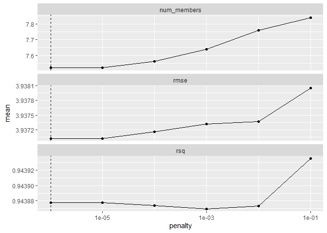
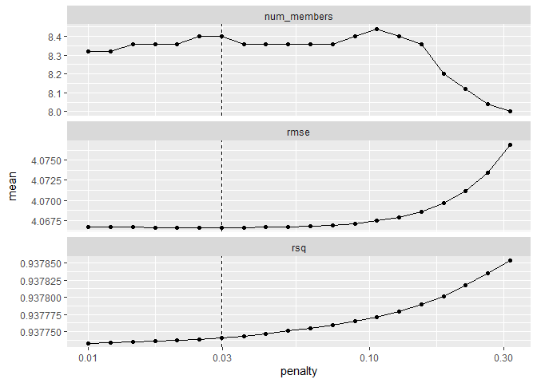
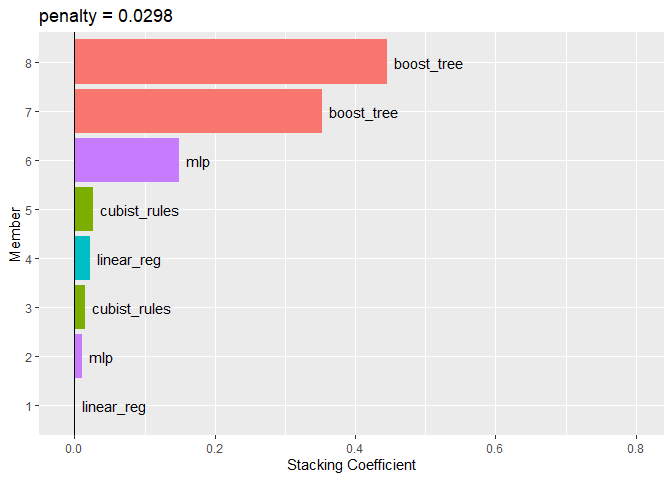

# 20 Ensembles of Models


```r
library(tidyverse)
```

```
## Warning: package 'ggplot2' was built under R version 4.3.3
```

```
## Warning: package 'tidyr' was built under R version 4.3.3
```

```
## Warning: package 'readr' was built under R version 4.3.3
```

```
## ── Attaching core tidyverse packages ──────────────────────── tidyverse 2.0.0 ──
## ✔ dplyr     1.1.4     ✔ readr     2.1.5
## ✔ forcats   1.0.0     ✔ stringr   1.5.1
## ✔ ggplot2   3.5.1     ✔ tibble    3.2.1
## ✔ lubridate 1.9.3     ✔ tidyr     1.3.1
## ✔ purrr     1.0.2     
## ── Conflicts ────────────────────────────────────────── tidyverse_conflicts() ──
## ✖ dplyr::filter() masks stats::filter()
## ✖ dplyr::lag()    masks stats::lag()
## ℹ Use the conflicted package (<http://conflicted.r-lib.org/>) to force all conflicts to become errors
```

```r
library(tidymodels)
```

```
## Warning: package 'tidymodels' was built under R version 4.3.3
```

```
## ── Attaching packages ────────────────────────────────────── tidymodels 1.2.0 ──
## ✔ broom        1.0.5      ✔ rsample      1.2.1 
## ✔ dials        1.2.1      ✔ tune         1.2.1 
## ✔ infer        1.0.7      ✔ workflows    1.1.4 
## ✔ modeldata    1.3.0      ✔ workflowsets 1.1.0 
## ✔ parsnip      1.2.1      ✔ yardstick    1.3.1 
## ✔ recipes      1.0.10
```

```
## Warning: package 'dials' was built under R version 4.3.3
```

```
## Warning: package 'infer' was built under R version 4.3.3
```

```
## Warning: package 'modeldata' was built under R version 4.3.3
```

```
## Warning: package 'parsnip' was built under R version 4.3.3
```

```
## Warning: package 'recipes' was built under R version 4.3.3
```

```
## Warning: package 'rsample' was built under R version 4.3.3
```

```
## Warning: package 'tune' was built under R version 4.3.3
```

```
## Warning: package 'workflows' was built under R version 4.3.3
```

```
## Warning: package 'workflowsets' was built under R version 4.3.3
```

```
## Warning: package 'yardstick' was built under R version 4.3.3
```

```
## ── Conflicts ───────────────────────────────────────── tidymodels_conflicts() ──
## ✖ scales::discard() masks purrr::discard()
## ✖ dplyr::filter()   masks stats::filter()
## ✖ recipes::fixed()  masks stringr::fixed()
## ✖ dplyr::lag()      masks stats::lag()
## ✖ yardstick::spec() masks readr::spec()
## ✖ recipes::step()   masks stats::step()
## • Dig deeper into tidy modeling with R at https://www.tmwr.org
```

```r
library(doParallel)
```

```
## Loading required package: foreach
## 
## Attaching package: 'foreach'
## 
## The following objects are masked from 'package:purrr':
## 
##     accumulate, when
## 
## Loading required package: iterators
## Loading required package: parallel
```

```r
library(stacks)
```

```
## Warning: package 'stacks' was built under R version 4.3.3
```

```r
library(probably)
```

```
## Warning: package 'probably' was built under R version 4.3.3
```

```
## 
## Attaching package: 'probably'
## 
## The following objects are masked from 'package:base':
## 
##     as.factor, as.ordered
```

```r
library(patchwork)
```

```
## Warning: package 'patchwork' was built under R version 4.3.3
```

```r
library(applicable)
```

```
## Warning: package 'applicable' was built under R version 4.3.3
```

```r
tidymodels_prefer()

#super speed
cl <- makePSOCKcluster(8)
registerDoParallel(cl)
```

## 20.1 CREATING THE TRAINING SET FOR STACKING


```r
load("ch15_Race_Results.RData")
race_results
```

```
## # A workflow set/tibble: 12 × 4
##    wflow_id             info             option    result   
##    <chr>                <list>           <list>    <list>   
##  1 MARS                 <tibble [1 × 4]> <opts[3]> <race[+]>
##  2 CART                 <tibble [1 × 4]> <opts[3]> <race[+]>
##  3 CART_bagged          <tibble [1 × 4]> <opts[3]> <rsmp[+]>
##  4 RF                   <tibble [1 × 4]> <opts[3]> <race[+]>
##  5 boosting             <tibble [1 × 4]> <opts[3]> <race[+]>
##  6 Cubist               <tibble [1 × 4]> <opts[3]> <race[+]>
##  7 SVM_radial           <tibble [1 × 4]> <opts[3]> <race[+]>
##  8 SVM_poly             <tibble [1 × 4]> <opts[3]> <race[+]>
##  9 KNN                  <tibble [1 × 4]> <opts[3]> <race[+]>
## 10 neural_network       <tibble [1 × 4]> <opts[4]> <race[+]>
## 11 full_quad_linear_reg <tibble [1 × 4]> <opts[3]> <race[+]>
## 12 full_quad_KNN        <tibble [1 × 4]> <opts[3]> <race[+]>
```


```r
concrete_stack <- 
  stacks() %>% 
  add_candidates(race_results)

concrete_stack
```

```
## # A data stack with 12 model definitions and 68 candidate members:
## #   MARS: 1 model configuration
## #   CART: 5 model configurations
## #   CART_bagged: 1 model configuration
## #   RF: 3 model configurations
## #   boosting: 4 model configurations
## #   Cubist: 13 model configurations
## #   SVM_radial: 1 model configuration
## #   SVM_poly: 1 model configuration
## #   KNN: 4 model configurations
## #   neural_network: 5 model configurations
## #   full_quad_linear_reg: 23 model configurations
## #   full_quad_KNN: 7 model configurations
## # Outcome: compressive_strength (numeric)
```

## 20.2 BLEND THE PREDICTIONS


```r
set.seed(2001)
ens <- blend_predictions(concrete_stack)
```


```r
autoplot(ens)
```

<!-- -->


```r
set.seed(2002)
ens <- blend_predictions(concrete_stack, penalty = 10^seq(-2, -0.5, length = 20))
autoplot(ens)
```

<!-- -->


```r
ens
```

```
## ── A stacked ensemble model ─────────────────────────────────────
## 
## 
## Out of 68 possible candidate members, the ensemble retained 8.
## 
## Penalty: 0.0297635144163132.
## 
## Mixture: 1.
## 
## 
## The 8 highest weighted members are:
```

```
## # A tibble: 8 × 3
##   member                    type            weight
##   <chr>                     <chr>            <dbl>
## 1 boosting_1_04             boost_tree   0.446    
## 2 boosting_1_16             boost_tree   0.353    
## 3 neural_network_1_12       mlp          0.149    
## 4 Cubist_1_07               cubist_rules 0.0258   
## 5 full_quad_linear_reg_1_16 linear_reg   0.0228   
## 6 Cubist_1_25               cubist_rules 0.0153   
## 7 neural_network_1_17       mlp          0.0103   
## 8 full_quad_linear_reg_1_09 linear_reg   0.0000952
```

```
## 
## Members have not yet been fitted with `fit_members()`.
```


```r
autoplot(ens, "weights") +
  geom_text(aes(x = weight + 0.01, label = model), hjust = 0) + 
  theme(legend.position = "none") +
  lims(x = c(-0.01, 0.8))
```

<!-- -->

## 20.3 FIT THE MEMBER MODELS


```r
ens <- fit_members(ens)
```

```
## Error in {: task 3 failed - "! parsnip could not locate an implementation for `cubist_rules` model
##   specifications using the `Cubist` engine.
## ℹ The parsnip extension package rules implements support for this
##   specification.
## ℹ Please install (if needed) and load to continue.
## "
```


```r
ens
```

```
## ── A stacked ensemble model ─────────────────────────────────────
## 
## 
## Out of 68 possible candidate members, the ensemble retained 8.
## 
## Penalty: 0.0297635144163132.
## 
## Mixture: 1.
## 
## 
## The 8 highest weighted members are:
```

```
## # A tibble: 8 × 3
##   member                    type            weight
##   <chr>                     <chr>            <dbl>
## 1 boosting_1_04             boost_tree   0.446    
## 2 boosting_1_16             boost_tree   0.353    
## 3 neural_network_1_12       mlp          0.149    
## 4 Cubist_1_07               cubist_rules 0.0258   
## 5 full_quad_linear_reg_1_16 linear_reg   0.0228   
## 6 Cubist_1_25               cubist_rules 0.0153   
## 7 neural_network_1_17       mlp          0.0103   
## 8 full_quad_linear_reg_1_09 linear_reg   0.0000952
```

```
## 
## Members have not yet been fitted with `fit_members()`.
```

## 20.4 TEST SET RESULTS


```r
reg_metrics <- metric_set(rmse, rsq)
ens_test_pred <- 
  predict(ens, concrete_test) %>% 
  bind_cols(concrete_test)
```

```
## Error in `predict()`:
## ! The supplied model stack hasn't been fitted yet.  Please fit the
##   necessary members with fit_members() to predict on new data.
```

```r
ens_test_pred %>% 
  reg_metrics(compressive_strength, .pred)
```

```
## Error in `metric_set()`:
## ! Failed to compute `rmse()`.
## Caused by error:
## ! object 'ens_test_pred' not found
```

## 20.5 CHAPTER SUMMARY


```r
stopCluster(cl)
```
