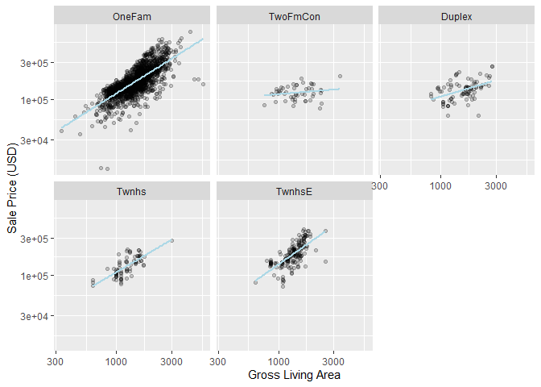
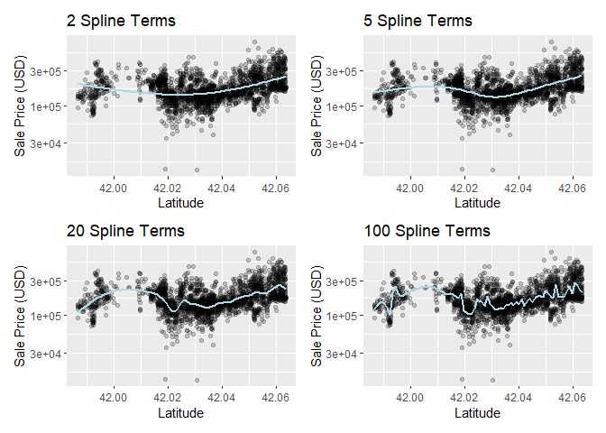

# 8 Feature Engineering with recipes


```r
library(tidymodels)
```

```
## ── Attaching packages ────────────────────────────────────── tidymodels 1.1.1 ──
```

```
## ✔ broom        1.0.5     ✔ recipes      1.0.8
## ✔ dials        1.2.0     ✔ rsample      1.2.0
## ✔ dplyr        1.1.4     ✔ tibble       3.2.1
## ✔ ggplot2      3.4.4     ✔ tidyr        1.3.0
## ✔ infer        1.0.5     ✔ tune         1.1.2
## ✔ modeldata    1.2.0     ✔ workflows    1.1.3
## ✔ parsnip      1.1.1     ✔ workflowsets 1.0.1
## ✔ purrr        1.0.2     ✔ yardstick    1.2.0
```

```
## ── Conflicts ───────────────────────────────────────── tidymodels_conflicts() ──
## ✖ purrr::discard() masks scales::discard()
## ✖ dplyr::filter()  masks stats::filter()
## ✖ dplyr::lag()     masks stats::lag()
## ✖ recipes::step()  masks stats::step()
## • Search for functions across packages at https://www.tidymodels.org/find/
```

```r
data(ames)

ames <- mutate(ames, Sale_Price = log10(Sale_Price))

set.seed(502)
ames_split <- initial_split(ames, prop = 0.80, strata = Sale_Price)
ames_train <- training(ames_split)
ames_test  <-  testing(ames_split)

lm_model <- linear_reg() %>% set_engine("lm")

lm_wflow <- 
  workflow() %>% 
  add_model(lm_model) %>% 
  add_variables(outcome = Sale_Price, predictors = c(Longitude, Latitude))

lm_fit <- fit(lm_wflow, ames_train)
```


## 8.1 A SIMPLE recipe() FOR THE AMES HOUSING DATA


```r
lm(Sale_Price ~ Neighborhood + log10(Gr_Liv_Area) + Year_Built + Bldg_Type, data = ames)
```

```
## 
## Call:
## lm(formula = Sale_Price ~ Neighborhood + log10(Gr_Liv_Area) + 
##     Year_Built + Bldg_Type, data = ames)
## 
## Coefficients:
##                                         (Intercept)  
##                                          -0.8551717  
##                           NeighborhoodCollege_Creek  
##                                           0.0135485  
##                                NeighborhoodOld_Town  
##                                          -0.0289607  
##                                 NeighborhoodEdwards  
##                                          -0.0493174  
##                                NeighborhoodSomerset  
##                                           0.0499653  
##                      NeighborhoodNorthridge_Heights  
##                                           0.1335758  
##                                 NeighborhoodGilbert  
##                                          -0.0337334  
##                                  NeighborhoodSawyer  
##                                          -0.0042779  
##                          NeighborhoodNorthwest_Ames  
##                                           0.0004589  
##                             NeighborhoodSawyer_West  
##                                          -0.0174582  
##                                NeighborhoodMitchell  
##                                           0.0004695  
##                               NeighborhoodBrookside  
##                                          -0.0110205  
##                                NeighborhoodCrawford  
##                                           0.0914254  
##                  NeighborhoodIowa_DOT_and_Rail_Road  
##                                          -0.0839821  
##                              NeighborhoodTimberland  
##                                           0.0604062  
##                              NeighborhoodNorthridge  
##                                           0.0845868  
##                             NeighborhoodStone_Brook  
##                                           0.1459657  
## NeighborhoodSouth_and_West_of_Iowa_State_University  
##                                          -0.0282535  
##                             NeighborhoodClear_Creek  
##                                           0.0480071  
##                          NeighborhoodMeadow_Village  
##                                          -0.0899124  
##                               NeighborhoodBriardale  
##                                          -0.0465821  
##                     NeighborhoodBloomington_Heights  
##                                           0.0402528  
##                                 NeighborhoodVeenker  
##                                           0.0885538  
##                         NeighborhoodNorthpark_Villa  
##                                           0.0262051  
##                                 NeighborhoodBlueste  
##                                           0.0322372  
##                                  NeighborhoodGreens  
##                                           0.1751507  
##                             NeighborhoodGreen_Hills  
##                                           0.2229230  
##                                NeighborhoodLandmark  
##                                          -0.0119925  
##                                  log10(Gr_Liv_Area)  
##                                           0.6343996  
##                                          Year_Built  
##                                           0.0020678  
##                                   Bldg_TypeTwoFmCon  
##                                          -0.0312306  
##                                     Bldg_TypeDuplex  
##                                          -0.1038443  
##                                      Bldg_TypeTwnhs  
##                                          -0.0968859  
##                                     Bldg_TypeTwnhsE  
##                                          -0.0414929
```


```r
tidymodels_prefer()

simple_ames <- 
  recipe(Sale_Price ~ Neighborhood + Gr_Liv_Area + Year_Built + Bldg_Type,
         data = ames_train) %>%
  step_log(Gr_Liv_Area, base = 10) %>% 
  step_dummy(all_nominal_predictors())
simple_ames
```

```
## 
```

```
## ── Recipe ──────────────────────────────────────────────────────────────────────
```

```
## 
```

```
## ── Inputs
```

```
## Number of variables by role
```

```
## outcome:   1
## predictor: 4
```

```
## 
```

```
## ── Operations
```

```
## • Log transformation on: Gr_Liv_Area
```

```
## • Dummy variables from: all_nominal_predictors()
```

## 8.2 USING RECIPES


```r
lm_wflow %>% 
  add_recipe(simple_ames)
```

```
## Error in `add_recipe()`:
## ! A recipe cannot be added when variables already exist.
```


```r
lm_wflow <- 
  lm_wflow %>% 
  remove_variables() %>% 
  add_recipe(simple_ames)
lm_wflow
```

```
## ══ Workflow ════════════════════════════════════════════════════════════════════
## Preprocessor: Recipe
## Model: linear_reg()
## 
## ── Preprocessor ────────────────────────────────────────────────────────────────
## 2 Recipe Steps
## 
## • step_log()
## • step_dummy()
## 
## ── Model ───────────────────────────────────────────────────────────────────────
## Linear Regression Model Specification (regression)
## 
## Computational engine: lm
```


```r
lm_fit <- fit(lm_wflow, ames_train)
```


```r
predict(lm_fit, ames_test %>% slice(1:3))
```

```
## Warning in predict.lm(object = object$fit, newdata = new_data, type =
## "response", : prediction from rank-deficient fit; consider predict(.,
## rankdeficient="NA")
```

```
## # A tibble: 3 × 1
##   .pred
##   <dbl>
## 1  5.08
## 2  5.32
## 3  5.28
```


```r
# Get the recipe after it has been estimated:
lm_fit %>% 
  extract_recipe(estimated = TRUE)
```

```
## 
```

```
## ── Recipe ──────────────────────────────────────────────────────────────────────
```

```
## 
```

```
## ── Inputs
```

```
## Number of variables by role
```

```
## outcome:   1
## predictor: 4
```

```
## 
```

```
## ── Training information
```

```
## Training data contained 2342 data points and no incomplete rows.
```

```
## 
```

```
## ── Operations
```

```
## • Log transformation on: Gr_Liv_Area | Trained
```

```
## • Dummy variables from: Neighborhood and Bldg_Type | Trained
```


```r
lm_fit %>% 
  # This returns the parsnip object:
  extract_fit_parsnip() %>% 
  # Now tidy the linear model object:
  tidy() %>% 
  slice(1:5)
```

```
## # A tibble: 5 × 5
##   term                       estimate std.error statistic   p.value
##   <chr>                         <dbl>     <dbl>     <dbl>     <dbl>
## 1 (Intercept)                -0.669    0.231        -2.90 3.80e-  3
## 2 Gr_Liv_Area                 0.620    0.0143       43.2  2.63e-299
## 3 Year_Built                  0.00200  0.000117     17.1  6.16e- 62
## 4 Neighborhood_College_Creek  0.0178   0.00819       2.17 3.02e-  2
## 5 Neighborhood_Old_Town      -0.0330   0.00838      -3.93 8.66e-  5
```

## 8.3 HOW DATA ARE USED BY THE recipe()
## 8.4 EXAMPLES OF RECIPE STEPS
### 8.4.1 ENCODING QUALITATIVE DATA IN A NUMERIC FORMAT


```r
simple_ames <- 
  recipe(Sale_Price ~ Neighborhood + Gr_Liv_Area + Year_Built + Bldg_Type,
         data = ames_train) %>%
  step_log(Gr_Liv_Area, base = 10) %>% 
  step_other(Neighborhood, threshold = 0.01) %>% 
  step_dummy(all_nominal_predictors())
```

### 8.4.2 INTERACTION TERMS

```r
ggplot(ames_train, aes(x = Gr_Liv_Area, y = 10^Sale_Price)) + 
  geom_point(alpha = .2) + 
  facet_wrap(~ Bldg_Type) + 
  geom_smooth(method = lm, formula = y ~ x, se = FALSE, color = "lightblue") + 
  scale_x_log10() + 
  scale_y_log10() + 
  labs(x = "Gross Living Area", y = "Sale Price (USD)")
```

<!-- -->


```r
Sale_Price ~ Neighborhood + log10(Gr_Liv_Area) + Bldg_Type + 
  log10(Gr_Liv_Area):Bldg_Type
# or
Sale_Price ~ Neighborhood + log10(Gr_Liv_Area) * Bldg_Type 
```


```r
simple_ames <- 
  recipe(Sale_Price ~ Neighborhood + Gr_Liv_Area + Year_Built + Bldg_Type,
         data = ames_train) %>%
  step_log(Gr_Liv_Area, base = 10) %>% 
  step_other(Neighborhood, threshold = 0.01) %>% 
  step_dummy(all_nominal_predictors()) %>% 
  # Gr_Liv_Area is on the log scale from a previous step
  step_interact( ~ Gr_Liv_Area:starts_with("Bldg_Type_") )
```

### 8.4.3 SPLINE FUNCTIONS


```r
library(patchwork)
library(splines)

plot_smoother <- function(deg_free) {
  ggplot(ames_train, aes(x = Latitude, y = 10^Sale_Price)) + 
    geom_point(alpha = .2) + 
    scale_y_log10() +
    geom_smooth(
      method = lm,
      formula = y ~ ns(x, df = deg_free),
      color = "lightblue",
      se = FALSE
    ) +
    labs(title = paste(deg_free, "Spline Terms"),
         y = "Sale Price (USD)")
}

( plot_smoother(2) + plot_smoother(5) ) / ( plot_smoother(20) + plot_smoother(100) )
```

<!-- -->


```r
recipe(Sale_Price ~ Neighborhood + Gr_Liv_Area + Year_Built + Bldg_Type + Latitude,
         data = ames_train) %>%
  step_log(Gr_Liv_Area, base = 10) %>% 
  step_other(Neighborhood, threshold = 0.01) %>% 
  step_dummy(all_nominal_predictors()) %>% 
  step_interact( ~ Gr_Liv_Area:starts_with("Bldg_Type_") ) %>% 
  step_ns(Latitude, deg_free = 20)
```

```
## 
```

```
## ── Recipe ──────────────────────────────────────────────────────────────────────
```

```
## 
```

```
## ── Inputs
```

```
## Number of variables by role
```

```
## outcome:   1
## predictor: 5
```

```
## 
```

```
## ── Operations
```

```
## • Log transformation on: Gr_Liv_Area
```

```
## • Collapsing factor levels for: Neighborhood
```

```
## • Dummy variables from: all_nominal_predictors()
```

```
## • Interactions with: Gr_Liv_Area:starts_with("Bldg_Type_")
```

```
## • Natural splines on: Latitude
```

### 8.4.4 FEATURE EXTRACTION


```r
  # Use a regular expression to capture house size predictors: 
  step_pca(matches("(SF$)|(Gr_Liv)"))
```

### 8.4.5 ROW SAMPLING STEPS


```r
  step_downsample(outcome_column_name)
```

### 8.4.6 GENERAL TRANSFORMATIONS

### 8.4.7 NATURAL LANGUAGE PROCESSING

### 8.5 SKIPPING STEPS FOR NEW DATA


```r
step_log(Sale_Price, base = 10)
```

## 8.6 TIDY A recipe()


```r
ames_rec <- 
  recipe(Sale_Price ~ Neighborhood + Gr_Liv_Area + Year_Built + Bldg_Type + 
           Latitude + Longitude, data = ames_train) %>%
  step_log(Gr_Liv_Area, base = 10) %>% 
  step_other(Neighborhood, threshold = 0.01) %>% 
  step_dummy(all_nominal_predictors()) %>% 
  step_interact( ~ Gr_Liv_Area:starts_with("Bldg_Type_") ) %>% 
  step_ns(Latitude, Longitude, deg_free = 20)
```


```r
tidy(ames_rec)
```

```
## # A tibble: 5 × 6
##   number operation type     trained skip  id            
##    <int> <chr>     <chr>    <lgl>   <lgl> <chr>         
## 1      1 step      log      FALSE   FALSE log_NSTJP     
## 2      2 step      other    FALSE   FALSE other_5HSyx   
## 3      3 step      dummy    FALSE   FALSE dummy_DMSaM   
## 4      4 step      interact FALSE   FALSE interact_ULMsR
## 5      5 step      ns       FALSE   FALSE ns_HMcZA
```


```r
ames_rec <- 
  recipe(Sale_Price ~ Neighborhood + Gr_Liv_Area + Year_Built + Bldg_Type + 
           Latitude + Longitude, data = ames_train) %>%
  step_log(Gr_Liv_Area, base = 10) %>% 
  step_other(Neighborhood, threshold = 0.01, id = "my_id") %>% 
  step_dummy(all_nominal_predictors()) %>% 
  step_interact( ~ Gr_Liv_Area:starts_with("Bldg_Type_") ) %>% 
  step_ns(Latitude, Longitude, deg_free = 20)
```


```r
tidy(ames_rec)
```

```
## # A tibble: 5 × 6
##   number operation type     trained skip  id            
##    <int> <chr>     <chr>    <lgl>   <lgl> <chr>         
## 1      1 step      log      FALSE   FALSE log_PW6gd     
## 2      2 step      other    FALSE   FALSE my_id         
## 3      3 step      dummy    FALSE   FALSE dummy_for8K   
## 4      4 step      interact FALSE   FALSE interact_zm0tx
## 5      5 step      ns       FALSE   FALSE ns_9aI3F
```


```r
lm_wflow <- 
  workflow() %>% 
  add_model(lm_model) %>% 
  add_recipe(ames_rec)
```


```r
lm_fit <- fit(lm_wflow, ames_train)
```


```r
estimated_recipe <- 
  lm_fit %>% 
  extract_recipe(estimated = TRUE)

tidy(estimated_recipe, id = "my_id")
```

```
## # A tibble: 22 × 3
##    terms        retained           id   
##    <chr>        <chr>              <chr>
##  1 Neighborhood North_Ames         my_id
##  2 Neighborhood College_Creek      my_id
##  3 Neighborhood Old_Town           my_id
##  4 Neighborhood Edwards            my_id
##  5 Neighborhood Somerset           my_id
##  6 Neighborhood Northridge_Heights my_id
##  7 Neighborhood Gilbert            my_id
##  8 Neighborhood Sawyer             my_id
##  9 Neighborhood Northwest_Ames     my_id
## 10 Neighborhood Sawyer_West        my_id
## # ℹ 12 more rows
```


```r
tidy(estimated_recipe, number = 2)
```

```
## # A tibble: 22 × 3
##    terms        retained           id   
##    <chr>        <chr>              <chr>
##  1 Neighborhood North_Ames         my_id
##  2 Neighborhood College_Creek      my_id
##  3 Neighborhood Old_Town           my_id
##  4 Neighborhood Edwards            my_id
##  5 Neighborhood Somerset           my_id
##  6 Neighborhood Northridge_Heights my_id
##  7 Neighborhood Gilbert            my_id
##  8 Neighborhood Sawyer             my_id
##  9 Neighborhood Northwest_Ames     my_id
## 10 Neighborhood Sawyer_West        my_id
## # ℹ 12 more rows
```

## 8.7 COLUMN ROLES


```r
ames_rec %>% update_role(address, new_role = "street address")
```

## 8.8 CHAPTER SUMMARY


```r
library(tidymodels)
data(ames)
ames <- mutate(ames, Sale_Price = log10(Sale_Price))

set.seed(502)
ames_split <- initial_split(ames, prop = 0.80, strata = Sale_Price)
ames_train <- training(ames_split)
ames_test  <-  testing(ames_split)

ames_rec <- 
  recipe(Sale_Price ~ Neighborhood + Gr_Liv_Area + Year_Built + Bldg_Type + 
           Latitude + Longitude, data = ames_train) %>%
  step_log(Gr_Liv_Area, base = 10) %>% 
  step_other(Neighborhood, threshold = 0.01) %>% 
  step_dummy(all_nominal_predictors()) %>% 
  step_interact( ~ Gr_Liv_Area:starts_with("Bldg_Type_") ) %>% 
  step_ns(Latitude, Longitude, deg_free = 20)
  
lm_model <- linear_reg() %>% set_engine("lm")

lm_wflow <- 
  workflow() %>% 
  add_model(lm_model) %>% 
  add_recipe(ames_rec)

lm_fit <- fit(lm_wflow, ames_train)
```

