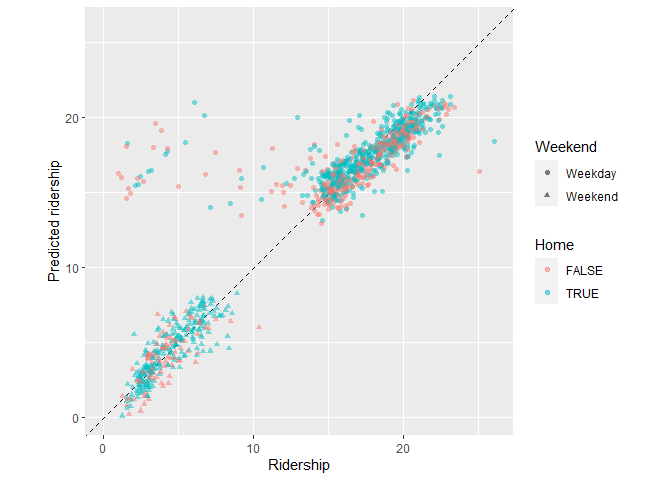

```r
library(modeldata)
library(tidyverse)
```

```
## ── Attaching core tidyverse packages ──────────────────────── tidyverse 2.0.0 ──
## ✔ dplyr     1.1.4     ✔ readr     2.1.4
## ✔ forcats   1.0.0     ✔ stringr   1.5.1
## ✔ ggplot2   3.4.4     ✔ tibble    3.2.1
## ✔ lubridate 1.9.3     ✔ tidyr     1.3.0
## ✔ purrr     1.0.2     
## ── Conflicts ────────────────────────────────────────── tidyverse_conflicts() ──
## ✖ dplyr::filter() masks stats::filter()
## ✖ dplyr::lag()    masks stats::lag()
## ℹ Use the conflicted package (<http://conflicted.r-lib.org/>) to force all conflicts to become errors
```

```r
library(lubridate)
library(tidymodels)
```

```
## ── Attaching packages ────────────────────────────────────── tidymodels 1.1.1 ──
## ✔ broom        1.0.5     ✔ rsample      1.2.0
## ✔ dials        1.2.0     ✔ tune         1.1.2
## ✔ infer        1.0.5     ✔ workflows    1.1.3
## ✔ parsnip      1.1.1     ✔ workflowsets 1.0.1
## ✔ recipes      1.0.8     ✔ yardstick    1.2.0
## ── Conflicts ───────────────────────────────────────── tidymodels_conflicts() ──
## ✖ scales::discard() masks purrr::discard()
## ✖ dplyr::filter()   masks stats::filter()
## ✖ recipes::fixed()  masks stringr::fixed()
## ✖ dplyr::lag()      masks stats::lag()
## ✖ yardstick::spec() masks readr::spec()
## ✖ recipes::step()   masks stats::step()
## • Learn how to get started at https://www.tidymodels.org/start/
```

```r
data("Chicago")
Chicago
```

```
## # A tibble: 5,698 × 50
##    ridership Austin Quincy_Wells Belmont Archer_35th Oak_Park Western Clark_Lake
##        <dbl>  <dbl>        <dbl>   <dbl>       <dbl>    <dbl>   <dbl>      <dbl>
##  1     15.7   1.46         8.37     4.60       2.01     1.42    3.32       15.6 
##  2     15.8   1.50         8.35     4.72       2.09     1.43    3.34       15.7 
##  3     15.9   1.52         8.36     4.68       2.11     1.49    3.36       15.6 
##  4     15.9   1.49         7.85     4.77       2.17     1.44    3.36       15.7 
##  5     15.4   1.50         7.62     4.72       2.06     1.42    3.27       15.6 
##  6      2.42  0.693        0.911    2.27       0.624    0.426   1.11        2.41
##  7      1.47  0.408        0.414    1.63       0.378    0.225   0.567       1.37
##  8     15.5   0.987        4.81     3.52       1.34     0.879   1.94        9.02
##  9     15.9   1.55         8.23     4.71       2.22     1.46    3.46       16.0 
## 10     15.9   1.59         8.25     4.77       2.23     1.48    3.51       15.8 
## # ℹ 5,688 more rows
## # ℹ 42 more variables: Clinton <dbl>, Merchandise_Mart <dbl>,
## #   Irving_Park <dbl>, Washington_Wells <dbl>, Harlem <dbl>, Monroe <dbl>,
## #   Polk <dbl>, Ashland <dbl>, Kedzie <dbl>, Addison <dbl>,
## #   Jefferson_Park <dbl>, Montrose <dbl>, California <dbl>, temp_min <dbl>,
## #   temp <dbl>, temp_max <dbl>, temp_change <dbl>, dew <dbl>, humidity <dbl>,
## #   pressure <dbl>, pressure_change <dbl>, wind <dbl>, wind_max <dbl>, …
```

## 1.  Explore the data

Make a histogram of ridership.  What might be causing the two peaks.  Is there a predictor variable that can account for this (or that can be used to make a new variable to account for it)?  
I am not suggesting that you do regressions or plots on all variables at this time, rather that you think about what might have this kind of impact.  
If you need to make a new predictor variable, go ahead.


```r
ggplot(Chicago, aes(x = ridership)) +
  geom_histogram()
```

```
## `stat_bin()` using `bins = 30`. Pick better value with `binwidth`.
```

<!-- -->


```r
library(lubridate)
Chicago <- Chicago %>%
  mutate(DoW = as.character(wday(ymd(date), label = T, abbr = F)),
         Weekend = ifelse(DoW == "Saturday" |DoW == "Sunday",
                          "Weekend",
                          "Weekday")) %>%
  select(-DoW)

ggplot(Chicago, aes(x = ridership, fill = Weekend)) +
  geom_density(alpha = 0.5)
```

<!-- -->

## 2. Training and Test
Make an 80/20 train/test split.  Do you need to stratify over anything?
So that we are working on the same split, use `set.seed(010324)` in you code chunk


```r
set.seed(010324)
# Since there's 2 clear peaks of ridership we should stratify over ridership to make sure we get even amounts of samples across the two peaks
chicago_split <- initial_split(Chicago, prop = 0.80, strata = ridership)
chicago_train <- training(chicago_split)
chicago_test <- testing(chicago_split)
```

## 3. Workflow set
Let's compare the effectiveness  of the `temp` and `percip` [six] predictors.

### 3A
Use a workflow set (see chapter 7) to fit six models, each of which has your predictor from Q1 along with one of the following variables:
`temp_min`, `temp`, `temp_max`, `temp_change`, `percip`, `percip_max`
The formula for one of these would be something like `ridership ~ temp_min + Q1_predictor`.


```r
formulas <- list(
  ridership ~ temp_min + Weekend,
  ridership ~ temp + Weekend,
  ridership ~ temp_max + Weekend,
  ridership ~ temp_change + Weekend,
  ridership ~ percip + Weekend,
  ridership ~ percip_max + Weekend
)
lm_model <- linear_reg() %>% set_engine("lm")
rider_models <- workflow_set(preproc = formulas,
                             models = list(lm = lm_model)
                            )

rider_models <-
   rider_models %>%
   mutate(fit = map(info, ~ fit(.x$workflow[[1]], chicago_train)))
```

### 3B
Compare the model fits / predictors (this can be using any of the p-value of the predictor, R2, AIC, log-lik).  Don't worry about the test set, just compare goodness of fit when fit with the training set.


```r
rider_models %>%
  mutate(tidy=map(fit, tidy)) %>%
  unnest(tidy) %>%
  filter(grepl("temp|percip", term)) %>%
  arrange(p.value) %>%
  select(wflow_id, term, info, p.value)
```

```
## # A tibble: 6 × 4
##   wflow_id     term        info              p.value
##   <chr>        <chr>       <list>              <dbl>
## 1 formula_2_lm temp        <tibble [1 × 4]> 9.99e-68
## 2 formula_1_lm temp_min    <tibble [1 × 4]> 7.95e-67
## 3 formula_3_lm temp_max    <tibble [1 × 4]> 1.95e-66
## 4 formula_4_lm temp_change <tibble [1 × 4]> 1.06e- 5
## 5 formula_6_lm percip_max  <tibble [1 × 4]> 1.32e- 3
## 6 formula_5_lm percip      <tibble [1 × 4]> 5.48e- 1
```

## 4 Recipes
### 4A
Create a workflow recipe does the following:
* normalizes all weather and station predictors
* creates a set of PCs for the weather-related predictors, keeping enough PCs to explain 75% of the variance in the weather variables
* creates a second set of PCs for the station-related predictors, keeping enough PCs to explaining 75% of the variance in these variables
Hint: tidy(), prep(), and bake() methods for recipes may be helpful in examining what you have done.  The help file on recipe is good too.
Hint2: You can use various dplyr::select functions and regular expressions to avoid having to type out the variable names.  But as a fair-warning, it took me a lot longer to figure that out than it would have to just type then out.  (But next time it might be faster).  I can demo.


```r
chicago_rec <- 
  recipe(ridership ~ ., data = chicago_train) %>%
  update_role(Austin:California, new_role = "station") %>%
  update_role(temp_min:weather_storm, new_role = "weather") %>%
  step_normalize(has_role("station"), has_role("weather")) %>%
  step_pca(has_role("station"), threshold = .75, prefix = "station_PC", id = "station_pca") %>%
  step_pca(has_role("weather"), threshold = .75, prefix = "weather_PC", id = "weather_pca")

chicago_rec
```

```
## 
```

```
## ── Recipe ──────────────────────────────────────────────────────────────────────
```

```
## 
```

```
## ── Inputs
```

```
## Number of variables by role
```

```
## outcome:    1
## predictor: 12
## station:   20
## weather:   18
```

```
## 
```

```
## ── Operations
```

```
## • Centering and scaling for: has_role("station") and has_role("weather")
```

```
## • PCA extraction with: has_role("station")
```

```
## • PCA extraction with: has_role("weather")
```

### 4B
Use the recipe from 4A to fit a linear regression of ridership on the new PCs and all remaining predictors (i.e. those not used in making the PCs).  Use the training data.


```r
lm_wflow <- 
  workflow() %>% 
  add_model(lm_model) %>% 
  add_recipe(chicago_rec)

lm_fit <- fit(lm_wflow, chicago_train)

tidy(lm_fit) %>% arrange(p.value)
```

```
## # A tibble: 20 × 5
##    term              estimate  std.error statistic    p.value
##    <chr>                <dbl>      <dbl>     <dbl>      <dbl>
##  1 WeekendWeekend  -11.7       0.189      -61.8     0        
##  2 date              0.000937  0.0000248   37.9     9.75e-273
##  3 weather_PC1       0.363     0.0237      15.3     1.08e- 51
##  4 (Intercept)       3.74      0.331       11.3     3.03e- 29
##  5 station_PC1       0.140     0.0203       6.88    6.96e- 12
##  6 Bulls_Home        0.314     0.116        2.70    7.06e-  3
##  7 WhiteSox_Away    -0.232     0.0999      -2.32    2.03e-  2
##  8 weather_PC5      -0.0545    0.0336      -1.63    1.04e-  1
##  9 Bears_Away       -0.332     0.229       -1.45    1.47e-  1
## 10 weather_PC6       0.0451    0.0352       1.28    2.00e-  1
## 11 weather_PC4       0.0343    0.0273       1.26    2.09e-  1
## 12 weather_PC2      -0.0188    0.0184      -1.02    3.06e-  1
## 13 Blackhawks_Away   0.115     0.116        0.993   3.21e-  1
## 14 weather_PC3       0.0228    0.0237       0.963   3.36e-  1
## 15 Bears_Home       -0.157     0.212       -0.740   4.59e-  1
## 16 Blackhawks_Home   0.0315    0.119        0.264   7.92e-  1
## 17 Bulls_Away       -0.00759   0.116       -0.0657  9.48e-  1
## 18 WhiteSox_Home    NA        NA           NA      NA        
## 19 Cubs_Away        NA        NA           NA      NA        
## 20 Cubs_Home        NA        NA           NA      NA
```

### 4C
Use the fit from 4B to predict ridership in the test data.  Evaluate the predictions.


```r
chicago_test_res <- predict(lm_fit, new_data = chicago_test %>% select(-ridership))
```

```
## Warning in predict.lm(object = object$fit, newdata = new_data, type =
## "response", : prediction from rank-deficient fit; consider predict(.,
## rankdeficient="NA")
```

```r
chicago_test_res <- bind_cols(chicago_test_res, chicago_test %>% select(ridership))
```


```r
ggplot(chicago_test_res, aes(x = ridership, y = .pred)) + 
  # Create a diagonal line:
  geom_abline(lty = 2) + 
  geom_point(alpha = 0.5) + 
  labs(y = "Predicted ridership", x = "Ridership") +
  # Scale and size the x- and y-axis uniformly:
  coord_obs_pred()
```

<!-- -->

Few random spikes


```r
rmse(chicago_test_res, truth = ridership, estimate = .pred)
```

```
## # A tibble: 1 × 3
##   .metric .estimator .estimate
##   <chr>   <chr>          <dbl>
## 1 rmse    standard        2.48
```
