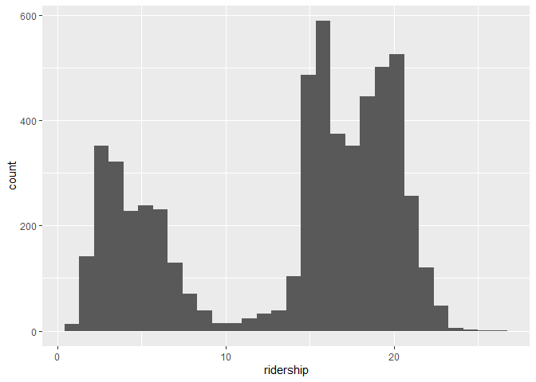
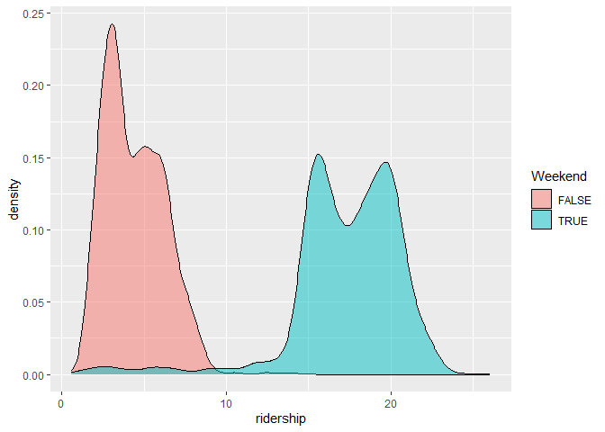
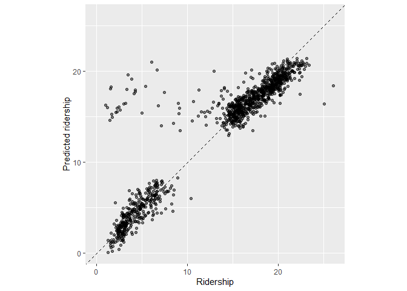
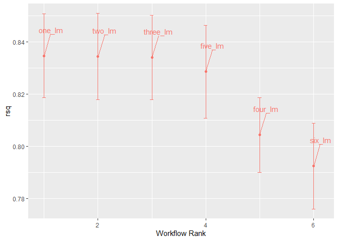
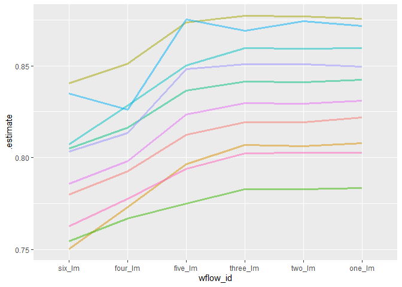
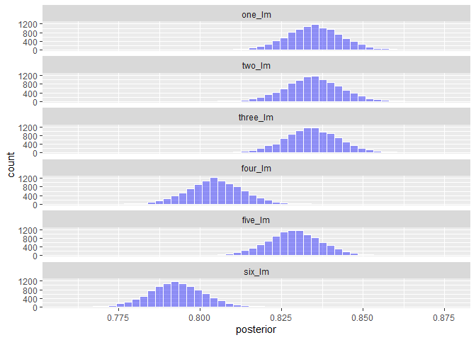
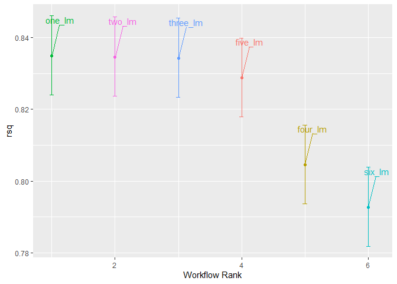
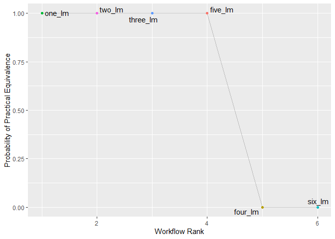

```r
library(modeldata)
library(tidyverse)
```

```
## ── Attaching core tidyverse packages ──────────────────────── tidyverse 2.0.0 ──
## ✔ dplyr     1.1.2     ✔ readr     2.1.4
## ✔ forcats   1.0.0     ✔ stringr   1.5.0
## ✔ ggplot2   3.4.4     ✔ tibble    3.2.1
## ✔ lubridate 1.9.2     ✔ tidyr     1.3.0
## ✔ purrr     1.0.2     
## ── Conflicts ────────────────────────────────────────── tidyverse_conflicts() ──
## ✖ dplyr::filter() masks stats::filter()
## ✖ dplyr::lag()    masks stats::lag()
## ℹ Use the conflicted package (<http://conflicted.r-lib.org/>) to force all conflicts to become errors
```

```r
library(lubridate)
library(tidymodels)
```

```
## ── Attaching packages ────────────────────────────────────── tidymodels 1.1.1 ──
## ✔ broom        1.0.5     ✔ rsample      1.2.0
## ✔ dials        1.2.0     ✔ tune         1.1.2
## ✔ infer        1.0.5     ✔ workflows    1.1.3
## ✔ parsnip      1.1.1     ✔ workflowsets 1.0.1
## ✔ recipes      1.0.8     ✔ yardstick    1.2.0
## ── Conflicts ───────────────────────────────────────── tidymodels_conflicts() ──
## ✖ scales::discard() masks purrr::discard()
## ✖ dplyr::filter()   masks stats::filter()
## ✖ recipes::fixed()  masks stringr::fixed()
## ✖ dplyr::lag()      masks stats::lag()
## ✖ yardstick::spec() masks readr::spec()
## ✖ recipes::step()   masks stats::step()
## • Use suppressPackageStartupMessages() to eliminate package startup messages
```

```r
data("Chicago")
Chicago
```

```
## # A tibble: 5,698 × 50
##    ridership Austin Quincy_Wells Belmont Archer_35th Oak_Park Western Clark_Lake
##        <dbl>  <dbl>        <dbl>   <dbl>       <dbl>    <dbl>   <dbl>      <dbl>
##  1     15.7   1.46         8.37     4.60       2.01     1.42    3.32       15.6 
##  2     15.8   1.50         8.35     4.72       2.09     1.43    3.34       15.7 
##  3     15.9   1.52         8.36     4.68       2.11     1.49    3.36       15.6 
##  4     15.9   1.49         7.85     4.77       2.17     1.44    3.36       15.7 
##  5     15.4   1.50         7.62     4.72       2.06     1.42    3.27       15.6 
##  6      2.42  0.693        0.911    2.27       0.624    0.426   1.11        2.41
##  7      1.47  0.408        0.414    1.63       0.378    0.225   0.567       1.37
##  8     15.5   0.987        4.81     3.52       1.34     0.879   1.94        9.02
##  9     15.9   1.55         8.23     4.71       2.22     1.46    3.46       16.0 
## 10     15.9   1.59         8.25     4.77       2.23     1.48    3.51       15.8 
## # ℹ 5,688 more rows
## # ℹ 42 more variables: Clinton <dbl>, Merchandise_Mart <dbl>,
## #   Irving_Park <dbl>, Washington_Wells <dbl>, Harlem <dbl>, Monroe <dbl>,
## #   Polk <dbl>, Ashland <dbl>, Kedzie <dbl>, Addison <dbl>,
## #   Jefferson_Park <dbl>, Montrose <dbl>, California <dbl>, temp_min <dbl>,
## #   temp <dbl>, temp_max <dbl>, temp_change <dbl>, dew <dbl>, humidity <dbl>,
## #   pressure <dbl>, pressure_change <dbl>, wind <dbl>, wind_max <dbl>, …
```

## 1.  Explore the data

Make a histogram of ridership.  What might be causing the two peaks.  Is there a predictor variable that can account for this (or that can be used to make a new variable to account for it)?  
I am not suggesting that you do regressions or plots on all variables at this time, rather that you think about what might have this kind of impact.  
If you need to make a new predictor variable, go ahead.


```r
ggplot(Chicago, aes(x = ridership)) +
  geom_histogram()
```

```
## `stat_bin()` using `bins = 30`. Pick better value with `binwidth`.
```

<!-- -->


```r
library(lubridate)
Chicago <- Chicago %>%
  mutate(Weekend = timeDate::isBizday(timeDate::as.timeDate(date)))

ggplot(Chicago, aes(x = ridership, fill = Weekend)) +
  geom_density(alpha = 0.5)
```

<!-- -->

## 2. Training and Test
Make an 80/20 train/test split.  Do you need to stratify over anything?
So that we are working on the same split, use `set.seed(010324)` in you code chunk


```r
set.seed(010324)
# Since there's 2 clear peaks of ridership we should stratify over ridership to make sure we get even amounts of samples across the two peaks
chicago_split <- initial_split(Chicago, prop = 0.80, strata = ridership)
chicago_train <- training(chicago_split)
chicago_test <- testing(chicago_split)
```

## 3. Workflow set
Let's compare the effectiveness  of the `temp` and `percip` [six] predictors.

### 3A
Use a workflow set (see chapter 7) to fit six models, each of which has your predictor from Q1 along with one of the following variables:
`temp_min`, `temp`, `temp_max`, `temp_change`, `percip`, `percip_max`
The formula for one of these would be something like `ridership ~ temp_min + Q1_predictor`.


```r
formulas <- list(
  ridership ~ temp_min + Weekend,
  ridership ~ temp + Weekend,
  ridership ~ temp_max + Weekend,
  ridership ~ temp_change + Weekend,
  ridership ~ percip + Weekend,
  ridership ~ percip_max + Weekend
)
lm_model <- linear_reg() %>% set_engine("lm")
rider_models <- workflow_set(preproc = formulas,
                             models = list(lm = lm_model)
                            )

rider_models <-
   rider_models %>%
   mutate(fit = map(info, ~ fit(.x$workflow[[1]], chicago_train)))
```

### 3B
Compare the model fits / predictors (this can be using any of the p-value of the predictor, R2, AIC, log-lik).  Don't worry about the test set, just compare goodness of fit when fit with the training set.


```r
rider_models %>%
  mutate(tidy=map(fit, tidy)) %>%
  unnest(tidy) %>%
  filter(grepl("temp|percip", term)) %>%
  arrange(p.value) %>%
  select(wflow_id, term, info, p.value)
```

```
## # A tibble: 6 × 4
##   wflow_id     term        info              p.value
##   <chr>        <chr>       <list>              <dbl>
## 1 formula_2_lm temp        <tibble [1 × 4]> 9.99e-68
## 2 formula_1_lm temp_min    <tibble [1 × 4]> 7.95e-67
## 3 formula_3_lm temp_max    <tibble [1 × 4]> 1.95e-66
## 4 formula_4_lm temp_change <tibble [1 × 4]> 1.06e- 5
## 5 formula_6_lm percip_max  <tibble [1 × 4]> 1.32e- 3
## 6 formula_5_lm percip      <tibble [1 × 4]> 5.48e- 1
```

## 4 Recipes
### 4A
Create a workflow recipe does the following:
* normalizes all weather and station predictors
* creates a set of PCs for the weather-related predictors, keeping enough PCs to explain 75% of the variance in the weather variables
* creates a second set of PCs for the station-related predictors, keeping enough PCs to explaining 75% of the variance in these variables
Hint: tidy(), prep(), and bake() methods for recipes may be helpful in examining what you have done.  The help file on recipe is good too.
Hint2: You can use various dplyr::select functions and regular expressions to avoid having to type out the variable names.  But as a fair-warning, it took me a lot longer to figure that out than it would have to just type then out.  (But next time it might be faster).  I can demo.


```r
chicago_rec <- 
  recipe(ridership ~ ., data = chicago_train) %>%
  update_role(Austin:California, new_role = "station") %>%
  update_role(temp_min:weather_storm, new_role = "weather") %>%
  step_normalize(has_role("station"), has_role("weather")) %>%
  step_pca(has_role("station"), threshold = .75, prefix = "station_PC", id = "station_pca") %>%
  step_pca(has_role("weather"), threshold = .75, prefix = "weather_PC", id = "weather_pca")

chicago_rec
```

```
## 
```

```
## ── Recipe ──────────────────────────────────────────────────────────────────────
```

```
## 
```

```
## ── Inputs
```

```
## Number of variables by role
```

```
## outcome:    1
## predictor: 12
## station:   20
## weather:   18
```

```
## 
```

```
## ── Operations
```

```
## • Centering and scaling for: has_role("station"), has_role("weather")
```

```
## • PCA extraction with: has_role("station")
```

```
## • PCA extraction with: has_role("weather")
```

### 4B
Use the recipe from 4A to fit a linear regression of ridership on the new PCs and all remaining predictors (i.e. those not used in making the PCs).  Use the training data.


```r
lm_wflow <- 
  workflow() %>% 
  add_model(lm_model) %>% 
  add_recipe(chicago_rec)

lm_fit <- fit(lm_wflow, chicago_train)

tidy(lm_fit) %>% arrange(p.value)
```

```
## # A tibble: 20 × 5
##    term             estimate  std.error statistic    p.value
##    <chr>               <dbl>      <dbl>     <dbl>      <dbl>
##  1 WeekendTRUE     11.7       0.189       61.8     0        
##  2 date             0.000937  0.0000248   37.9     9.75e-273
##  3 (Intercept)     -7.96      0.435      -18.3     3.27e- 72
##  4 weather_PC1      0.363     0.0237      15.3     1.08e- 51
##  5 station_PC1      0.140     0.0203       6.88    6.96e- 12
##  6 Bulls_Home       0.314     0.116        2.70    7.06e-  3
##  7 WhiteSox_Away   -0.232     0.0999      -2.32    2.03e-  2
##  8 weather_PC5     -0.0545    0.0336      -1.63    1.04e-  1
##  9 Bears_Away      -0.332     0.229       -1.45    1.47e-  1
## 10 weather_PC6      0.0451    0.0352       1.28    2.00e-  1
## 11 weather_PC4      0.0343    0.0273       1.26    2.09e-  1
## 12 weather_PC2     -0.0188    0.0184      -1.02    3.06e-  1
## 13 Blackhawks_Away  0.115     0.116        0.993   3.21e-  1
## 14 weather_PC3      0.0228    0.0237       0.963   3.36e-  1
## 15 Bears_Home      -0.157     0.212       -0.740   4.59e-  1
## 16 Blackhawks_Home  0.0315    0.119        0.264   7.92e-  1
## 17 Bulls_Away      -0.00759   0.116       -0.0657  9.48e-  1
## 18 WhiteSox_Home   NA        NA           NA      NA        
## 19 Cubs_Away       NA        NA           NA      NA        
## 20 Cubs_Home       NA        NA           NA      NA
```

### 4C
Use the fit from 4B to predict ridership in the test data.  Evaluate the predictions.


```r
chicago_test_res <- predict(lm_fit, new_data = chicago_test %>% select(-ridership))
```

```
## Warning in predict.lm(object = object$fit, newdata = new_data, type =
## "response", : prediction from rank-deficient fit; consider predict(.,
## rankdeficient="NA")
```

```r
chicago_test_res <- bind_cols(chicago_test_res, chicago_test %>% select(ridership))
```


```r
ggplot(chicago_test_res, aes(x = ridership, y = .pred)) + 
  # Create a diagonal line:
  geom_abline(lty = 2) + 
  geom_point(alpha = 0.5) + 
  labs(y = "Predicted ridership", x = "Ridership") +
  # Scale and size the x- and y-axis uniformly:
  coord_obs_pred()
```

<!-- -->

Few random spikes


```r
rmse(chicago_test_res, truth = ridership, estimate = .pred)
```

```
## # A tibble: 1 × 3
##   .metric .estimator .estimate
##   <chr>   <chr>          <dbl>
## 1 rmse    standard        2.48
```

### NEW STUFF

###  Compare these 6 models
1. All PCs and remaining predictors (same as Q4). optional: compare random forest and lm for this full data set
2. The PCs + the weekend variable (no sports team data)
3. 1 weather PC, 1 station PC, + the weekend variable
4. 1 weather PC + the weekend variable
5. 1 station PC + the weekend variable
6. the weekend variable only


```r
# Reiterate preprocessing
base_rec <- 
  recipe(ridership ~ ., data = chicago_train) %>%
  update_role(Austin:California, new_role = "station") %>%
  update_role(temp_min:weather_storm, new_role = "weather") %>%
  update_role(Blackhawks_Away:Cubs_Home, new_role = "sports") %>%
  update_role(date, new_role = "date") %>%
  step_normalize(has_role("station"), has_role("weather"))
  
base_rec
```

```
## 
```

```
## ── Recipe ──────────────────────────────────────────────────────────────────────
```

```
## 
```

```
## ── Inputs
```

```
## Number of variables by role
```

```
## outcome:    1
## predictor:  1
## station:   20
## weather:   18
## sports:    10
## date:       1
```

```
## 
```

```
## ── Operations
```

```
## • Centering and scaling for: has_role("station"), has_role("weather")
```


```r
# See if base, just the weekend predictor is what I actually have
lm_wflow <- 
  workflow() %>% 
  add_model(lm_model) %>% 
  add_recipe(base_rec)

lm_fit <- fit(lm_wflow, chicago_train)

tidy(lm_fit) %>% arrange(p.value)
```

```
## # A tibble: 2 × 5
##   term        estimate std.error statistic p.value
##   <chr>          <dbl>     <dbl>     <dbl>   <dbl>
## 1 (Intercept)     4.41    0.0826      53.4       0
## 2 WeekendTRUE    12.9     0.0978     132.        0
```

```r
# Yes only the weekend predictor was used
```


```r
# Build each recipe
rec_1 <- base_rec %>%
  step_pca(has_role("station"), threshold = .75, prefix = "station_PC", id = "station_pca") %>%
  step_pca(has_role("weather"), threshold = .75, prefix = "weather_PC", id = "weather_pca") %>%
  update_role(has_role("sports"), new_role = "predictor")

rec_2 <- base_rec %>%
  step_pca(has_role("station"), threshold = .75, prefix = "station_PC", id = "station_pca") %>%
  step_pca(has_role("weather"), threshold = .75, prefix = "weather_PC", id = "weather_pca")

rec_3 <- base_rec %>%
  step_pca(has_role("station"), num_comp = 1, prefix = "station_PC", id = "station_pca") %>%
  step_pca(has_role("weather"), num_comp = 1, prefix = "weather_PC", id = "weather_pca")
  
rec_4 <- base_rec %>%
  step_pca(has_role("weather"), num_comp = 1, prefix = "weather_PC", id = "weather_pca")

rec_5 <- base_rec %>%
  step_pca(has_role("station"), num_comp = 1, prefix = "station_PC", id = "station_pca")

rec_6 <- base_rec

preproc <- list(
  one = rec_1,
  two = rec_2,
  three = rec_3,
  four = rec_4,
  five = rec_5,
  six = rec_6
)
```


```r
# Another sanity check on model 3
lm_wflow <- 
  workflow() %>% 
  add_model(lm_model) %>% 
  add_recipe(rec_3)

lm_fit <- fit(lm_wflow, chicago_train)

tidy(lm_fit) %>% arrange(p.value)
```

```
## # A tibble: 4 × 5
##   term        estimate std.error statistic   p.value
##   <chr>          <dbl>     <dbl>     <dbl>     <dbl>
## 1 (Intercept)    7.78     0.140       55.5 0        
## 2 WeekendTRUE    8.19     0.189       43.4 0        
## 3 station_PC1    0.555    0.0196      28.3 1.15e-162
## 4 weather_PC1    0.245    0.0187      13.1 1.62e- 38
```

```r
# Works as intended
```


```r
# make workflowset
lm_models <- workflow_set(
  preproc = preproc,
  models = list(lm = linear_reg()), cross = FALSE
)
lm_models
```

```
## # A workflow set/tibble: 6 × 4
##   wflow_id info             option    result    
##   <chr>    <list>           <list>    <list>    
## 1 one_lm   <tibble [1 × 4]> <opts[0]> <list [0]>
## 2 two_lm   <tibble [1 × 4]> <opts[0]> <list [0]>
## 3 three_lm <tibble [1 × 4]> <opts[0]> <list [0]>
## 4 four_lm  <tibble [1 × 4]> <opts[0]> <list [0]>
## 5 five_lm  <tibble [1 × 4]> <opts[0]> <list [0]>
## 6 six_lm   <tibble [1 × 4]> <opts[0]> <list [0]>
```


```r
chicago_folds <- vfold_cv(chicago_train, v = 10)
keep_pred <- control_resamples(save_pred = TRUE, save_workflow = TRUE)

lm_models <- lm_models %>%
  workflow_map("fit_resamples",
               seed = 1101,
               verbose = TRUE,
               resamples = chicago_folds,
               control = keep_pred)
```

```
## i 1 of 6 resampling: one_lm
```

```
## → A | warning: prediction from rank-deficient fit; consider predict(., rankdeficient="NA")
```

```
## 
There were issues with some computations   A: x1

There were issues with some computations   A: x2

There were issues with some computations   A: x3

There were issues with some computations   A: x4

There were issues with some computations   A: x5

There were issues with some computations   A: x6

There were issues with some computations   A: x7

There were issues with some computations   A: x8

There were issues with some computations   A: x9

There were issues with some computations   A: x10

There were issues with some computations   A: x10
## ✔ 1 of 6 resampling: one_lm (3.2s)
## i 2 of 6 resampling: two_lm
## ✔ 2 of 6 resampling: two_lm (2.4s)
## i 3 of 6 resampling: three_lm
## ✔ 3 of 6 resampling: three_lm (1.9s)
## i 4 of 6 resampling: four_lm
## ✔ 4 of 6 resampling: four_lm (1.5s)
## i 5 of 6 resampling: five_lm
## ✔ 5 of 6 resampling: five_lm (1.5s)
## i 6 of 6 resampling: six_lm
## ✔ 6 of 6 resampling: six_lm (1.2s)
```

```r
lm_models
```

```
## # A workflow set/tibble: 6 × 4
##   wflow_id info             option    result   
##   <chr>    <list>           <list>    <list>   
## 1 one_lm   <tibble [1 × 4]> <opts[2]> <rsmp[+]>
## 2 two_lm   <tibble [1 × 4]> <opts[2]> <rsmp[+]>
## 3 three_lm <tibble [1 × 4]> <opts[2]> <rsmp[+]>
## 4 four_lm  <tibble [1 × 4]> <opts[2]> <rsmp[+]>
## 5 five_lm  <tibble [1 × 4]> <opts[2]> <rsmp[+]>
## 6 six_lm   <tibble [1 × 4]> <opts[2]> <rsmp[+]>
```


```r
collect_metrics(lm_models) %>%
  filter(.metric == "rmse")
```

```
## # A tibble: 6 × 9
##   wflow_id .config          preproc model .metric .estimator  mean     n std_err
##   <chr>    <chr>            <chr>   <chr> <chr>   <chr>      <dbl> <int>   <dbl>
## 1 one_lm   Preprocessor1_M… recipe  line… rmse    standard    2.65    10  0.0772
## 2 two_lm   Preprocessor1_M… recipe  line… rmse    standard    2.65    10  0.0796
## 3 three_lm Preprocessor1_M… recipe  line… rmse    standard    2.66    10  0.0779
## 4 four_lm  Preprocessor1_M… recipe  line… rmse    standard    2.89    10  0.0629
## 5 five_lm  Preprocessor1_M… recipe  line… rmse    standard    2.70    10  0.0842
## 6 six_lm   Preprocessor1_M… recipe  line… rmse    standard    2.98    10  0.0684
```


```r
library(ggrepel)
autoplot(lm_models, metric = "rsq") +
  geom_text_repel(aes(label = wflow_id), nudge_x = 1/8, nudge_y = 1/100) +
  theme(legend.position = "none")
```

<!-- -->


```r
rsq_indiv_estimates <- 
  collect_metrics(lm_models, summarize = FALSE) %>% 
  filter(.metric == "rsq") 

rsq_wider <- 
  rsq_indiv_estimates %>% 
  select(wflow_id, .estimate, id) %>% 
  pivot_wider(id_cols = "id", names_from = "wflow_id", values_from = ".estimate")

corrr::correlate(rsq_wider %>% select(-id), quiet = TRUE)
```

```
## # A tibble: 6 × 7
##   term     one_lm two_lm three_lm four_lm five_lm six_lm
##   <chr>     <dbl>  <dbl>    <dbl>   <dbl>   <dbl>  <dbl>
## 1 one_lm   NA      0.999    0.999   0.970   0.996  0.963
## 2 two_lm    0.999 NA        0.999   0.968   0.997  0.966
## 3 three_lm  0.999  0.999   NA       0.974   0.994  0.961
## 4 four_lm   0.970  0.968    0.974  NA       0.960  0.968
## 5 five_lm   0.996  0.997    0.994   0.960  NA      0.975
## 6 six_lm    0.963  0.966    0.961   0.968   0.975 NA
```


```r
rsq_indiv_estimates %>% 
  mutate(wflow_id = reorder(wflow_id, .estimate)) %>% 
  ggplot(aes(x = wflow_id, y = .estimate, group = id, color = id)) + 
  geom_line(alpha = .5, linewidth = 1.25) + 
  theme(legend.position = "none")
```

<!-- -->


```r
library(tidyposterior)
library(rstanarm)
```

```
## Loading required package: Rcpp
```

```
## 
## Attaching package: 'Rcpp'
```

```
## The following object is masked from 'package:rsample':
## 
##     populate
```

```
## This is rstanarm version 2.26.1
```

```
## - See https://mc-stan.org/rstanarm/articles/priors for changes to default priors!
```

```
## - Default priors may change, so it's safest to specify priors, even if equivalent to the defaults.
```

```
## - For execution on a local, multicore CPU with excess RAM we recommend calling
```

```
##   options(mc.cores = parallel::detectCores())
```

```r
rsq_anova <-
  perf_mod(
    lm_models,
    metric = "rsq",
    prior_intercept = rstanarm::student_t(df = 1),
    chains = 4,
    iter = 5000,
    seed = 1102
  )
```

```
## 
## SAMPLING FOR MODEL 'continuous' NOW (CHAIN 1).
## Chain 1: 
## Chain 1: Gradient evaluation took 0.001939 seconds
## Chain 1: 1000 transitions using 10 leapfrog steps per transition would take 19.39 seconds.
## Chain 1: Adjust your expectations accordingly!
## Chain 1: 
## Chain 1: 
## Chain 1: Iteration:    1 / 5000 [  0%]  (Warmup)
## Chain 1: Iteration:  500 / 5000 [ 10%]  (Warmup)
## Chain 1: Iteration: 1000 / 5000 [ 20%]  (Warmup)
## Chain 1: Iteration: 1500 / 5000 [ 30%]  (Warmup)
## Chain 1: Iteration: 2000 / 5000 [ 40%]  (Warmup)
## Chain 1: Iteration: 2500 / 5000 [ 50%]  (Warmup)
## Chain 1: Iteration: 2501 / 5000 [ 50%]  (Sampling)
## Chain 1: Iteration: 3000 / 5000 [ 60%]  (Sampling)
## Chain 1: Iteration: 3500 / 5000 [ 70%]  (Sampling)
## Chain 1: Iteration: 4000 / 5000 [ 80%]  (Sampling)
## Chain 1: Iteration: 4500 / 5000 [ 90%]  (Sampling)
## Chain 1: Iteration: 5000 / 5000 [100%]  (Sampling)
## Chain 1: 
## Chain 1:  Elapsed Time: 17.062 seconds (Warm-up)
## Chain 1:                16.367 seconds (Sampling)
## Chain 1:                33.429 seconds (Total)
## Chain 1: 
## 
## SAMPLING FOR MODEL 'continuous' NOW (CHAIN 2).
## Chain 2: 
## Chain 2: Gradient evaluation took 5.8e-05 seconds
## Chain 2: 1000 transitions using 10 leapfrog steps per transition would take 0.58 seconds.
## Chain 2: Adjust your expectations accordingly!
## Chain 2: 
## Chain 2: 
## Chain 2: Iteration:    1 / 5000 [  0%]  (Warmup)
## Chain 2: Iteration:  500 / 5000 [ 10%]  (Warmup)
## Chain 2: Iteration: 1000 / 5000 [ 20%]  (Warmup)
## Chain 2: Iteration: 1500 / 5000 [ 30%]  (Warmup)
## Chain 2: Iteration: 2000 / 5000 [ 40%]  (Warmup)
## Chain 2: Iteration: 2500 / 5000 [ 50%]  (Warmup)
## Chain 2: Iteration: 2501 / 5000 [ 50%]  (Sampling)
## Chain 2: Iteration: 3000 / 5000 [ 60%]  (Sampling)
## Chain 2: Iteration: 3500 / 5000 [ 70%]  (Sampling)
## Chain 2: Iteration: 4000 / 5000 [ 80%]  (Sampling)
## Chain 2: Iteration: 4500 / 5000 [ 90%]  (Sampling)
## Chain 2: Iteration: 5000 / 5000 [100%]  (Sampling)
## Chain 2: 
## Chain 2:  Elapsed Time: 20.484 seconds (Warm-up)
## Chain 2:                13.237 seconds (Sampling)
## Chain 2:                33.721 seconds (Total)
## Chain 2: 
## 
## SAMPLING FOR MODEL 'continuous' NOW (CHAIN 3).
## Chain 3: 
## Chain 3: Gradient evaluation took 8.4e-05 seconds
## Chain 3: 1000 transitions using 10 leapfrog steps per transition would take 0.84 seconds.
## Chain 3: Adjust your expectations accordingly!
## Chain 3: 
## Chain 3: 
## Chain 3: Iteration:    1 / 5000 [  0%]  (Warmup)
## Chain 3: Iteration:  500 / 5000 [ 10%]  (Warmup)
## Chain 3: Iteration: 1000 / 5000 [ 20%]  (Warmup)
## Chain 3: Iteration: 1500 / 5000 [ 30%]  (Warmup)
## Chain 3: Iteration: 2000 / 5000 [ 40%]  (Warmup)
## Chain 3: Iteration: 2500 / 5000 [ 50%]  (Warmup)
## Chain 3: Iteration: 2501 / 5000 [ 50%]  (Sampling)
## Chain 3: Iteration: 3000 / 5000 [ 60%]  (Sampling)
## Chain 3: Iteration: 3500 / 5000 [ 70%]  (Sampling)
## Chain 3: Iteration: 4000 / 5000 [ 80%]  (Sampling)
## Chain 3: Iteration: 4500 / 5000 [ 90%]  (Sampling)
## Chain 3: Iteration: 5000 / 5000 [100%]  (Sampling)
## Chain 3: 
## Chain 3:  Elapsed Time: 19.057 seconds (Warm-up)
## Chain 3:                12.924 seconds (Sampling)
## Chain 3:                31.981 seconds (Total)
## Chain 3: 
## 
## SAMPLING FOR MODEL 'continuous' NOW (CHAIN 4).
## Chain 4: 
## Chain 4: Gradient evaluation took 9.8e-05 seconds
## Chain 4: 1000 transitions using 10 leapfrog steps per transition would take 0.98 seconds.
## Chain 4: Adjust your expectations accordingly!
## Chain 4: 
## Chain 4: 
## Chain 4: Iteration:    1 / 5000 [  0%]  (Warmup)
## Chain 4: Iteration:  500 / 5000 [ 10%]  (Warmup)
## Chain 4: Iteration: 1000 / 5000 [ 20%]  (Warmup)
## Chain 4: Iteration: 1500 / 5000 [ 30%]  (Warmup)
## Chain 4: Iteration: 2000 / 5000 [ 40%]  (Warmup)
## Chain 4: Iteration: 2500 / 5000 [ 50%]  (Warmup)
## Chain 4: Iteration: 2501 / 5000 [ 50%]  (Sampling)
## Chain 4: Iteration: 3000 / 5000 [ 60%]  (Sampling)
## Chain 4: Iteration: 3500 / 5000 [ 70%]  (Sampling)
## Chain 4: Iteration: 4000 / 5000 [ 80%]  (Sampling)
## Chain 4: Iteration: 4500 / 5000 [ 90%]  (Sampling)
## Chain 4: Iteration: 5000 / 5000 [100%]  (Sampling)
## Chain 4: 
## Chain 4:  Elapsed Time: 16.901 seconds (Warm-up)
## Chain 4:                12.524 seconds (Sampling)
## Chain 4:                29.425 seconds (Total)
## Chain 4:
```


```r
model_post <- 
  rsq_anova %>% 
  # Take a random sample from the posterior distribution
  # so set the seed again to be reproducible. 
  tidy(seed = 1103) 

glimpse(model_post)
```

```
## Rows: 60,000
## Columns: 2
## $ model     <chr> "one_lm", "two_lm", "three_lm", "four_lm", "five_lm", "six_l…
## $ posterior <dbl> 0.8350375, 0.8357445, 0.8362503, 0.8080247, 0.8316641, 0.794…
```


```r
model_post %>% 
  mutate(model = forcats::fct_inorder(model)) %>%
  ggplot(aes(x = posterior)) + 
  geom_histogram(bins = 50, color = "white", fill = "blue", alpha = 0.4) + 
  facet_wrap(~ model, ncol = 1)
```

<!-- -->


```r
autoplot(rsq_anova) +
  geom_text_repel(aes(label = workflow), nudge_x = 1/8, nudge_y = 1/100) +
  theme(legend.position = "none")
```

<!-- -->


```r
autoplot(rsq_anova, type = "ROPE", size = 0.02) +
  geom_text_repel(aes(label = workflow)) +
  theme(legend.position = "none")
```

<!-- -->

